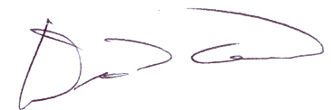

---
output:
  pdf_document:
    fig_caption: yes
    number_sections: no  #note: change to 'no' for most journals
    keep_tex: false

---

```{r setup, include=FALSE}
  library(knitr)
  knitr::opts_chunk$set(echo = TRUE)

```


```{r, echo = FALSE, fig.align='center', out.width="100%"}
  
```

`r format(Sys.time(), '%d %B, %Y')`
\hfill\break

Prof. Rob Freckleton, Executive Editor\hfill\break
*Methods in Ecology and Evolution*

\hfill\break

Prof. Freckleton,

Please find attached our manuscript “A standardized effect size for evaluating and comparing the strength of phylogenetic signal” which we are submitting for consideration for publication in *Methods in Ecology and Evolution*. This manuscript is not being considered elsewhere for publication, and all authors are aware of this submission.  \hfill\break

Why appropriate for *MEE*: Evolutionary biologists wish to quantify and compare the strength of phylogenetic signal across datasets, but analytical tools for these comparisons are generally lacking. Here we develop a standardized effect size, $Z_K$, which measures the strength of phylogenetic signal on a common statistical scale. We also provide a test statistic, $\hat{Z}_{12}$, for comparing the strength of phylogenetic signal across datasets. We find that two commonly used parameters (Pagel's $\lambda$ and Blomberg's *K*), not converted to effect sizes, are unsuitable for this purpose. Our effect-size procedure enables biologists to quantitatively address hypotheses that compare the strength of phylogenetic signal between various phenotypic traits, even when those traits are found in different evolutionary lineages or have different units or scales. \hfill\break

We hope you find the work suitable for consideration in *Methods in Ecology and Evolution.* \hfill\break

Sincerely,

```{r, echo = FALSE, fig.align='left', out.width="30%"}
  
```

Dean C. Adams, Professor\hfill\break
Department of Ecology, Evolution, and Organismal Biology\hfill\break
Iowa State University
