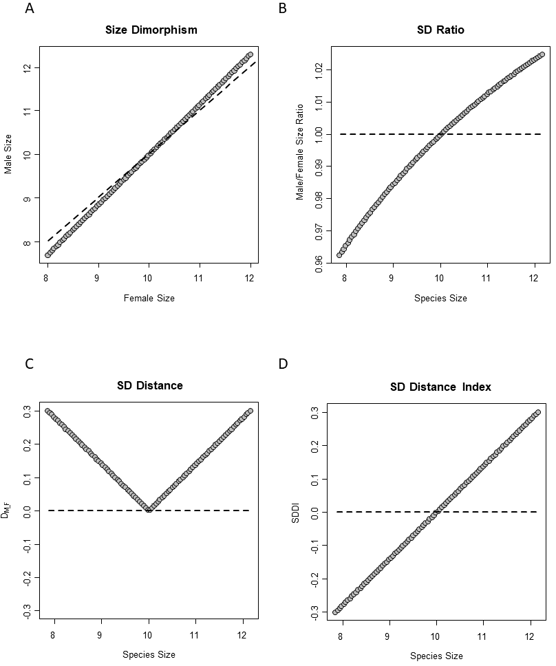
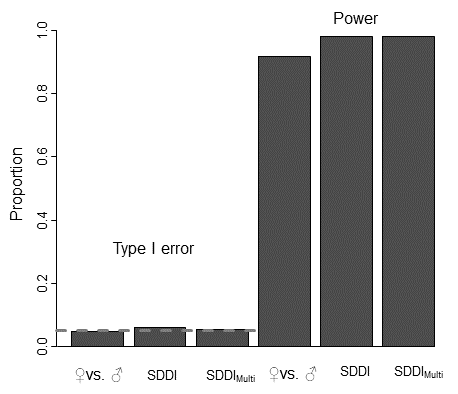
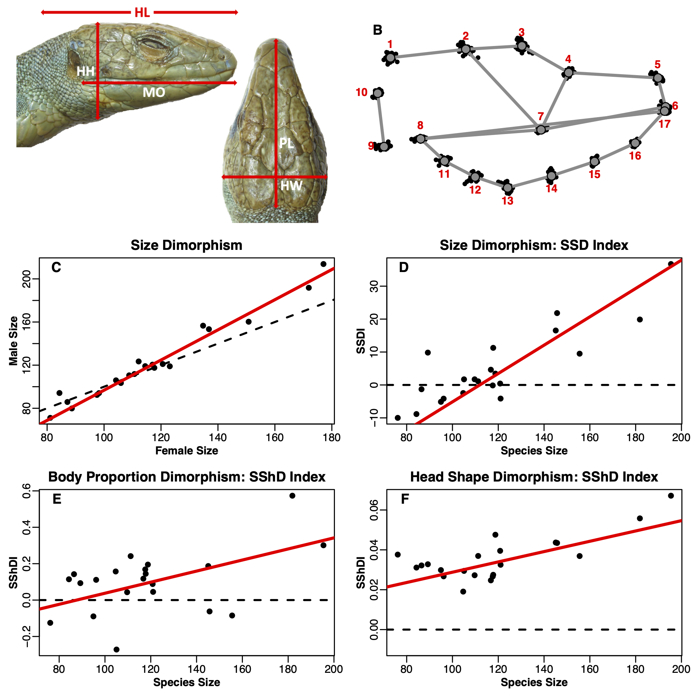
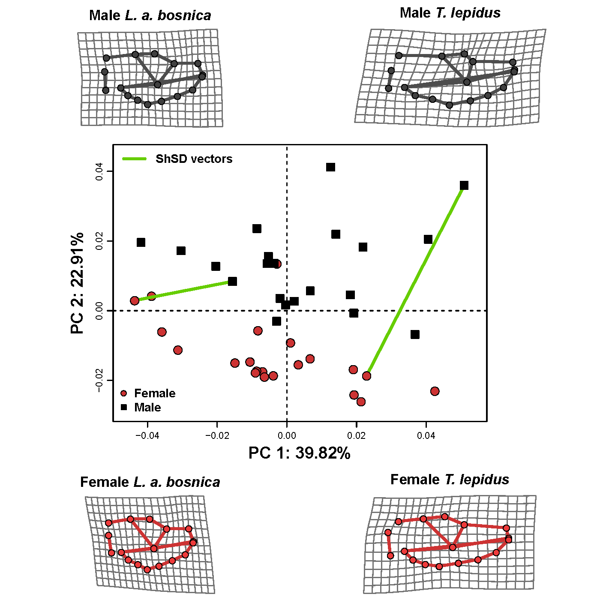
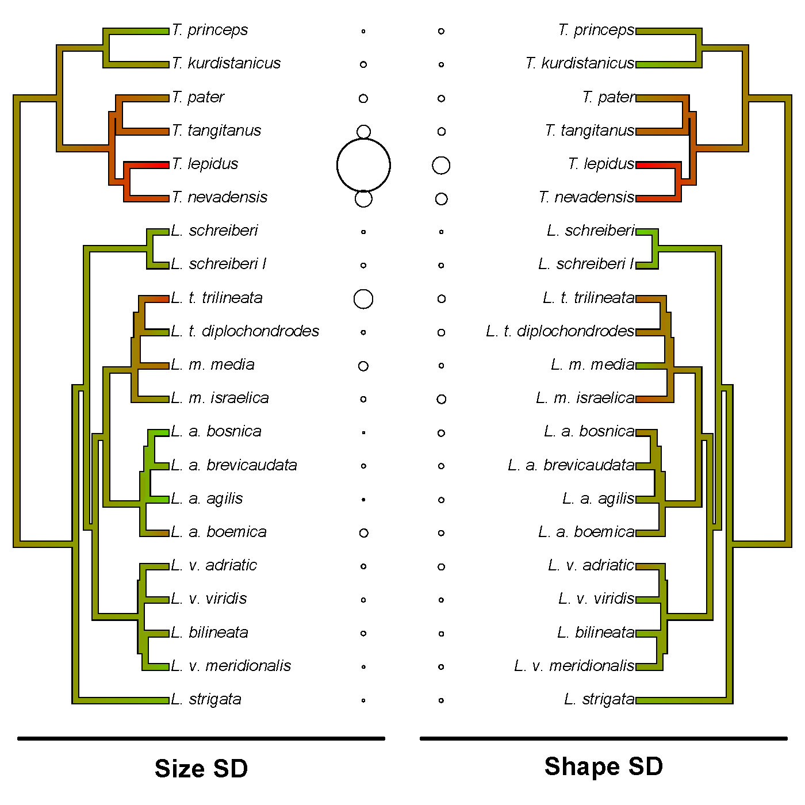

---
title:

output:
  pdf_document:
    fig_caption: yes
    number_sections: no  #note: change to 'no' for most journals
    keep_tex: true
    pandoc_args:


csl: evolution.csl
bibliography: bibliography.bib

header-includes:
  - \usepackage{setspace}\doublespacing
  - \usepackage{lineno}\linenumbers
  

---
# A multivariate equivalency and general test for Rensch's Rule: Implications for the evolution of sexual shape dimorphism

\hfill\break

**Keywords**: Pagel's lambda, phylogenetic signal \hfill\break

**Short Title**: Problems with Pagel's lambda \hfill\break

```{r setup, include=FALSE}
  library(knitr)
  knitr::opts_chunk$set(echo = TRUE)
```

# Abstract

Rensch's rule, the allometric association between the degree of sexual dimorphism and overall body size, is an important framework for understanding the evolution of trends in phenotypic differentiation between the sexes across taxa. While virtually all recent treatments have explored the degree of sexual size dimorphism, understanding how dimorphism in other phenotypic traits evolves is equally relevant. Indeed, Rensch's original treatment focused not only on size, but also on dimorphism in relative body proportions, coloration, the presence of ornaments, etc. Here, we derive a multivariate equivalency for viewing trends in sexual dimorphism – relative to overall body size – across taxa, and provide a generalized test to determine whether such patterns are consistent with Rensch's rule. For univariate linear traits such as body size, our approach yields equivalent results to those from standard procedures, but our test is also capable of detecting trends in multivariate datasets like shape. Computer simulations reveal the method displays appropriate statistical properties, and an empirical example in Mediterranean lizards illustrates the efficacy of our approach on both univariate and multivariate phenotypes. Our generalized procedure substantially extends the toolkit available for investigating macroevolutionary patterns of sexual dimorphism and seeking a better understanding of the processes that underlie them.

\newpage


# Introduction
It is widely observed that males and females of the same species are not identical, but rather differ -- sometimes substantially -- in their phenotypic characteristics [@Fairbairn1997; @Fairbairn2013]. Indeed, sexual dimorphism is pervasive across many animal clades, and understanding the causes for these patterns has attracted considerable attention in evolutionary biology for well over a century [e.g., @Darwin1871; @Fairbairn2007]. One of the most conspicuous differences between males and females is in their body sizes [@Andersson1994], where sex-specific differences are often hypothesized to be the result of selection pressures related to reproduction, or the distinct ecological roles of males and females in their respective habitat [@Stephens2009; @Littleford-Colquhoun2019; @Tarr2018; @Kaliontzopoulou2015; @Cox2003]. For example, both sexual selection on male body size [@Cox2003; @Garcia-Navas2015; @Horne2020], and fecundity selection on female body size [@Stuart-Fox2008; @Serrano-Meneses2006], are expected to enhance the degree of sexual size dimorphism in taxa over evolutionary time. Likewise, when males and females respond differently to environmental factors, intraspecific competition may generate ecological divergence between them, resulting in varying patterns of sexual dimorphism [@DayanSimberloff2005; @Meiri2014; @Kaliontzopoulou_et_al2010; @Butler_et_al2000; @Bolnick2003]. \hfill\break

At macroevolutionary scales, changes in the relative contribution of the selective forces above may create variation in the degree of sexual dimorphism displayed across closely related taxa. For instance, sister species inhabiting different environments, or possessing distinct ecological adaptations, may exhibit differing degrees of sexual dimorphism, as a result of the varying intensity of sexual selection they endure [@Oestman2011]. Likewise, the interplay between sexual and natural selection that species experience may result in sexual dimorphism of differing magnitudes across taxa [@Kaliontzopoulou2015; @Stuart-Fox2007; @Blanckenhorn2006]. One evolutionary framework that connects adaptive explanations for the evolution of sexual size dimorphism (SSD) with trends in overall body size across taxa is Rensch's rule. Here it is predicted that SSD will increase with species' average body size in species where males are the larger sex (hyperallometry), and likewise will decrease with increasing body size where females are the larger sex (hypoallometry) [@Abouheif1997; @Fairbairn1997]. Put another way, Rensch's rule predicts that the extent of sexual dimorphism increases at more extreme body sizes (both large and small) across taxa. Empirical studies have documented trends in SSD consistent with Rensch's rule in a wide variety of animal taxa [@Dale2007; @Ceballos2013; @Regis2017; @Johnson2017]. However, other clades display the converse trend [@Burbrink2019; @Penalver-Alcazar2019], and some clades display no relationship between SSD and body size [@Astua2010; @Hirst2014; @Johnson2017]. From an evolutionary perspective, the association between SSD and body size has been hypothesized to be driven by variation in ontogenetic or static allometries across taxa, which results from the influence of sexual selection on growth and maturation patterns [@Rensch1960; @Dale2007]. \hfill\break

Interestingly, virtually all evaluations of Rensch's rule have investigated patterns of sexual size dimorphism, yet Rensch's original contributions were concerned with a much wider array of phenotypic traits that can differ between the sexes. These included not only sexual differences in body size, but also in general body proportions (e.g., relative wing and limb lengths), the degree of complexity of different body structures, the presence of sex-specific  ornamentation (e.g., horns, body coloration, etc.), and other sex-specific differences [@Rensch1950; @Rensch1960]. In like manner, some studies have documented patterns of sexual shape dimorphism [e.g., @Berns2013; @Kelly2013; @Kaliontzopoulou2015], sex-specific differences in ornamentation [@Geist1988; @Watson2010; @Emlen2008], or coloration [e.g., @Endler1983]. However, such studies have typically been restricted to one or a few taxa, and have not explained macroevolutionary variation in sexual dimorphism in a manner that relates directly to Rensch's rule. Thus, when viewed from this perspective, Rensch's [-@Rensch1950] vision was far more synthetic, as he sought to explain the extent to which sexual dimorphism -- across a general suite of phenotypic characteristics -- scaled with overall body size in organisms, and why some species displayed a greater degree of sexual dimorphism than did others. Remarkably, patterns of intraspecific static allometry in sexually selected traits establishes a direct link between variation in those traits relative to size, and the evolutionary allometry across taxa in the degree of sexual dimorphism that may be expected [@Reiss1986; @Bonduriansky2007; see also @Rensch1960]. Under this framework, the "exaggeration" of body structures or other phenotypic traits with increasing body size is predicted to translate, at macroevolutionary scales, into increased degrees of sexual dimorphism with increasing body size. However, despite this clear prediction, and Rensch's original observations, the evolutionary scaling of the degree of sexual dimorphism in phenotypic traits other than size, remains largely unexplored. \hfill\break

Another current limitation in our understanding of Rensch's rule is the fact that to date, all studies have been conducted exclusively on univariate data, primarily regarding body size. However, understanding phenotypic evolution is inherently a multivariate endeavor [@Blows2007; @Collyer_et_al2015a; @AdamsCollyer2018a; @AdamsCollyer2019], as processes such as natural and sexual selection simultaneously operate on more than one trait [@Lande1979; @LandeArnold1983], and can affect variation in complex multidimensional traits such as shape. To interrogate such patterns, the analytics used to evaluate evolutionary trends in phenotypic datasets must be sufficiently general to accommodate this empirical fact. Unfortunately, all current analytical approaches for evaluating trends in sexual dimorphism as they relate to overall body size are explicitly univariate; thereby excluding the possibility of evaluating patterns in complex multidimensional traits such as organismal shape. Though is has been extensively documented in sexual size dimorphism, it remains unknown whether Rensch's rule applies equally to sexual shape dimorphism, as determining this requires an analytical framework capable of evaluating trends in sexual dimorphism in both univariate and multivariate datasets. \hfill\break

In this paper, we derive a multivariate equivalency for inspecting variation in sexual dimorphism -- relative to overall body size -- across taxa, and provide a generalized test to determine whether they are consistent with Rensch's rule. Our procedure is appropriate for evaluating trends in univariate traits measured on a linear scale (such as body size or relative limb length), as well as in multivariate datasets representing complex phenotypes (such as sets of body proportions or landmark-based shape data). For univariate data, the approach yields equivalent results to what is normally accomplished for size-based SSD evaluations. However, the approach extends these procedures for the examination of sexual dimorphism in multivariate data, thereby increasing the potential for our conceptual understanding of the consequences of sexual and natural selection on complex organismal phenotypes. We conduct a series of computer simulations demonstrating that the approach displays appropriate statistical properties when evaluating trends in both univariate and multivariate data. We also provide an empirical example in Mediterranean green lizards which illustrates the efficacy of our approach on both univariate and multivariate datasets. Finally, we highlight the new avenues of evolutionary research that our generalization facilitates, and make comments on the prospects for future empirical advances.  

# Methods and Results

## *Conceptual Development*

To arrive at a general test for Rensch's rule that can accommodate multivariate data, we must first derive a series of mathematical equivalencies based upon how interspecific patterns of size dimorphism are typically evaluated. For sexual size dimorphism, interspecific patterns are often inspected using a bivariate plot, where the size of one sex is plotted against the size of the other sex [e.g., @Fairbairn1994; @Abouheif1997; @Ceballos2013]. An idealized example is shown in Fig. 1A, with male size plotted against female size. The diagonal line represents no size dimorphism; or a 1:1 size ratio between the sexes across the range of body sizes for species in the clade of interest. In this construction (i.e., with females plotted on the x-axis), deviations from this line represent differential trends in size dimorphism across taxa. To evaluate such patterns statistically, a phylogenetic regression is performed, and in this case, a slope significantly greater than 1.0 (i.e., $\beta_{1}>1.0$) would be treated as evidence that the evolutionary changes in sexual size dimorphism across taxa are consistent with Rensch's rule [@Fairbairn1997]. \hfill\break

An equivalent representation of patterns of sexual dimorphism may also be found using ratios (e.g., male size:female size). When plotted against the average size for each species (Fig. 1B), the same information is conveyed as is found in the more commonly utilized male - female plot of Fig. 1A. However, in this representation, the line designating no sexual dimorphism is horizontal, with a slope of zero (i.e., $\beta_{1}=0.0$) and an intercept of 1.0. As before, a phylogenetic regression may be performed on these data, and in this case, if the slope is significantly steeper than zero (i.e., $\beta_{1}>0.0$), patterns consistent with Rensch's rule are observed. \hfill\break

A third equivalency is shown in Fig. 1C. Here, the Euclidean distance between male and female means for each species ($D_{SD}=\sqrt{(Y_{male}-Y_{female})^2}$) is shown relative to the overall size of the species. This plot is similar to a Bland-Altmann plot [@Altman1983], except that the Euclidean distance, rather than a difference score, is plotted along the y-axis (as distances can accommodate data of different dimensionality). Under Rensch's rule, this *sexual dimorphism distance* may become greater as species are progressively larger [hyperallometry, sensu @Abouheif1997] or may become greater as species are progressively smaller [hypoallometry, sensu @Abouheif1997]. In both cases, patterns correspond to species displaying progressively more sexual dimorphism at extreme body sizes; a trend consistent with Rensch's rule. Note that the inflection point in Fig. 1C represents an intermediate size where there is no sexual dimorphism for the trait, and corresponds to where the male-female regression line of Fig. 1A crosses the line representing no sexual dimorphism. This inflection point may represent the overall mean size across species in the lineage, or may be some other value. For instance, in some lineages [e.g., turtles: @Ceballos2013], nearly all species are female biased, in which case the inflection point for $D_{SD}$ vs. size would be found at the far-right end of the plot. \hfill\break

Finally, from $D_{SD}$ a *sexual dimorphism distance index* ($SDDI$) may be constructed as:

$$SDDI=-1*D_{SD}$$
$$SDDI=+1*D_{SD}$$ 

Here, $D_{SD}$ is multiplied by either a +1 or -1, based on a comparison of male and female trait values for the species. For instance, when single-valued traits on a linear scale are examined (e.g., leg length or wing extent), $D_{SD}$ is multiplied by -1 for those species where females display larger values than males, and remains unchanged for species where males are larger than females. This logic is analogous to that of Lovich and Gibbons [-@Lovich1992] for their index of overall body size dimorphism. However, from a geometric perspective, this procedure is tantamount to determining which species in Fig. 1A are found below the 1:1 size line (i.e., the line representing no size dimorphism), and multiplying those species' $D_{SD}$ by -1. \hfill\break

Unfortunately, applying the same logic to multidimensional trait data is more complicated, as sex-specific differences are not always guaranteed to align with some *a priori* direction in the multivariate dataspace. Thus, for multivariate datasets, one of two procedures may be used. First, for multivariate sets of traits that are measured on the same linear scale (e.g., length, width, and height measures), one could envision a hyperdimensional version of the plot displayed in Fig. 1A, but where the set of male traits are plotted against the set of female traits. In this construction, because the traits are quantified on the same measured scale, the 1:1 size vector representing no sexual dimorphism does exist, and emanates from the origin of the space extending in a positive direction as the trait values increase. To determine whether male trait values deviate more from this vector than do female trait values, a partial least squares analysis may be performed [@RohlfCorti2000]. Partial least squares (PLS) is a multivariate association procedure which describes the covariation between sets of traits (in this case, between the set of male traits and the set of female traits). Scores along the first PLS axis represent the maximal covariation between male and female traits projected to a single dimension, and species whose male and female PLS scores are identical are those displaying no sexual dimorphism. Thus, deviations from that pattern represent instances of multivariate sexual dimorphism. By plotting these scores, one may determine which species display female scores (on $PLS_1$) that are larger than their corresponding male scores (when negative values on $PLS_1$ correspond to smaller individuals; otherwise, the converse comparison is used). The $D_{SD}$ for these species may then be multiplied by -1 to obtain the $SDDI$ for that species. Note that when PLS is used on univariate data, this procedure obtains values identical to those from the method described previously where male and female sizes are compared directly. Thus, for multivariate traits measured on a linear scale, this is a direct generalization of the standard univariate procedure (see empirical example below). \hfill\break

Alternatively, one might be interested in examining multidimensional traits other than linear biometric measurements, such as color or shape. For instance, one may characterize the shape of males and females using geometric morphometric methods [@Bookstein1991; @MitteroeckerGunz2009; @Adams_et_al2013], where the locations of anatomical landmarks and semilandmarks are used to obtain a set of shape variables. Geometric morphometric methods also result in a multidimensional characterization of phenotypic traits, from which the degree of sexual dimorphism for each species may be quantified using $D_{SD}$. However, because the resulting shape variables do not have a one to one correspondence with linear size measures, there is no *a priori* direction in the multivariate shape space that is equivalent to the 1:1 size vector found with sets of linear traits. In fact, for the case of isometry (i.e., shape does not change as size changes), all observations are represented by a single location in the shape space. Thus, while a PLS of male shapes versus female shapes will describe the covariation between them, this direction is not guaranteed to align with size, because there is no direction in the shape space that may be used to unambiguously determine whether dimorphism is male- or female-biased, as for shape variables there is no *a priori* directionality. Nonetheless, one may still quantitatively determine whether the degree of sexual shape dimorphism covaries with overall body size, by using the sexual dimorphism index as defined by the dimorphism distance (i.e., $SDDI=D_{SD}$) to represent the degree of multivariate shape dimorphism for each species. \hfill\break

Once the sexual dimorphism distance index ($SDDI$) is calculated, it may be evaluated against the average size of each species. Here, data conforming to Rensch's rule will result in significant trends of sexual dimorphism relative to mean body size (Fig. 1D). As with size ratios, the line of no sexual dimorphism is a horizontal line, but this time it is centered on zero, as a distance of zero corresponds to no sexual dimorphism. Thus, a phylogenetic regression of these data whose slope is significantly different from zero (e.g., $\beta_{1}\neq0.0$) provides evidence that the evolution of sexual dimorphism is consistent with patterns expected under Rensch's rule. For cases where traits are measured on a linear scale, patterns expected under Rensch's rule exhibit a slope significantly greater than zero ($\beta_{1}>0.0$), as in the usual formulation. Likewise, when using geometric morphometric shape data (or any other type of mean-centered multidimensional data), hyperallometric patterns consistent with Rensch's rule would also display a slope significantly greater than zero ($\beta_{1}>0.0$), indicating that the degree of sexual shape dimorphism increases with increasing body size. Conversely however, hypoallometric patterns would display the opposite pattern ($\beta_{1}<0.0$), indicating that smaller species display greater sexual shape dimorphism. \hfill\break

## *Simulations*

To ascertain the statistical performance of the approach proposed here, we conducted a series of computer simulations. We evaluated the ability of SDDI to characterize patterns of sexual dimorphism in both univariate and multivariate datasets. For each simulation, we generated a pure-birth phylogeny containing 50 species, on which we simulated datasets under a Brownian motion model of evolution. For univariate data ($p=1$), a single trait was evolved along the phylogeny, and represented the female trait values ($x$). Next, male values ($y$) were simulated in such a manner as to generate a known male:female relationship (plus random error), using the function: $y=\alpha{x}+\mathcal{N}(\mu=0,\sigma=0.1)$. For type I error simulations, no sexual dimorphism was generated, meaning that the slope, $\alpha$, characterized a 1:1 relationship between male and female trait values (i.e., $\alpha=1.0$). For power simulations, we simulated male values with a slope greater than 1.0 to correspond with patterns following Rensch's rule (i.e., $\alpha=1.1$).  A total of 1,000 datasets were generated under each simulation condition. We then evaluated all datasets using standard approaches (i.e., a phylogenetic regression of male values versus female values), as well as a phylogenetic regression of SDDI versus average body size. The proportion of significant datasets was treated as the type I error ($\alpha=1.0$) or power ($\alpha=1.1$) respectively. \hfill\break

For multivariate data ($p=5$), a slightly different procedure was utilized. First, average body size ($s$) was evolved along the phylogeny under Brownian motion. Next, female traits ($\mathbf{X}$) were simulated on the phylogeny under Brownian motion, using a $p\times{p}$ trait covariance matrix with correlations between traits of ($r=0.7$). For simulations where there was no pattern of sexual dimorphism across species (i.e., type I error simulations) male trait values were then generated by incorporating random error to the female trait values, in a manner analogous to that achieved in the univariate simulations: $\mathbf{Y}=\mathbf{X}_{F}+\mathcal{N}(\mu=0,\sigma=0.1$). For simulations where patterns of sexual dimorphism covaried with body size (i.e., power simulations), male trait values were generated by incorporating random error to the female trait values, but with the addition that female trait values were pre-multiplied by a scalar value of body size: $\mathbf{Y}=(0.1*s)*\mathbf{X}_{F}+\mathcal{N}(\mu=0,\sigma=0.1$). This ensured that male and female trait values covaried with one another as expected, and also covaried with size in the desired direction. As before, a total of 1,000 datasets were generated under each simulation condition. We then evaluated all datasets using a phylogenetic regression of SDDI versus average body size. The proportion of significant datasets was treated as the type I error ($\alpha=1.0$) or power ($\alpha=1.1$) respectively. \hfill\break

*Simulation Results*: For the univariate dataset, we found that both a phylogenetic regression of male size on female size, as well as a phylogenetic regression of $SDDI$ on body size, resulted in appropriate type I error rates near the nominal $\alpha\approx0.05$ (Fig. 2). Further, when data were simulated under conditions consistent with Rensch's rule, both procedures were capable of detecting the signal of the pattern, and did so with very high power. Thus, using the $SDDI$ approach proposed here was equivalent to what is normally utilized for univariate datasets. Likewise, for multivariate data, the $SDDI$ approach displayed appropriate type I error ($\alpha\approx0.05$) and high statistical power under the conditions simulated (Fig. 2). Additionally, multiplying $D_{SD}$ by $\pm1$ had little effect on the outcome for multivariate data, as in both cases type I error and power results were virtually identical. Thus, methods for evaluating sexual dimorphism using geometric morphometric data are anticipated to remain robust. Overall results from these simulations imply that using the sexual dimorphism distance index ($SDDI$) proposed here provides an appropriate means of characterizing patterns of sexual dimorphism in both univariate and multivariate traits, and that the procedure is capable of detecting patterns consistent with Rensch's rule when they are present in phenotypic datasets. \hfill\break

## *Empirical Example*

To illustrate the utility of the approach presented here, we conducted an analysis of both size and shape dimorphism in a group of Mediterranean lizards with extensive body size variation. Our dataset consisted of three data types: male and female values of body size (snout-vent length: SVL), male and female values for a series of head measurements (head length, head width, head height, pileus length, and mouth opening: Fig. 3A), and male and female values of head shape (Fig. 3B). A total of 374 specimens from 21 lineages of green lizards, a monophyletic clade that includes two genera (*Lacerta* and *Timon*), were obtained from natural history museum collections. For each lineage, we obtained samples distributed across the entire distribution range, resulting in an initial database of 1062 specimens. In order to take sampling bias into account, we selected the 10 largest individuals per sex, when sufficient specimens were available, for use in subsequent size and shape analyses. A detailed account of the specimens used for this study is available in the Supplemental Material. \hfill\break

From these specimens, we calculated mean body size for each sex and lineage. Likewise, we calculated the mean trait values for each sex and lineage for the set of linear measures. These values were then standardized by SVL; resulting in a set of head measurements proportional to body size for each sex $\times$ lineage combination. Additionally, we quantified lateral head shape variation using geometric morphometric methods [@Adams_et_al2013]. This was accomplished by first digitizing 17 landmarks and semilandmarks from images of the right side of the head (Fig. 3B). The thin-plate spline was used to estimate the position of missing landmarks [@Gunz2009], and the position of the jaw relative to the skull was standardized using the fixed angle method [@Adams1999]. Next, a generalized Procrustes analysis  [@RohlfSlice1990] was performed to eliminate non-shape variation from the landmark data and align the specimens to a common coordinate system. The position of semilandmarks (i.e. 11-16, Fig. 3B) was optimized by minimizing the bending energy [@Bookstein1997]. From the aligned Procrustes coordinates the mean head shape for males and for females was then calculated for each lineage. Finally, the phylogenetic relationships among lineages were estimated using published sequences on five mitochondrial and four nuclear gene fragments, totaling 8383 bp. These were then used following standard phylogenetic inference procedures to generate a dated consensus phylogeny for the lineages of interest (for details see Supplemental Material). \hfill\break

Using these data, we conducted a series of analyses to investigate whether patterns of sexual size dimorphism (SSD) and sexual shape dimorphism (SShD) in this group corresponded to expectations under Rensch's rule. First, we examined patterns of SSD using a phylogenetic regression of male size against female size. Here, a slope significantly greater than 1.0 ($\beta>1.0$) was treated as evidence consistent with Rensch's rule. Additionally, we evaluated SSD patterns using the approach developed here, via a phylogenetic regression of the sexual size dimorphism index against mean body size for each species. Second, we evaluated multivariate patterns of sexual dimorphism in head proportions in relation to body size, using the sexual dimorphism index obtained from the Euclidean distance between male and female means from each species ($D_{SD}$). Partial least squares was used to determine which species displayed female scores (on $PLS_1$) larger than their corresponding male scores, and the sexual dimorphism index was then obtained by multiplying the sexual dimorphism distance by +1 or -1, respectively (i.e., $SDDI=\pm1*D_{SD}$). We then performed a phylogenetic regression of $SDDI$ for head proportions versus mean body size to determine whether patterns of dimorphism corresponded to what is expected under Rensch's rule. Third, we obtained the degree of sexual dimorphism in head shape for each species using the Procrustes distance between male and female means, and from this calculated the sexual shape dimorphism index ($SShDI$) in their original units as described above (i.e., $SShDI=D_{SD}$). We then performed a phylogenetic regression of sexual shape dimorphism ($SShDI$) against the mean body size for each species to determine whether patterns of head shape dimorphism were consistent with predictions from Rensch's rule. Additionally, patterns of head shape dimorphism were further investigated using principal components analysis of the set of mean male and female head shapes across species. Finally, we used phylogenetic correlation [phylogenetic partial least squares: sensu Adams and Felice -@AdamsFelice2014] to determine whether the degree of head shape dimorphism was associated with levels of size dimorphism. All analyses were performed in R 3.6.2 [@R-Base] using the packages `geomorph` [@AdamsOtarola2013; @AdamsGeomorph], `RRPP` [@CollyerAdams2018], and routines written by the authors. \hfill\break

*Empirical Results*: Using phylogenetic regression, we found a significant relationship between male size and female size, with a slope significantly greater than one ($\beta = 1.39$, $T=2.91$, $P = 0.009$: Fig. 3C). This indicated that the degree of sexual size dimorphism differed systematically with overall body size; a pattern consistent with that expected under Rensch's rule. In this case, both hypoallometry and hyperallometry [*sensu* @Abouheif1997] were displayed (Fig. 3C). Specifically, in male-biased species, the degree of sexual dimorphism was greater with increasing body size, and in female-biased species the degree of sexual dimorphism increased in smaller species (though the pattern was more pronounced in male-biased species). Similarly, when using the sexual size dimorphism index (SSDI), we found a significant and positive evolutionary relationship between SSDI and mean body size, confirming the Rensch's rule pattern identified using the commonly-used procedure ($\beta = 0.43$, $F=22.95$, $Z=1.89$, $P = 0.004$: Fig. 3D).  \hfill\break

When multivariate patterns of sexual dimorphism were evaluated, we found that the degree of dimorphism in head proportions increased as body size increased: a pattern consistent with Rensch's rule ($F=7.20$, $Z=1.41$, $P = 0.022$: Fig. 3E). Likewise, when patterns of head shape dimorphism were examined, we found that the degree of sexual shape dimorphism (SShDI) increased in larger species, and a phylogenetic regression of sexual shape dimorphism versus mean body size was found to be significant ($F=6.05$, $Z=1.35$, $P = 0.03$: Fig. 3F). Thus, for both multivariate datasets, the degree of sexual dimorphism was enhanced in larger species [hyperallometry; sensu @Abouheif1997]: a pattern consistent with what was expected under Rensch's rule. To our knowledge, this is the first empirical demonstration of a pattern following Rensch's rule in multivariate data.  \hfill\break

Visualizing patterns of head shape dimorphism using principal components analysis (Fig. 4), it was evident that males and females occupied distinct regions of morphospace. Further, the head shapes of males and females of the smallest lineage, *Lacerta agilis bosnica*, were distinct from those of the largest species, *Timon lepidus*. When connected, the sexual shape dimorphism vectors for these two species did not coincide with one another in the ordination, implying a difference in sexual shape dimorphism across species. Specifically, the vector for *T. lepidus* was longer than that for *L. agilis bosnica*, which reflected the greater degree of sexual shape dimorphism exhibited by this species. Thin-plate spline deformation grids facilitated a graphical description of these shape differences, where sexual shape dimorphism in *L. agilis bosnica* was best described as a contrast between longer-headed males, with an amplified tympanic area; and short-headed females, with a relatively more reduced tympanic region (Fig. 4, left). By contrast, sexual shape dimorphism in *T. lepidus* was both more prominent in the tympanic area, similarly to what was observed in *L. agilis bosnica*; and also included a modification of the relative lower jaw area. Indeed, males of *T. lepidus* were characterized by both a longer posterior head region and by deeper lower jaw configurations as compared to females of the same species.  \hfill\break

Finally, across taxa, the degree of body size and head shape dimorphism were significantly correlated with one another ($r=0.73$, $p=0.0001$), but not when evaluated in a phylogenetic context ($r_{PPLS} = 0.361$, $Z=1.28$, $P = 0.12$). Part of this difference may be explained by the fact that the largest species (i.e. members of the genus *Timon*) - which displayed the greatest degree of both size and shape dimorphism - form a clade within the broader phylogeny for the group (Fig. 5). Thus, despite the strong association of size and shape dimorphism, there were fewer changes of these patterns across branches of the phylogeny. Generally speaking, the degree of size dimorphism and the degree of shape dimorphism increased in larger taxa, and heat maps of the evolution of size and shape dimorphism across the phylogeny indicated a strong association between the two; particularly in large taxa (Fig. 5). Thus, in this system, it appeared that evolutionary changes in size between the sexes were accompanied by concomitant changes in head shape. 

# Discussion

A longstanding question in evolutionary biology is understanding why sexual dimorphism, the degree of differentiation between the sexes, varies across species. A frequently used schema for exploring macroevolutionary patterns of sexual dimorphism is Rensch's rule, which predicts that sexual dimorphism should increase with body size in species where males are the larger sex, and decrease with increasing body size in species where females are the larger sex. Remarkably, virtually all recent studies have focused on macroevolutionary variation in sexual *size* dimorphism, despite the relevance of sexual dimorphism in other traits, as encompassed by Rensch's original treatment [@Rensch1950]. This gap has been driven, in part, by the lack of adequate tools for evaluating Rensch's rule in multivariate traits, such as color, ornament complexity, or shape. In this article, we fill this procedural gap by providing an analytical equivalency that allows the generalization of statistical tests of Rensch's rule for both univariate and multivariate traits. The approach describes the degree of sexual dimorphism as a distance between male and female trait values in phenotype space, thereby facilitating its use on either single-valued traits (e.g., body size), or complex, multivariate traits (e.g. organismal shape). Computer simulations confirm that the approach exhibits appropriate type I error rates and statistical power, thereby providing an adequate procedure for testing whether empirical data comply with the predictions of Rensch's rule. The implementation of our approach on an empirical study of Mediterranean lizards revealed that patterns of sexual dimorphism comply with Rensch's rule not only for body size, but also for relative head proportions and head shape, offering new insights and triggering novel hypotheses about the possible proximate and evolutionary causes that may underlie such patterns. \hfill\break

Our empirical example in Mediterranean green lizards exemplifies a case study investigating variation in sexual dimorphism -- not only in size -- but also in multivariate phenotypes, like shape, and how this method can provide useful insights into the proximate and evolutionary causes underlying such patterns. First, we found that the degree of sexual size dimorphism increased as taxa became larger (Fig. 3C, D). This pattern is compliant with Rensch's rule and corresponds with hyperallometry [@Abouheif1997], which is to be expected when males are the larger sex [@Fairbairn1997]. In this group males are larger than females in most lineages (Fig. 3C), as is commonly observed in lacertids [@Brana1996]. Additionally, as in many lizard species, sexual selection in this group is primarily mediated through territoriality, where male-male competition selects for a larger male body size [@Stamps1983]. Thus, in this system there is an association between male-biased sexual size dimorphism and male-male competition. As such, the patterns of size dimorphism observed in this study are consistent with those expected under a scenario where sexual selection drives the evolution of larger male body size across taxa via male-male competition. \hfill\break

Likewise, our multivariate analyses revealed that head morphology differed between the sexes, and that the degree of sexual dimorphism in multivariate head shape also corresponded to that expected under Rensch's rule (Fig. 3E, 3F). That is, while both small (e.g. *L. a. bosnica*, Fig. 4, left) and large (e.g. *T. lepidus*, Fig. 4, right) species are sexually dimorphic in head shape, the degree of sexual shape dimorphism increased with average body size (Fig. 3F); a pattern consistent with a scenario of hyperallometry. Examination of the resulting shape differences revealed that sexual dimorphism in head shape was associated with an amplification of the posterior head region, and also in the relative size of the lower jaw (in the case of *T. lepidus*). Biomechanically, these are precisely the anatomical regions where the jaw adductor muscles reside [@Haas1973], and as such, an amplification of these areas in males would enhance biting performance [@Herrel1996; @Kaliontzopoulou2012]; a functional trait that has important implications for male competitive capacity [@Lailvaux2007; @HUYGHE2005]. In addition, one might predict that the need for stronger jaw musculature in males becomes disproportionately more intense with increasing body size, as male combats are expected to be more fierce among larger-bodied opponents. Thus, our findings that head shape dimorphism increases with overall body size is also consistent with the hypothesis that sexual selection on structures related to territoriality and male competitive interactions are responsible for the macroevolutionary patterns of sexual shape dimorphism observed in this group. To our knowledge, this is the first example of Rensch's rule in a multivariate phenotype. \hfill\break

With respect to the analytical approach proposed here, our characterization of sexual dimorphism via a *shape distance* and the $SDDI$ statistic is completely general, and may be used to evaluate evolutionary trends in any continuous, quantitative trait that differs between the sexes. Our empirical example highlighted the efficacy of the approach for evaluating trends in univariate traits such as body size, and also several types of complex data where organismal phenotypes are quantified by multiple dimensions. As such, the approach developed here expands our current analytical toolkit to provide a means of evaluating evolutionary trends in sexual dimorphism for a broader class of phenotypic traits than has previously been considered. Indeed, this advance more closely embodies Rensch's [-@Rensch1950] original conceptualization for understanding patterns of sexual dimorphism, as his broader vision was to explain why phenotypic differences *writ large* exist among the sexes. Thus, use of the $SDDI$ will facilitate a greater degree of evolutionary exploration into patterns of sexual dimorphism than has been possible in recent decades. Further, with the inclusion of multivariate traits, the formulation proposed here opens the door for investigations into the evolution of sexual shape dimorphism, and whether such patterns correspond to those expected under Rensch's rule. Thus, the mathematical test proposed here is general, and may be used for any quantitative phenotypic trait under scrutiny. \hfill\break

Finally, because $SDDI$ is derived from a phenotypic distance, one could, in theory, utilize the approach to characterize patterns of sexual dimorphism in non-continuous traits, and determine quantitatively whether the degree of sexual dimorphism is enhanced with increasing body size. Across the tree of life, major phenotypic adaptations are often described as evolutionary innovations or novelties [sensu @Wagner1996a; @Wagner2002; @Peterson2016], where these changes are characterized as discrete shifts from one phenotypic state to another [e.g., @Holliday2012; @OKeefe2011]. In like manner, discrete phenotypic differences are known to exist between the sexes; for instance where males display horns or other ornamentation [@Geist1988; @Emlen2008] that females lack. Over evolutionary time, a series of such discrete phenotypic differences may accumulate in males relative to females, resulting in an elaboration of phenotypic differences between the sexes in suites of such traits. With an appropriate distance measure for discrete traits (e.g., Hamming distance), the approach developed here is capable of characterizing such patterns, and determining whether sets of discrete phenotypic differences are enhanced with increasing body size among species. Thus, our approach is the first to our knowledge to facilitate a formal evaluation of both discrete and continuous phenotypic differences between the sexes, providing a comprehensive means of determining whether sets of phenotypic traits differ in a manner as predicted by Rensch's rule. 

\newpage

# References

 \setlength{\parindent}{-0.25in}
 \setlength{\leftskip}{0.25in}
 \setlength{\parskip}{8pt}
 \noindent

<div id="refs"></div>
 
\newpage

# Figure Legends

\textbf{Figure 1}. (A) Sexual size dimorphism for males and females across 100 hypothetical species. The pattern displayed exhibits a slope > 1.0, and thus corresponds to Rensch's rule. (B) The same data represented as the ratio of $M/F$ sizes plotted against average species size. (C) Sexual dimorphism represented as the distance between males and females: $SDD = D_{M:F}$. (D) Sexual dimorphism represented as an index of the SD Distance: $SDDI = \pm1*D_{M:F}$. In all panels,  the dashed line corresponds to values representing no sexual dimorphism (the 1:1 line).  \hfill\break

\textbf{Figure 2}. Results of phylogenetic simulations testing the type I error and statistical power for detecting patterns consistent with Rensch's rule. Vertical bars represent the proportion of datasets found to be significant. For type I error analyses, the dashed line marks the standard threshold of $\alpha= 0.05$. For univariate data, both phylogenetic regression of male versus female size (standard approach), and $SDDI$ versus overall body size (new approach) were performed. For multivariate data, only $SDDI$ versus overall body size was examined. \hfill\break

\textbf{Figure 3}. (A) Set of linear measurements used to obtain head proportions. HL: head length, HW: head width, HH: head height, PL: pileus length, MO: mouth opening. (B) Locations of 17 landmarks (1-10; 17) and semilandmarks (11-16) used to quantify head shape. (C) Patterns of sexual size dimorphism represented as male versus female size. (D) Patterns of sexual size dimorphism, represented as sexual size dimorphism index ($SSDI$) versus mean size. (E) Multivariate patterns sexual dimorphism in body proportions ($SShDI$) versus mean size. (F) Multivariate patterns of sexual shape dimorphism ($SShDI$) versus mean size. In panels C, D, E, and F, the red line indicates the regression estimate obtained from the data, while the dashed line corresponds to values representing no sexual dimorphism.  \hfill\break

\textbf{Figure 4}. Principal components plot of male (black squares) and female (red points) species mean head shape: the first two PC axes explain over 60% of the total shape variation. Green lines correspond to the sexual shape dimorphism in one of the smallest species, *Lacerta agilis bosnica*, and in the largest species, *Timon lepidus*. Thin-plate spline deformation grids display the mean head shape for males and females of these species.  \hfill\break

 \textbf{Figure 5}. Heat maps (green: lower values; red: higher values) displaying the evolution of (A) sexual size dimorphism, and (B) sexual shape dimorphism across the phylogeny. For each panel, an index of sexual size dimorphism ($SSDI$) or sexual shape dimorphism ($SShDI$) is displayed, with circles being proportional to the degree of sexual dimorphism. \hfill\break


\newpage

```{r, echo = FALSE, out.width="95%"}
  

```

\singlespacing \textbf{Figure 1}. (A) Sexual size dimorphism for males and females across 100 hypothetical species. The pattern displayed exhibits a slope > 1.0, and thus corresponds to Rensch's rule. (B) The same data represented as the ratio of $M/F$ sizes plotted against average species size. (C) Sexual dimorphism represented as the distance between males and females: $SDD = D_{M:F}$. (D) Sexual dimorphism represented as an index of the SD Distance: $SDDI = \pm1*D_{M:F}$. In all panels,  the dashed line corresponds to values representing no sexual dimorphism (the 1:1 line).  \hfill\break


\newpage

```{r, echo = FALSE, out.width="70%"}
  

```

\singlespacing \textbf{Figure 2}. Results of phylogenetic simulations testing the type I error and statistical power for detecting patterns consistent with Rensch's rule. Vertical bars represent the proportion of datasets found to be significant. For type I error analyses, the dashed line marks the standard threshold of $\alpha= 0.05$. For univariate data, both phylogenetic regression of male versus female size (standard approach), and $SDDI$ versus overall body size (new approach) were performed. For multivariate data, only $SDDI$ versus overall body size was examined. \hfill\break

\newpage
```{r, echo = FALSE, out.width="95%"}
  

```

\singlespacing \textbf{Figure 3}. (A) Set of linear measurements used to obtain head proportions. HL: head length, HW: head width, HH: head height, PL: pileus length, MO: mouth opening. (B) Locations of 17 landmarks (1-10; 17) and semilandmarks (11-16) used to quantify head shape. (C) Patterns of sexual size dimorphism represented as male versus female size. (D) Patterns of sexual size dimorphism, represented as sexual size dimorphism index ($SSDI$) versus mean size. (E) Multivariate patterns sexual dimorphism in body proportions ($SShDI$) versus mean size. (F) Multivariate patterns of sexual shape dimorphism ($SShDI$) versus mean size. In panels C, D, E, and F, the red line indicates the regression estimate obtained from the data, while the dashed line corresponds to values representing no sexual dimorphism. \hfill\break


\newpage

```{r, echo = FALSE, out.width="95%"}
  

```

\singlespacing \textbf{Figure 4}. Principal components plot of male (black squares) and female (red points) species mean head shape: the first two PC axes explain over 60% of the total shape variation. Green lines correspond to the sexual shape dimorphism in one of the smallest species, *Lacerta agilis bosnica*, and in the largest species, *Timon lepidus*. Thin-plate spline deformation grids display the mean head shape for males and females of these species.  \hfill\break


\newpage

```{r, echo = FALSE, out.width="95%"}
  

```

\singlespacing \textbf{Figure 5}. Heat maps (green: lower values; red: higher values) displaying the evolution of (A) sexual size dimorphism, and (B) sexual shape dimorphism across the phylogeny. For each panel, an index of sexual size dimorphism ($SSDI$) or sexual shape dimorphism ($SShDI$) is displayed, with circles being proportional to the degree of sexual dimorphism. \hfill\break
