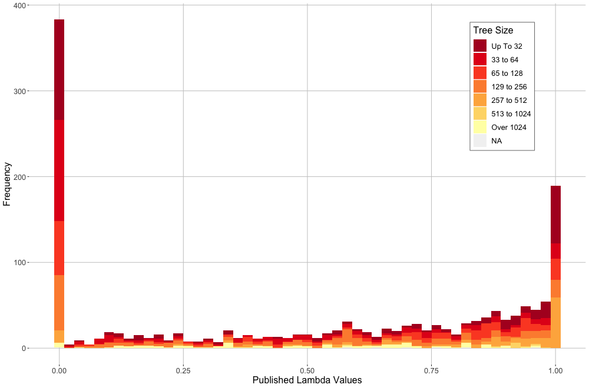
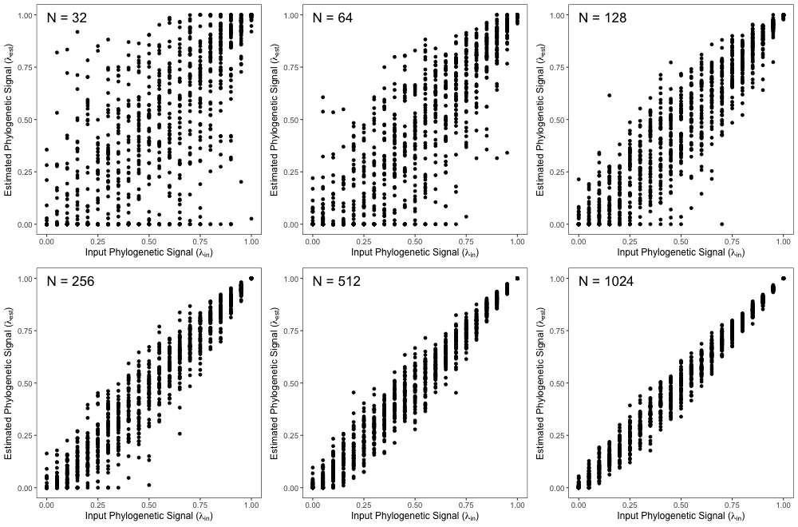
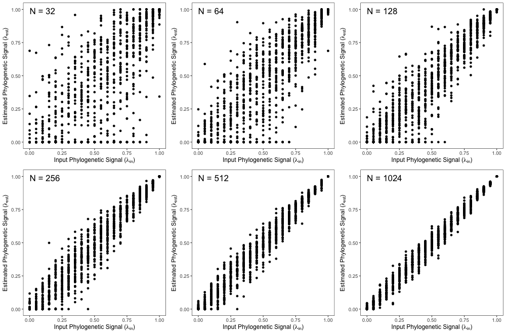

---
title:

output:
  pdf_document:
    fig_caption: yes
    number_sections: no  #note: change to 'no' for most journals
    keep_tex: true
    pandoc_args:


csl: evolution.csl
bibliography: bibliography.bib

header-includes:
  - \usepackage{setspace}\doublespacing
  - \usepackage{lineno}\linenumbers

---
# Pagel's Lambda Estimates are Often Inaccurate

\hfill\break

**Keywords**: Pagel's lambda, phylogenetic signal \hfill\break

**Short Title**: Inaccuracies in Pagel's Lambda \hfill\break

```{r setup, include=FALSE}
  library(knitr)
  knitr::opts_chunk$set(echo = TRUE)
```

# Abstract

 conclusion holds: interpreting the regression is not appreciably different (in terms of slopes and f values)


\newpage


# Introduction
Investigating macroevolutionary patterns requires a phylogenetic approach as species are non-independent by nature of their shared ancestry. Since the first appropriate method was introduced by Felsenstein (phylogenetic independent contrasts; [@Felsenstein1987]), dozens of other methods have been developed and applied to increasingly complex questions in macroevolutionary biology (e.g. [@AdamsNason2019]). Understanding the degree of phylogenetic signal present in a dataset is paramount, and identifies the mode with which a trait has evolved. High measures of phylogenetic signal indicate a Brownian motion process, whereas lower levels of phylogenetic signal indicate natural selection or some other evolutionary force has influenced the traits evolutionary history. \hfill\break

Several approaches to quantify phylogenetic signal exist. For continuous data, the most common parameters used in the literature include Pagel's lambda [@Pagel1997] and Blomberg's kappa [@Blomberg1900]. Pagel's lambda has the advantage of being couched in the likelihood framework and thus has also been utilized to encorporate phylogenetic signal while doing phylogenetic regressions and ANOVA. However, the accuracy of the lambda estiamtion methods have not been fully evaluated, and thus it remains unknown the degree to which lambda estimates appropriately represent degree of phylogenetic signal. \hfill\break

An earlier study[@BoettigerEtAl2012], breifly addressed this topic by showing how uninformative smaller phylogenies could be using  estimation methods for various parameters. That paper concluded that a measure of power must be considered when quantifying Pagel's lambda. Here we take a more comprehensive approach to demonstrate the scenarios under which estimated lambdas accurately reflect known lambdas as well as the effect of these at times dubious estimation methods on significance testing when used in a pgls framework. 


# Methods and Results

## *Simulated trait*

To assess the accuracy of Pagel's lambda estimations, we simulated pure-birth phylogenies with known lambdas. We ____ by scaling simulated phylogeny with the scaling parameter and . <!-- obviously this paragraph sucks -->  We also did this with other tree shapes (symmetrical and ladder). \hfill\break


## *Simulated ANOVA and Regressions*

To ascertain the statistical performance of pgls  \hfill\break

## *Meta-Analysis of Empirical Results*

Despite the urging of Boettiger and colleagues to publish confidence intervals with all lambda parameter estimates, only 18% of papers published in 2019 do so. \hfill\break

All analyses were performed in R 3.6.2 [@R-Base] using the packages `geomorph` [@AdamsOtarola2013; @AdamsGeomorph], `RRPP` [@CollyerAdams2018]. \hfill\break


# Discussion


Using the estimated lambda values from pgls are not useful. The questions of whether or not signal exists is appropriate, but inferring more from lambda magnitude is inappropriate. \hfill\break


A longstanding question in evolutionary biology is understanding why sexual dimorphism, the degree of differentiation between the sexes, varies across species. A frequently used schema for exploring macroevolutionary patterns of sexual dimorphism is Rensch's rule, which predicts that sexual dimorphism should increase with body size in species where males are the larger sex, and decrease with increasing body size in species where females are the larger sex. Remarkably, virtually all recent studies have focused on macroevolutionary variation in sexual *size* dimorphism, despite the relevance of sexual dimorphism in other traits, as encompassed by Rensch's original treatment [@Rensch1950]. This gap has been driven, in part, by the lack of adequate tools for evaluating Rensch's rule in multivariate traits, such as color, ornament complexity, or shape. In this article, we fill this procedural gap by providing an analytical equivalency that allows the generalization of statistical tests of Rensch's rule for both univariate and multivariate traits. The approach describes the degree of sexual dimorphism as a distance between male and female trait values in phenotype space, thereby facilitating its use on either single-valued traits (e.g., body size), or complex, multivariate traits (e.g. organismal shape). Computer simulations confirm that the approach exhibits appropriate type I error rates and statistical power, thereby providing an adequate procedure for testing whether empirical data comply with the predictions of Rensch's rule. The implementation of our approach on an empirical study of Mediterranean lizards revealed that patterns of sexual dimorphism comply with Rensch's rule not only for body size, but also for relative head proportions and head shape, offering new insights and triggering novel hypotheses about the possible proximate and evolutionary causes that may underlie such patterns. \hfill\break

Our empirical example in Mediterranean green lizards exemplifies a case study investigating variation in sexual dimorphism -- not only in size -- but also in multivariate phenotypes, like shape, and how this method can provide useful insights into the proximate and evolutionary causes underlying such patterns. First, we found that the degree of sexual size dimorphism increased as taxa became larger (Fig. 3C, D). This pattern is compliant with Rensch's rule and corresponds with hyperallometry [@Abouheif1997], which is to be expected when males are the larger sex [@Fairbairn1997]. In this group males are larger than females in most lineages (Fig. 3C), as is commonly observed in lacertids [@Brana1996]. Additionally, as in many lizard species, sexual selection in this group is primarily mediated through territoriality, where male-male competition selects for a larger male body size [@Stamps1983]. Thus, in this system there is an association between male-biased sexual size dimorphism and male-male competition. As such, the patterns of size dimorphism observed in this study are consistent with those expected under a scenario where sexual selection drives the evolution of larger male body size across taxa via male-male competition. \hfill\break

Likewise, our multivariate analyses revealed that head morphology differed between the sexes, and that the degree of sexual dimorphism in multivariate head shape also corresponded to that expected under Rensch's rule (Fig. 3E, 3F). That is, while both small (e.g. *L. a. bosnica*, Fig. 4, left) and large (e.g. *T. lepidus*, Fig. 4, right) species are sexually dimorphic in head shape, the degree of sexual shape dimorphism increased with average body size (Fig. 3F); a pattern consistent with a scenario of hyperallometry. Examination of the resulting shape differences revealed that sexual dimorphism in head shape was associated with an amplification of the posterior head region, and also in the relative size of the lower jaw (in the case of *T. lepidus*). Biomechanically, these are precisely the anatomical regions where the jaw adductor muscles reside [@Haas1973], and as such, an amplification of these areas in males would enhance biting performance [@Herrel1996; @Kaliontzopoulou2012]; a functional trait that has important implications for male competitive capacity [@Lailvaux2007; @HUYGHE2005]. In addition, one might predict that the need for stronger jaw musculature in males becomes disproportionately more intense with increasing body size, as male combats are expected to be more fierce among larger-bodied opponents. Thus, our findings that head shape dimorphism increases with overall body size is also consistent with the hypothesis that sexual selection on structures related to territoriality and male competitive interactions are responsible for the macroevolutionary patterns of sexual shape dimorphism observed in this group. To our knowledge, this is the first example of Rensch's rule in a multivariate phenotype. \hfill\break

With respect to the analytical approach proposed here, our characterization of sexual dimorphism via a *shape distance* and the $SDDI$ statistic is completely general, and may be used to evaluate evolutionary trends in any continuous, quantitative trait that differs between the sexes. Our empirical example highlighted the efficacy of the approach for evaluating trends in univariate traits such as body size, and also several types of complex data where organismal phenotypes are quantified by multiple dimensions. As such, the approach developed here expands our current analytical toolkit to provide a means of evaluating evolutionary trends in sexual dimorphism for a broader class of phenotypic traits than has previously been considered. Indeed, this advance more closely embodies Rensch's [-@Rensch1950] original conceptualization for understanding patterns of sexual dimorphism, as his broader vision was to explain why phenotypic differences *writ large* exist among the sexes. Thus, use of the $SDDI$ will facilitate a greater degree of evolutionary exploration into patterns of sexual dimorphism than has been possible in recent decades. Further, with the inclusion of multivariate traits, the formulation proposed here opens the door for investigations into the evolution of sexual shape dimorphism, and whether such patterns correspond to those expected under Rensch's rule. Thus, the mathematical test proposed here is general, and may be used for any quantitative phenotypic trait under scrutiny. \hfill\break

Finally, because $SDDI$ is derived from a phenotypic distance, one could, in theory, utilize the approach to characterize patterns of sexual dimorphism in non-continuous traits, and determine quantitatively whether the degree of sexual dimorphism is enhanced with increasing body size. Across the tree of life, major phenotypic adaptations are often described as evolutionary innovations or novelties [sensu @Wagner1996a; @Wagner2002; @Peterson2016], where these changes are characterized as discrete shifts from one phenotypic state to another [e.g., @Holliday2012; @OKeefe2011]. In like manner, discrete phenotypic differences are known to exist between the sexes; for instance where males display horns or other ornamentation [@Geist1988; @Emlen2008] that females lack. Over evolutionary time, a series of such discrete phenotypic differences may accumulate in males relative to females, resulting in an elaboration of phenotypic differences between the sexes in suites of such traits. With an appropriate distance measure for discrete traits (e.g., Hamming distance), the approach developed here is capable of characterizing such patterns, and determining whether sets of discrete phenotypic differences are enhanced with increasing body size among species. Thus, our approach is the first to our knowledge to facilitate a formal evaluation of both discrete and continuous phenotypic differences between the sexes, providing a comprehensive means of determining whether sets of phenotypic traits differ in a manner as predicted by Rensch's rule. 

\newpage

# References

 \setlength{\parindent}{-0.25in}
 \setlength{\leftskip}{0.25in}
 \setlength{\parskip}{8pt}
 \noindent

<div id="refs"></div>
 
\newpage

# Figure Legends

\textbf{Figure 1}. (A) Sexual size dimorphism for males and females across 100 hypothetical species. The pattern displayed exhibits a slope > 1.0, and thus corresponds to Rensch's rule. (B) The same data represented as the ratio of $M/F$ sizes plotted against average species size. (C) Sexual dimorphism represented as the distance between males and females: $SDD = D_{M:F}$. (D) Sexual dimorphism represented as an index of the SD Distance: $SDDI = \pm1*D_{M:F}$. In all panels,  the dashed line corresponds to values representing no sexual dimorphism (the 1:1 line).  \hfill\break

\textbf{Figure 2}. Results of phylogenetic simulations testing the type I error and statistical power for detecting patterns consistent with Rensch's rule. Vertical bars represent the proportion of datasets found to be significant. For type I error analyses, the dashed line marks the standard threshold of $\alpha= 0.05$. For univariate data, both phylogenetic regression of male versus female size (standard approach), and $SDDI$ versus overall body size (new approach) were performed. For multivariate data, only $SDDI$ versus overall body size was examined. \hfill\break

\textbf{Figure 3}. (A) Set of linear measurements used to obtain head proportions. HL: head length, HW: head width, HH: head height, PL: pileus length, MO: mouth opening. (B) Locations of 17 landmarks (1-10; 17) and semilandmarks (11-16) used to quantify head shape. (C) Patterns of sexual size dimorphism represented as male versus female size. (D) Patterns of sexual size dimorphism, represented as sexual size dimorphism index ($SSDI$) versus mean size. (E) Multivariate patterns sexual dimorphism in body proportions ($SShDI$) versus mean size. (F) Multivariate patterns of sexual shape dimorphism ($SShDI$) versus mean size. In panels C, D, E, and F, the red line indicates the regression estimate obtained from the data, while the dashed line corresponds to values representing no sexual dimorphism.  \hfill\break


\newpage

```{r, echo = FALSE, out.width="95%"}
  

```

\singlespacing \textbf{Figure 1}.  \hfill\break


\newpage

```{r, echo = FALSE, out.width="70%"}
  

```

\singlespacing \textbf{Figure 2}.  \hfill\break

\newpage
```{r, echo = FALSE, out.width="95%"}
  

```

\singlespacing \textbf{Figure 3}.  \hfill\break


