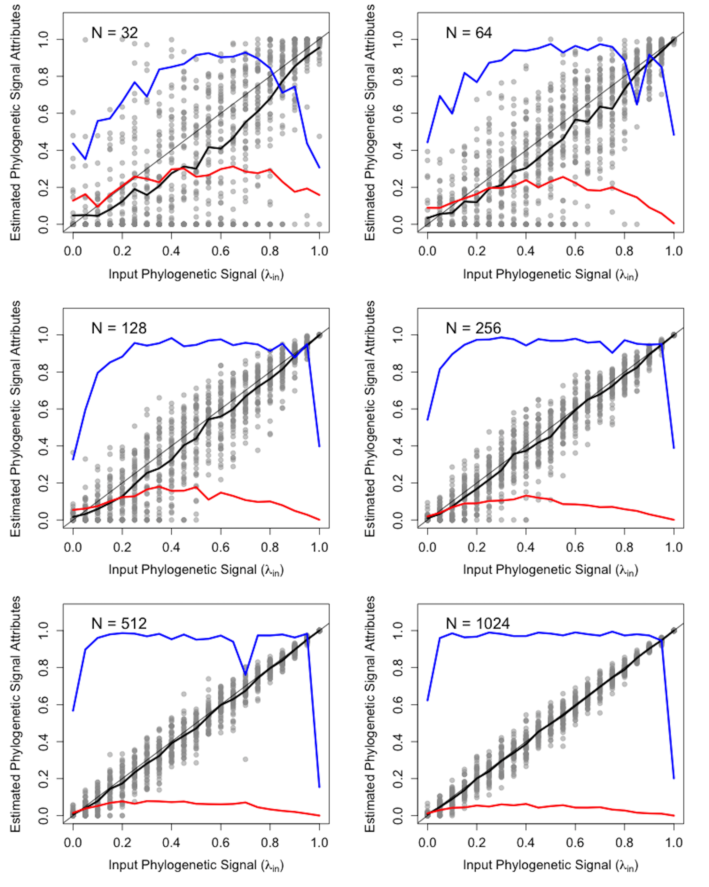
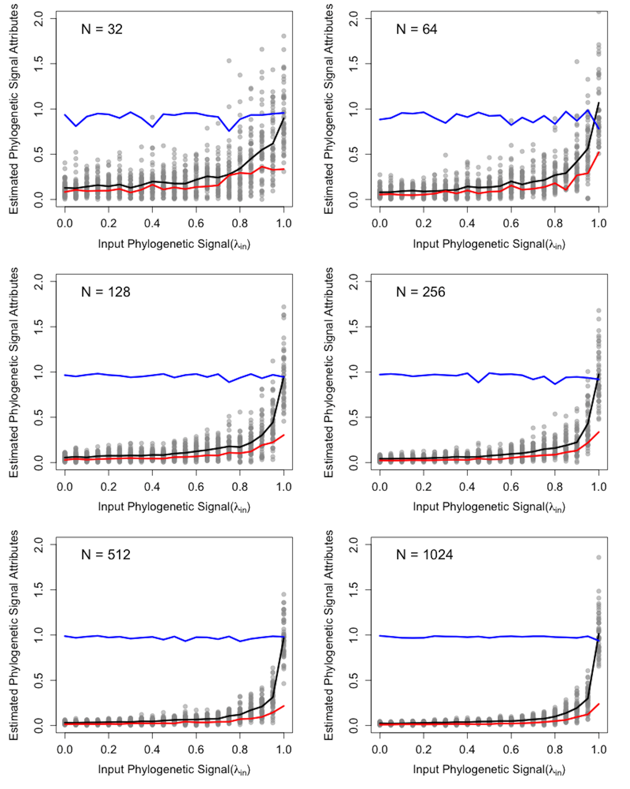
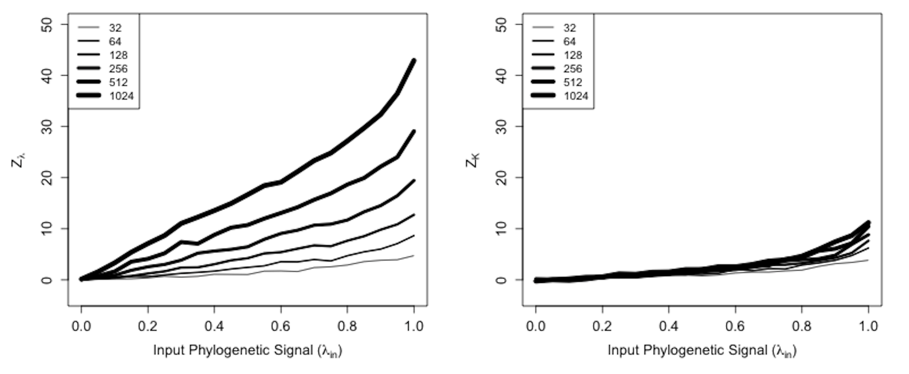
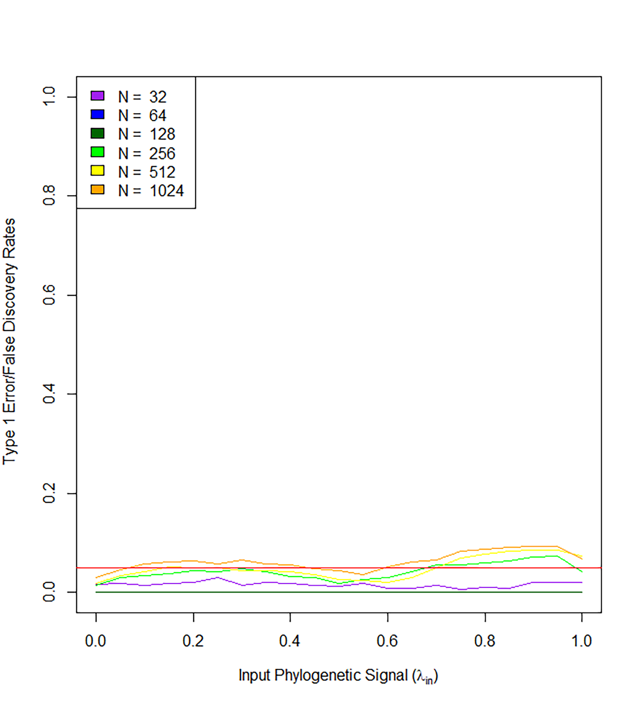
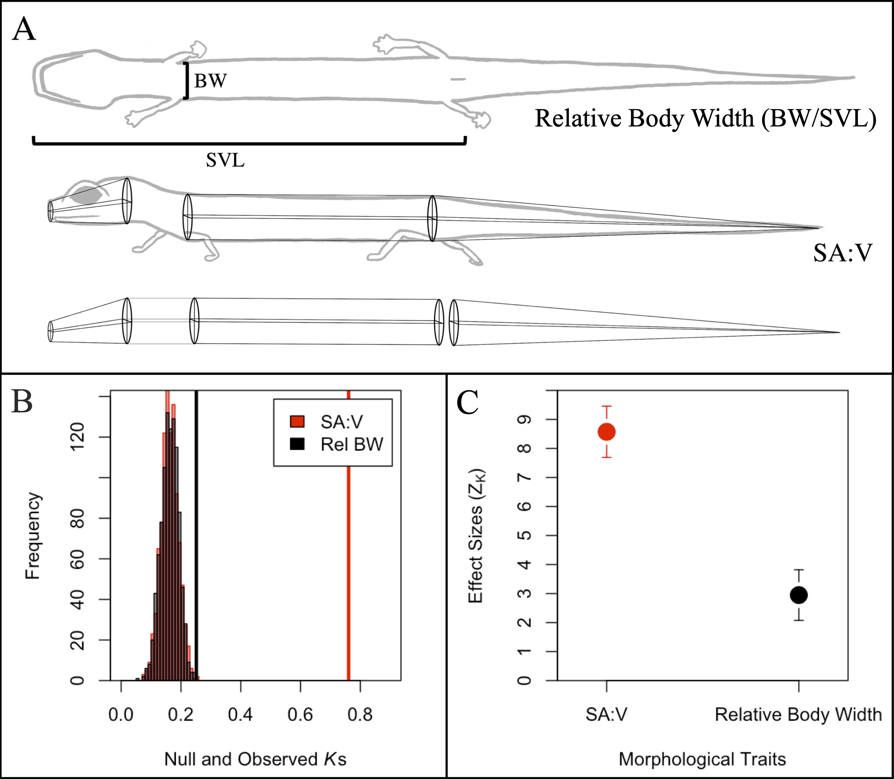

\begin{center}
\textbf{Dean C. Adams$^{1,*}$, Erica K. Baken$^{1,2}$, and Michael L. Collyer$^2$}
\end{center}

\begin{center}`r format(Sys.time(), '%d %B, %Y')`\end{center}

$^{1}$Department of Ecology, Evolution, and Organismal Biology, Iowa State University, Ames, Iowa, USA.

$^{2}$Department of Science, Chatham University, Pittsburgh, Pennsylvania, USA. 

$^{*}$Correspondence: Dean C. Adams <dcadams@iastate.edu> 
\hfill\break

**Keywords**: phylogenetic signal, macroevolution, lambda, kappa \hfill\break

**Short Title**: Effect size for phylogenetic signal \hfill\break

```{r setup, include=FALSE}
  library(knitr)
  knitr::opts_chunk$set(echo = TRUE)
```

```{r, include = FALSE}
library(stringr)
library(tidyverse)

RmdWords <- function(file) {

  # Creates a string of text
  file_string <- file %>%
    readLines() %>%
    paste0(collapse = " ") %>%
    # Remove YAML header
    str_replace_all("^<--- .*?--- ", "") %>%    
    str_replace_all("^--- .*?--- ", "") %>%
    # Remove code
    str_replace_all("```.*?```", "") %>%
    str_replace_all("`.*?`", "") %>%
    # Remove LaTeX
    str_replace_all("[^\\\\]\\$\\$.*?[^\\\\]\\$\\$", "") %>%
    str_replace_all("[^\\\\]\\$.*?[^\\\\]\\$", "") %>%
    # Deletes text between tags
    str_replace_all("TC:ignore.*?TC:endignore", "") %>%
    str_replace_all("[[:punct:]]", " ") %>%
    str_replace_all("  ", "") %>%
    str_replace_all("<", "") %>%
    str_replace_all(">", "")

  # Save several different results
  word_count <- str_count(file_string, "\\S+")
  char_count <- str_replace_all(string = file_string, " ", "") %>% str_count()

   return(list(num_words = word_count, num_char = char_count, word_list = file_string))
}

words <- RmdWords("2020-MEE-Adams_et_al-Physignal.Rmd")
```

**Research Article:** 

```{r, echo = FALSE}
count <- c(words = words$num_words, characters = words$num_char)
knitr::kable(t(count))
```

**Author Contributions**:  DCA conceived the original idea for this manuscript, and DCA, EKB, and MLC collaboratively developed the concept and contributed to all portions of this manuscript. All authors approve of the final product and are willingly accountable for any portion of the content.\hfill\break

**Data Archiving**: Empirical data used in this paper are available on DRYAD (associated with original articles). R-scripts for simulation tests are found at: https://github.com/deanadams/PhySigCompareZ. Computer code for implementing the two-sample comparison of effect sizes is found in geomorph (**upon article acceptance**): https://cran.r-project.org/web/packages/geomorph/index.html \hfill\break

**Acknowledgments**: We thank E. Glynne and B. Juarez for comments on early drafts of the manuscript. This work was sponsored in part by National Science Foundation Grants DBI-1902511 (to DCA) and DBI-1902694 (to MLC). The authors have no known conflicts of interest.

\newpage

\setcounter{section}{0}  

# Abstract {-}

1. Macroevolutionary studies frequently characterize the phylogenetic signal in phenotypes, however, analytical tools for comparing the strength of that signal across traits remain largely underdeveloped. 

2. In this paper, we evaluate the efficacy of Pagel's $\lambda$ to correctly estimate the strength of phylogenetic signal in phenotypic traits across a range of input values. We find that $\lambda$ behaves as a Bernoulli random variable, where estimates are increasingly skewed at larger and smaller input levels of phylogenetic signal. Further, the precision of $\lambda$ varies with input signal. 

3. Another measure, Blomberg's *K*, is more consistent across a range of tree sizes, and exhibits a positive relationship with input levels of phylogenetic signal. However, that relationship is decidedly nonlinear. Thus, neither $\lambda$ nor *K* are suitable as effect sizes for measuring the strength of phylogenetic signal, and comparing that signal across datasets. 

4. As an alternative, we propose a standardized effect size based on *K*, ($Z_K$), which measures the strength of phylogenetic signal more reliably than does $\lambda$, and places that signal on a common scale for statistical comparison. We develop tests based on $Z_K$ to provide a mechanism for formally comparing the strength of phylogenetic signal across datasets, in much the same manner as effect sizes may be used to summarize patterns in quantitative meta-analysis. 

5. Our approach extends the phylogenetic comparative toolkit to address hypotheses that compare the strength of phylogenetic signal between various phenotypic traits, even when those traits are found in different evolutionary lineages or have different units or scales.
 
\newpage

# Introduction

Investigating macroevolutionary patterns of trait variation requires a phylogenetic perspective, because the shared ancestry of species violates the assumption of independence among trait values that is common for statistical tests [@Felsenstein1985; @HarveyPagel1991]. Accounting for this evolutionary non-independence is the purview of *phylogenetic comparative methods* (PCMs): a suite of analytical tools that condition the data by the phylogenetic relatedness of observations [@Grafen1989; @GarlandIves2000; @Rohlf2001; @MartinsHansen1997; @OMeara_et_al2006;  @Beaulieu_et_al2012; @Adams2014b; @AdamsCollyer2018b]. PCMs are predicated on the notion that phylogenetic signal -- the tendency for closely related species to display similar trait values -- is present in cross-species datasets [@Felsenstein1985; @Pagel1999; @Blomberg_et_al2003]. Indeed, under numerous evolutionary models, phylogenetic signal is expected, as stochastic character change along the hierarchical structure of the tree of life generates trait covariation among taxa [@Felsenstein1985; @Blomberg_et_al2003; @Revell_et_al2008]. \hfill\break

Several analytical tools have been developed to quantify phylogenetic signal in phenotypic datasets [@Abouheif1999; @Gittleman1990; @Blomberg_et_al2003; @Adams2014a; @Pagel1999; @Klingenberg2010], and their statistical properties -- namely type I error rates and statistical power -- have been investigated to determine under what conditions phylogenetic signal can be detected [@Munkemuller_et_al2012; @Pavoine2012;  @DinizFilho2012; @Adams2014a; @MolinaVenegas2017; @Revell_et_al2008; @Revell2010; @Boettiger_et_al2012]. One of the most widely used methods for characterizing phylogenetic signal is Pagel's $\lambda$ [@Pagel1999], which transforms the lengths of the internal branches of the phylogeny to improve the fit of data to the phylogeny via maximum likelihood [@Pagel1999; @Freckleton_et_al2002]. When incorporated in PGLS, $\lambda$ serves as a tuning parameter which is optimized via log-likelihood profiling while evaluating the covariation between the dependent and independent variables, given the phylogeny [@Pagel1999; @Freckleton_et_al2002]. To infer whether phylogenetic signal differs from no signal or a Brownian motion (BM) model of evolutionary divergence, the observed model fit using $\hat\lambda$ may be statistically compared to that using  $\lambda=0$ or $\lambda=1$ via likelihood ratio tests [@Freckleton_et_al2002; @Cooper2010; @Bose2019] or confidence limits [@Vandelook2019]. \hfill\break

Another widely used measure is Blomberg's *K* [@Blomberg_et_al2003], which characterizes phylogenetic signal as the ratio of observed trait variation to the amount of variation expected under Brownian motion. Blomberg's *K* can be treated as a test statistic by employing a permutation test to generate its sampling distribution [@Blomberg_et_al2003; @Adams2014a] for determining whether significant phylogenetic signal is present in data. Both $\lambda$ and *K* seem intuitive to interpret, as a value of $0$ for both corresponds to no phylogenetic signal, while a value of $1$ corresponds to the amount of phylogenetic signal expected under Brownian motion. Thus, it is tempting to regard both $\lambda$ and *K* as descriptive statistics that measure the relative strength of phylogenetic signal, providing an estimate of its magnitude for comparison. \hfill\break

The appeal of Pagel's $\lambda$ and Blomberg's *K* as descriptive statistics is that they provide a basis for interpreting "weak" versus "strong" phylogenetic signal; i.e., small versus large values of $\hat{\lambda}$ or *K*, respectively, in a comparative sense [@DeMeester2019; @Pintanel2019;@Su2019]. Nonetheless, an important question that has yet to be considered is whether such comparisons are analytically appropriate, and whether these statistics are, or can be, converted to effect sizes for comparative analyses across datasets. To be statistics representing phylogenetic signal, they should have reliable distributional properties, which could be revealed with simulation experiments. For instance, as a proportional random variable bounded by $0$ and $1$, we might expect that $\hat{\lambda}$ is a random variable that follows the distribution of a Bernoulli probability parameter [@Forbes2011]; i.e., branch lengths in a tree are scaled proportionally to the probability that data arise from a BM process. Given a known $\lambda$ value used to generate random data on a tree, we would also expect  that the mean of an empirical sampling distribution of $\hat{\lambda}$ would approximately equal $\lambda$; the dispersion of $\hat{\lambda}$ would be largest at intermediate values of $\lambda$, $\hat{\lambda}$ would be predictable over the range of $\lambda$ with respect to tree size; the distribution of $\hat{\lambda}$ would be symmetric at intermediate values of $\lambda$ and more skewed toward values of 0 or 1; and that the distribution of $\hat{\lambda}$ would be more platykurtic at intermediate values of $\lambda$, becoming more leptokurtic toward 0 and 1 [@Forbes2011]. Prior work [@Munkemuller_et_al2012] seems to support some of these conjectures, based superficially on statistical moments for a given tree size (mean, variance, skewness, and kurtosis; see Fig. 2 of ref. [@Munkemuller_et_al2012]). However, because the "strength of Brownian motion" was simulated as a varied weighted-average of data simulated on trees with $\lambda=0$ and $\lambda=1$ and not as prescribed values of $\lambda$ [@Munkemuller_et_al2012], interpretation of these patterns is challenging. \hfill\break

By contrast, for Blomberg's *K*, which is positively unbounded, we might expect that for any $\lambda$ used to generate data, estimates of *K* might be a random variable that follows a normal distribution, with values distributed symmetrically [@Forbes2011]. This attribute seemed less reasonable based on the simulations performed by Münkemüller et al. [-@Munkemuller_et_al2012], which suggested that distributions were positively skewed and that Blomberg's *K* might not behave as a statistic that follows a normal distribution. However, because their simulations used a weighted combination of simulated phylogenetic signal strengths, strong inferences are not possible (and distributional attributes were not the intended result of their simulations). Thus, for both Pagel's $\lambda$ or Blomberg's *K*, evaluation of statistical moments across a range of $\lambda$ used to generate data would be valuable for adjudicating the reliability of these statistics as effect sizes.  Furthermore, the expected values of these statistics appear to vary with tree size [@Munkemuller_et_al2012], making comparisons across studies challenging. Therefore, transformation of these statistics into $Z$-scores would allow evaluation of the efficacy of each statistic to yield effect sizes that could be used for comparisons of the strength of phylogenetic signal across traits and lineages. \hfill\break

Here we use simulation experiments to compare the distributional attributes of $\hat{\lambda}$ and *K*, plus their effect sizes ($Z$-scores), across a range of tree size and phylogenetic signal strength.  We find that estimates of $\hat{\lambda}$ are increasingly skewed at larger and smaller input levels of phylogenetic signal and at smaller tree sizes, vary widely for a given input value of $\lambda$, and that the precision of $\hat{\lambda}$ is not constant across its range. By contrast, estimates of *K* are more consistent across tree sizes, and are normally distributed across the range of input levels of $\lambda$, making *K* a more reliable statistic. However, the relationship between *K* and input levels of phylogenetic signal is decidedly nonlinear. Thus, neither $\lambda$ nor *K* are suitable as effect sizes for measuring the strength of phylogenetic signal. As an alternative, we propose an effect size based on *K*, ($Z_K$), which provides consistent estimates of the strength of phylogenetic signal across tree sizes and signal strength. Further, because $Z_K$ places that phylogenetic signal on a common scale, it facilitates statistical comparisons of the relative strength of phylogenetic signal across datasets. We propose a two-sample statistic ($\hat{Z}_{12}$) to accomplish this task, and show that it displays appropriate levels of type I error and model misspecification. An empirical example is then provided to illustrate its use.

# Simulation methods and results

Methods for characterizing phylogenetic signal were evaluated by computer simulation. Briefly, simulations were conducted by generating pure-birth phylogenies at each of six different tree sizes ($n=2^5, 2^6, \cdots, 2^{10}$), and with differing levels of phylogenetic signal ($\lambda=0.0, 0.5, \cdots, 1.0$). We generated 50 random trees for each intersection of tree size and $\lambda$. For each $\lambda$ within each tree size, continuous traits were then simulated on each phylogeny under a BM model of evolution. For each set of 50 trees we measured the mean values of $\hat{\lambda}$ and *K*, their standard deviation, and calculated the Shapiro-Wilk $W$ statistic as a departure from normality (symmetry). For the latter, a value of $1.0$ indicates normally distributed values, while departures from $1.0$ indicate skewness. Simulations were then repeated for both balanced and pectinate trees, which yielded qualitatively similar results (see Supporting Information). Trees containing polytomies, and an evaluation of $\hat{\lambda}$ from models of linear regression and phylogenetic ANOVA, were also investigated, and results were qualitatively similar to those reported above (see Supporting Information). \hfill\break


## Lambda ($\lambda$) estimates of phylogenetic signal are inaccurate

Computer simulations reveal that for $\hat{\lambda}$, the distributional expectations of a Bernoulli variable were mostly upheld. First, the mean value of $\hat{\lambda}$ increases as $\lambda$ increases. Second, the precision in estimating $\lambda$ varies across the range of input values, as the standard deviation of $\hat{\lambda}$ is largest at intermediate values of $\lambda$ and smallest at extreme values (Fig.1 red line). Third, the distributions of $\hat{\lambda}$ tend toward normal distributions at intermediate levels of $\lambda$ but become increasingly skewed at more extreme values of $\lambda$ (Fig. 1 blue line). For small tree sizes, it is also clear that distributions are more platykurtic at intermediate values of $\hat{\lambda}$.  However, the mean value of $\hat{\lambda}$ is negatively-biased (particularly for small tree sizes but also consistently across most of its range; Fig. 1 black line) and standard deviations of $\hat{\lambda}$ are negatively associated with tree size.  For tress of 128 species or less, $\hat{\lambda}$ are quite variable, except for cases when $\lambda$ is near or equal to $1$. Taken together these results reveal that $\hat\lambda$ is a biased statistic that inconsistently estimates  phylogenetic signal, both across tree sizes and across the range of input values. Additional simulations (Supporting Information) reveal that incorporating $\hat\lambda$ in PGLS ANOVA and regression does not adversely affect the statistical properties of PGLS parameter estimation or model evaluation (type I error, power, bias in coefficients). Thus, it is reasonable to incorporate $\hat\lambda$ in PGLS as a parameter for tuning the degree of phylogenetic signal in the dependent variables during the analysis. However, the statistical properties shown in Fig. 1 demonstrate that $\lambda$ is unsuitable as an effect size for measuring the strength of phylogenetic signal in data, and thus $\lambda$ should not be used for comparing phylogenetic signal across datasets.  

## Kappa (*K*) estimates of phylogenetic signal are more reliable 

Simulation results demonstrate that *K* displays better statistical properties. First, as expected, mean values of *K* increase with increasing signal ($\lambda$) irrespective of tree size, albeit non-linearly (Fig. 2 black line). Second, the standard deviation of *K* is consistent across tree sizes (Fig. 2 red line), and while it increases with $\lambda$, it is always less than the mean (low coefficient of variation). This finding is perhaps unsurprising, as *K* is lower-bounded by 0, and is never large for small values of $\lambda$. Importantly, *K* is normally distributed across the range of input $\lambda$; a consistent pattern regardless of tree size (Fig. 2 blue line). This differs from results of [@Munkemuller_et_al2012], where the skewing appears to be due to combining random values generated independently, rather than being a property of *K* itself. Overall, these findings reveal that while *K* is more reliable as an estimate of phylogenetic signal, the non-linear scaling with input signal implies that it should not be considered an effect size that measures the strength of phylogenetic signal on a common scale for comparison across datasets.

## Effect sizes from *K* ($Z_K$) better characterize phylogenetic signal 

To measure the strength of phylogenetic signal on a common scale, we propose effect sizes (Z-scores) for both $\lambda$ and *K*. Statistically, a standardized effect size may be found as: 

\begin{align}
    Z_{\theta}=\frac{\theta_{obs}-E(\theta)}{\sigma_\theta}
\end{align}

where $\theta_{obs}$ is the observed test statistic, $E(\theta)$ is its expected value under the null hypothesis, and $\sigma_\theta$ is its standard error [@Glass1976; @Cohen1988;@Rosenthal1994]. Typically, $\theta_{obs}$ and $\sigma_\theta$ are estimated from the data, while $E(\theta)$ is obtained from the distribution of $\theta$ derived from parametric theory. However, recent advances in resampling theory [@Collyer_et_al2015a;@AdamsCollyer2016; @CollyerAdams2018;@AdamsCollyer2019b] have shown that $E(\theta)$ and $\sigma_\theta$ may also be obtained from an empirical sampling distribution of $\theta$ simulated from permutation procedures. \hfill\break

Formalizing the suggestion of Adams and Collyer [@AdamsCollyer2019],  an effect size for *K* may be found as:

\begin{align}
    Z_K=\frac{K_{obs}-\hat\mu_{K}}{\hat\sigma_{K}},
\end{align}

where $K_{obs}$ is the observed phylogenetic signal, and $\hat\mu_K$ and $\hat\sigma_K$ are the mean and standard deviation of the empirical sampling distribution of *K* obtained via permutation. The empirical sampling distribution of *K* can be first transformed via a Box-Cox transformation to better adhere to the assumption of normality. \hfill\break

For $\lambda$, deriving an effect size is more challenging, as $\lambda$ does not have a sampling distribution from which the standard error and confidence intervals may be obtained, and estimates from the Hessian matrix from PGLS are unreliable [@Boettiger_et_al2012]. Confidence intervals are therefore generated for the values of $\lambda$ that intersect the log-likehihood profile for corresponding percentiles of the $\chi^2$ distribution used to compare the putative model to a null model with $\lambda = 0$ [@Orme2013]. Thus, an effect size for $\lambda$ may be found as:

\begin{align}
   \lvert Z_{\lambda} \rvert = \sqrt{\chi^2_{\hat{\lambda}}}
\end{align}

where, $\hat{\lambda}$ is the maximized likelihood value of $\lambda$ and $\chi^{2}_{\hat{\lambda}}$ is the likelihood ratio statistic for the value. \hfill\break

Simulations reveal that both $Z_{\lambda}$ and $Z_K$ are associated with input phylogenetic signal ($\lambda$), indicating that both statistics capture the observed signal (Fig. 3). However, effect sizes from $\hat{\lambda}$ made little sense, as they are more strongly associated with tree size than they are with the actual phylogenetic signal in the data (Fig. 3). By contrast, $Z_K$ is much more consistent across tree sizes, and increases more linearly with increasing levels of phylogenetic signal. Additionally, $Z_K$ exhibits a much stronger association with phylogenetic signal strength as compared to tree size (Fig. 3), and its standard deviation is more consistent, implying similar levels of precision across the range of input signal (Supporting Information). Thus, $Z_K$ is a more reliable measure of the strength of phylogenetic signal, and may be used to compare levels of phylogenetic signal across datasets. 

## A test statistic ($\hat{Z}_{12}$) allows meaningful comparisons across datasets

To statistically compare the strength of phylogenetic signal across datasets we propose a two-sample test statistic ($\hat{Z}_{12}$). Based on statistical theory, a two-sample test statistic may be calculated as: 

\begin{align}
  \hat{Z}_{12}=\frac{\lvert{(K_{1}-\hat\mu_{K_1})-(K_{2}-\hat\mu_{K_2})}\rvert}{\sqrt{\hat\sigma^2_{K_1}+\hat\sigma^2_{K_2}}} 
\end{align}

where $K_1$, $K_2$, $\hat\mu_{K_1}$, $\hat\mu_{K_2}$, $\hat\sigma_{K_1}$, and $\hat\sigma_{K_2}$ are as defined above. Estimates of significance of $\hat{Z}_{12}$ may be obtained from a standard normal distribution, or permutation. Typically, $\hat{Z}_{12}$ is considered a two-tailed test, however directional (one-tailed) tests may be specified should the empirical situation require it [@AdamsCollyer2016; @AdamsCollyer2019b]. \hfill\break

We evaluated the type I error and false discovery rates of tests based on $\hat{Z}_{12}$ using a procedure similar to that above. Simulations were performed using pure-birth trees of different sizes ($n=2^5, 2^6, \cdots, 2^{10}$), and with differing levels of phylogenetic signal ($\lambda=0.0, 0.5, \cdots, 1.0$). For each combination of $n$ and $\lambda$, a total of 100 traits were simulated on pure-birth trees (50 traits per tree) under a Brownian motion model of evolution. Next, the phylogenetic signal between traits was compared in pairwise fashion for all combinations of traits, using $\hat{Z}_{12}$. The proportion of significant results provided an estimate of the type I error or false discovery rate. Specifically, type I error was evaluated when traits were simulated using no input phylogenetic signal (i.e., $\lambda = 0$). Likewise, false discovery rates were evaluated for data simulated with some known, but equal, level of phylogenetic signal (i.e., $\lambda > 0$). \hfill\break

Tests revealed that across simulation conditions, the average type I error of $\hat{Z}_{12}$ was approximately 0.05 (Fig. 4). Likewise, false discovery rates were also low, and were at or below the nominal 5% level (Fig. 4). Importantly, the statistical performance of $\hat{Z}_{12}$ appears unaffected by phylogeny size. Overall, these results reveal that tests based on $\hat{Z}_{12}$ have acceptable type I error and false discovery rates. Therefore, $\hat{Z}_{12}$ is an appropriate statistic for comparing the degree of phylogenetic signal across traits. 

# Empirical example

To demonstrate the utility of $\hat{Z}_{12}$, we compared  $Z_K$ for two ecologically-relevant traits in plethodontid salamander (Fig. 5): surface area to volume ratios (SA:V) and relative body width ($\frac{BW}{SVL}$) [@Baken2019; @Baken2020]. For this example, surface area to volume ratios (SA:V) and relative body width ($\frac{BW}{SVL}$) measures were obtained from individuals of 305 species, from which species means were obtained [@Baken2019; @Baken2020]. A time-dated molecular phylogeny for the group [@Bonett2017] was pruned to match the species in the phenotypic dataset. The phylogenetic signal in each trait was then characterized using *K*, which was converted to its effect size ($Z_K$) using `geomorph` 3.3.1 [@AdamsOtarola2013; @AdamsGeomorph], and routines by the authors (**to be incorporated in `geomorph` upon acceptance**). \hfill\break

While both traits contained significant phylogenetic signal, tests based on $\hat{Z}_{12}$ revealed that the degree of phylogenetic signal was significantly stronger in SA:V ($\hat{Z}_{12}=16.51$; $P< 0.00001$: Fig. 5). Biologically, this observation may be interpreted by the fact that the tropical species -- which form a monophyletic group within plethodontids -- display greater variation in SA:V, which covaries with disparity in their climatic niches [@Baken2020]. Thus, greater phylogenetic signal in SA:V is to be expected.

# Discussion

It is common in comparative evolutionary studies to characterize the phylogenetic signal in phenotypic traits to determine the extent to which shared evolutionary history has generated trait covariation among taxa. However, while numerous analytical approaches may be used to quantify phylogenetic signal [e.g., @Abouheif1999; @Gittleman1990; @Blomberg_et_al2003; @Adams2014a; @Pagel1999], methods that explicitly measure the strength of phylogenetic signal, or facilitate comparisons among datasets, have remained underdeveloped. We evaluated the precision of one common measure, Pagel's $\lambda$, and explored its efficacy for characterizing the strength of phylogenetic signal in phenotypic data. Using computer simulations, we found that $\lambda$ behaves as a Bernoulli random variable, with estimates that are increasingly skewed at larger and smaller input levels of phylogenetic signal. Further, the precision of $\lambda$ in estimating actual levels of phylogenetic signal varies with both tree size (see also ref. @Boettiger_et_al2012) and input levels of phylogentetic signal. From these findings we conclude that $\lambda$ is not a reliable indicator of the observed strength of phylogenetic signal in phenoytpic datasets, and should not be used as an effect size for comparing the degree of phylogenetic signal between datasets. \hfill\break

As an alternative, we described a standardized effect size ($Z$) for assessing the strength of phylogenetic signal. $Z$ expresses the magnitude of phylogenetic signal as a standard normal deviate, which is easily interpretable as the strength of phylogenetic signal relative to the mean. We applied this concept to both $\lambda$ and *K*, and found that $Z_K$ was a better estimate of the strength of phylogenetic signal in phenotypic data. First, values of $Z_K$ more accurately tracked known changes in the magnitude of phylogenetic signal, as demonstrated by the near linear relationship between $Z_K$ and input signal. Additionally, the precision of $Z_K$ was more consistent across the range of input levels of phylogenetic signal (Fig S1; Supporting Information). Thus, $Z_K$ is a more reliable measure of the relative strength of phylogenetic signal, and places that effect on a common and comparable scale. We therefore recommend that future studies interested in evaluating the strength of phylogenetic signal incorporate $Z_K$ as a statistical measure of this effect. \hfill\break

Next we proposed a two-sample test ($\hat{Z}_{12}$), which provides a formal statistical procedure for determining whether the strength of phylogenetic signal is greater in one phenotypic trait as compared to another. Prior studies have summarized patterns of variation in phylogenetic signal across datasets using summary test values, such as *K* [e.g.,  @Blomberg_et_al2003]. However, because *K* does not scale linearly with input levels of phylogenetic signal (Fig. 2), and its variance increases with increasing strength of phylogenetic signal [@Munkemuller_et_al2012; @DinizFilho2012], it should not be considered an effect size that measures the strength of phylogenetic signal on a common scale. By contrast, standardizing *K* to $Z_K$ via equation 2 alleviates these concerns, and facilitates formal statistical comparisons of the strength of signal across datasets. Thus when viewed from this perspective, the approach developed here aligns well with other statistical approaches such as meta-analysis [sensu @HedgesOlkin1985; @Glass1976; @Arnqvist1995], where summary statistics across datasets are converted to standardized effect sizes for subsequent "higher order" statistical summaries or comparisons. As such, our approach enables evolutionary biologists to quantitatively examine the relative strength of phylogenetic signal across a wide range of phenotypic traits, and thus opens the door for future discoveries that inform on how phenotypic diversity accumulates in macroevolutionary time across the tree of life. \hfill\break

One important advantage of the approach advocated here is that the resulting effect sizes ($Z_K$) are dimensionless, as the units of measurement cancel out during the calculation of $Z$ [@SokalRohlf2012]. Thus, $Z_K$ represents the strength of phylogenetic signal on a common and comparable scale -- measured in standard deviations -- regardless of the initial units and original scale of the phenotypic variables under investigation. This means that the strength of phylogenetic signal may be compared across datasets for continuous phenotypic traits measured in different units and scale, because those units have been standardized through their conversion to $Z_K$. For example, our approach could be utilized to determine whether the strength of phylogenetic signal (say, in response to ecological differentiation) is stronger in morphological traits (linear traits: $mm$), physiological traits (metabolic rate: $\frac{O^2}{min}$), or behavioral traits (aggression: $\frac{\#{displays}}{second}$). In fact, our empirical example provided just such a comparison, as SA:V is represented in $mm^{-1}$ while relative body size is a unitless ratio ($\frac{BW}{SVL}$). Additionally, our method  is capable of comparing the strength of phylogenetic signal in traits of different dimensionality, as estimates of phylogenetic signal using *K* have been generalized for multivariate data [$\kappa_{mult}$: see @Adams2014a]. Furthermore, tests based on $\hat{Z}_{12}$ may be utilized for comparing the strength of phylogenetic signal among datasets containing a different number of variables, and even for phenotypes obtained from species in different lineages, because their phylogenetic non-independence and observed variation are taken into account in the generation of the empirical sampling distribution via permutation. \hfill\break

This study is not the first to compare $\lambda$ and *K* for their ability as statistics to measure phylogenetic signal.  Our results for $\lambda$ and *K* values are consistent with those found in the simulations performed by Münkemüller et al. [-@Munkemuller_et_al2012], but that study investigated type I error rates and statistical power, finding that $\lambda$ performed better in both regards, irrespective of species number in trees.  Although not the central focus of their study, the same tendency for variable $\lambda$ and consistent *K* at intermediate phylogenetic signal strengths was observed (Fig. 2 of ref. [@Munkemuller_et_al2012]). Recent work by Molina-Venegas and Rodríguez [-@MolinaVenegas2017] found that *K* but not $\lambda$ tended to inflate the estimate of phylogenetic signal, leading to moderate type I and type II biases, if polytomic chronograms were used.  Their work more thoroughly addressed previous observations of inflated *K* for incompletely resolved phylogenetic trees [@Davies2012; @Munkemuller_et_al2012].  An interesting question is whether an inflated *K* value leads to an inflated $Z_K$ or does a tendency of a particular tree to inflate estimates of *K* also inflate the values in random permutations of a test, in which case $Z_K$ is robust to polytomies?  We repeated the analyses in Figs. 1 & 2, adjusting trees to have 20% collapsed nodes, per the technique of Molina-Venegas and Rodríguez [-@MolinaVenegas2017], and found results were consistent (Supporting Information).  This confirms that any tendency of incompletely resolved trees to inflate *K* as a descriptive statistic does not inflate $Z_K$ as an effect size. Furthermore, because comparison of effect sizes in a test is a comparison of locations of observed values in their sampling distributions, which would shift concomitantly because of this tendency, the $Z_{12}$ test statistic in equation 4 appears to be robust in spite of unresolved trees.  \hfill\break

Phylogenetic signal can be thought of as both an attribute to be measured in the data and a parameter that can be tuned to account for the phylogenetic non-independence among observations, for analysis of the data.  As such, $\lambda$ is appealing, as a statistic that potentially fulfills both roles.  However, the inability to estimate phylogenetic signal with $\lambda$ for data simulated with known phylogenetic signal is troublesome, and we recommend evolutionary biologists refrain from viewing it as a statistic to describe the amount of phylogenetic signal in the data.  Interestingly, *K* -- when standardized to an effect size $Z_K$ -- is a better statistic for measuring the amount of phylogenetic signal in data simulated with respect to known levels of $\lambda$.  Although $\lambda$ might be viewed as an important parameter for modifying the the conditional estimation of linear model coefficients with respect to phylogeny, it is neither a statistic that has meaningful comparative value as a measure of phylogenetic signal nor a statistic that lends itself well to reliable calculation of a test statistic.  By contrast, *K* has been shown here to be a reliable statistic, but only when standardized by the mean and standard deviation of its empirical sampling distribution (i.e., when converted to the effect size, $Z_K$).  Because one has control over the number of permutations used in analysis, one can be assured with many permutations that the empirical sampling distribution is representative of true probability distributions [@AdamsCollyer2018b].  Given the greater consistency in estimates of $Z_K$ across tree sizes and input signal, it is difficult to imagine a hypothesis test that can improve equation 4 for efficiently comparing phylogenetic signal for different traits, different trees, or a combination of both.

\newpage

# References {-}

 \setlength{\parindent}{-0.25in}
 \setlength{\leftskip}{0.25in}
 \setlength{\parskip}{8pt}
 \noindent
 
<div id="refs"></div>

\newpage

# Figures

Figure 1. Response of Pagel's $\lambda$ to increasing strength of Brownian motion. Gray line signifies the 1:1 line where the input value matches the estimate $\hat\lambda$. At each input level, the dark black line represents the empirically derived expected value (mean) of $\hat\lambda$, the red line is the standard deviation of $\hat\lambda$, and the blue line is Shapiro Wilks statistic of $\hat\lambda$ ($W=1.0$ signifies normality, $W< 1.0$ represent skewed distributions).  \hfill\break

Figure 2. Response of Blomberg's $K$ to increasing strength of Brownian motion.  At each input level, the black line represents the empirically derived expected value (mean) of $K$, the red line is the standard deviation of *K*, and the blue line is Shapiro Wilks statistic of $K$ ($W=1.0$ signifies normality, $W< 1.0$ represent skewed distributions). \hfill\break

Figure 3. Response of effect sizes $Z_\lambda$ and $Z_K$ to increasing strength of Brownian motion.  Means from simulation runs are shown for comparative ease. Individual values from each simulation run are available in Supporting Information. \hfill\break

Figure 4. Type I error rates and model misspecification for $\hat{Z}_{12}$. Type I error is found on the far-left of the plot ($\lambda = 0$).

Figure 5. (A) Linear measures for relative body size, and regions of the body used to estimate surface area to volume (SA:V) ratios. (B) Permutation distributions of phylogenetic signal for SA:V and $\frac{BW}{SVL}$, with observed values shown as vertical bars. (C) Effect sizes ($Z_K$) for SA:V and $\frac{BW}{SVL}$, with their 95% confidence intervals (CI not standardized by $\sqrt(n)$). \hfill\break

\newpage

```{r, echo = FALSE, out.width="100%", fig.cap = "Response of Pagel's $\\lambda$ to increasing strength of Brownian motion. Gray line signifies the 1:1 line where the input value matches the estimate $\\hat\\lambda$. At each input level, the dark black line represents the empirically derived expected value (mean) of $\\hat\\lambda$, the red line is the standard deviation of $\\hat\\lambda$, and the blue line is Shapiro Wilks statistic of $\\hat\\lambda$ ($W=1.0$ signifies normality, $W< 1.0$ represent skewed distributions). " }


```


```{r, echo = FALSE, out.width="100%", fig.cap = "Response of Blomberg's $K$ to increasing strength of Brownian motion.  At each input level, the black line represents the empirically derived expected value (mean) of $K$, the red line is the standard deviation of $K$, and the blue line is Shapiro Wilks statistic of *K* ($W=1.0$ signifies normality, $W< 1.0$ represent skewed distributions)."}


```


```{r, echo = FALSE, out.width="100%", fig.cap = "Response of effect sizes $Z_\\lambda$ and $Z_K$ to increasing strength of Brownian motion.  Means from simulation runs are shown for comparative ease. Individual values from each simulation run are available in Supporting Information."}


```

```{r, echo = FALSE, out.height="75%", fig.cap="Type I error rates and model misspecification for $\\hat{Z}_{12}$. Type I error is found on the far-left of the plot ($\\lambda = 0$)."}
  
```


```{r, echo = FALSE, out.width="90%", fig.cap = "(A) Linear measures for relative body size, and regions of the body used to estimate surface area to volume (SA:V) ratios. (B) Permutation distributions of phylogenetic signal for SA:V and $\\frac{BW}{SVL}$, with observed values shown as vertical bars. (C) Effect sizes ($Z_K$) for SA:V and $\\frac{BW}{SVL}$, with their 95\\% confidence intervals (CI not standardized by $\\sqrt(n)$)."}


```
