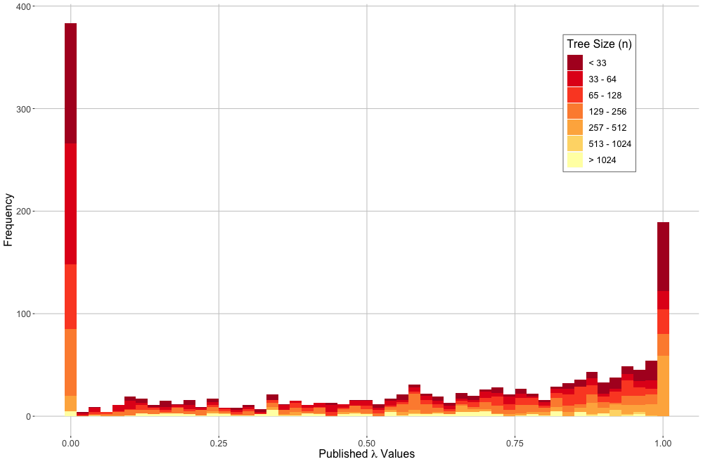

---
title:

output: 
  pdf_document:
    fig_caption: yes
    number_sections: no  #note: change to 'no' for most journals
    keep_tex: true
    pandoc_args:


csl: evolution.csl
bibliography: Lambda-Refs.bib

header-includes:
  - \usepackage{setspace}\doublespacing
  - \usepackage{lineno}\linenumbers

---
# Estimates of Phylogenetic Signal Based on Lambda are Often Inaccurate

\hfill\break

**Keywords**: Pagel's lambda, phylogenetic signal \hfill\break

**Short Title**: Inaccuracies in Pagel's Lambda \hfill\break

```{r setup, include=FALSE}
  library(knitr)
  knitr::opts_chunk$set(echo = TRUE)
```

# Abstract

{conclusion holds: interpreting the regression is not appreciably different (in terms of slopes and f values)}


\newpage


# Introduction
Investigating macroevolutionary patterns of trait variation requires a phylogenetic perspective, because the shared ancestry among species generates statistical non-independence [@Felsenstein1985; @HarveyPagel1991]. Accounting for this evolutionary non-independence is the purview of *phylogenetic comparative methods* (PCMs); a suite of analytical tools that condition the data on the phylogeny through the course of statisical evaluations of phenotypic trends [e.g., @Grafen1989; @GarlandIves2000; @Rohlf2001; @ButlerKing2004]. The past several decades have witnessed a rapid expansion in the development of PCMs to address an ever-growing set of macroevolutionary hypotheses [@MartinsHansen1997; @OMeara_et_al2006; @RevellHarmon2008; @Beaulieu_et_al2012; @Adams2014b; @Adams2014a; @AdamsCollyer2018b]. These methods are predicated on the notion that phylogenetic signal -- the tendancy for closely related species to display similar trait values -- is present in cross-species datasets [@Abouheif1999; @Pagel1999; @Blomberg_et_al2003; @Munkemuller_et_al2012]. Indeed, under numerous evolutionary models, phylogenetic signal is to be expected, as stochastic character change along the hierarchical structure of the tree of life generates trait covaration among related taxa [see @Felsenstein1985; @Blomberg_et_al2003; @Revell_et_al2008]. \hfill\break

In many macroevolutionary studies, it is often of interest to quantify the degree to which phylogenetic signal is displayed in continuous traits. Several analytical tools have been developed for this purpose [e.g., @Gittleman1990; @Abouheif1999; @Pagel1999; @Blomberg_et_al2003; @Klingenberg2010; @Adams2014a], which differ primarily in how they characterize the phylogenetic dependency of trait variation among taxa. One commonly used statistical measure, *Kappa* ($K$), expresses the strength of phylogenetic signal as the ratio of observed trait variation to the trait variation conditioned on the phylogeny; scaled by what is expected under Brownian motion given the phylogeny's size and shape [@Blomberg_et_al2003; also @Adams2014a]. Another approach, Pagel's $\lambda$ [@Pagel1999], uses maximum likelihood to fit the data to the phylogeny under some model of evolutionary change (typically Brownian motion). The inclusion of a scaling parameter, $\lambda$,  transforms the lengths of the internal branches of the phylogeny to improve the fit, and this parameter describes the degree of phylogenetic signal in the dataset [@Pagel1999; @Freckleton_et_al2002]. Pagel's $\lambda$ also has the advantage that it may be included when estimating the association of traits in a phylogenetic context, meaning that one may account for the degree of phylogenetic signal while conducting phylogenetic regression or ANOVA [see @Freckleton_et_al2002]. \hfill\break

Several studies have investigated the statistical properties of methods for estimating phylogenetic signal under various conditions [e.g., @Munkemuller_et_al2012; @Pavoine2012;  @DinizFilho2012; @MolinaVenegas2017; see also @Revell_et_al2008; @Revell2010]. These have largely focused on the ability of methods to detect the presence of phylogenetic signal (i.e., type I and type II error rates) under complex models of evolutionary change, across a range of phylogeny sizes, and with varying degrees of phylogenetic uncertainty or unresolved topologies. In terms of parameter estimation, Revell [-@Revell2010] confirmed that regression parameters were accurately estimated when $\lambda$ was included during phylogenetic regression, and Munkmuller et al. [-@Munkemuller_et_al2012] found that estimates of phylogenetic signal obtained using various measures generally increased when input levels of phylogenetic signal were stronger. However, the precision of those estimates could not be determined, because the input levels of phylogenetic signal were simulated via a scaling factor ($w$) that was not directly comparable to the measures of phylogenetic signal being compared [see @Munkemuller_et_al2012]. One study [@Boettiger_et_al2012] found that estimates of Pagel's $\lambda$ displayed less variation when data were simulated on a large phylogeny ($N=281$) as compared to a small one ($N=13$), concluding that insufficient data (i.e., the number of species) was the underlying cause of the lack of precision in parameter estimation. However, this conclusion assumes that parameter estimation remains equally precise across its range of values ($\lambda = 0 \to 1$); an assumption that to date, has not been investigated. Thus, despite widespread use of Pagel's [-@Pagel1999] $\lambda$ in macroevolutionary studies, at present, we still lack a general understanding of the precision with which $\lambda$ can estimate levels of phylogenetic signal in phenotypic datasets.  \hfill\break

In this study, we evaluate the precision of Pagel's $\lambda$ to estimate known levels of phylogenetic signal in phenotypic data. First we use computer simulations across differing numbers of species, and differing input levels of phylogenetic signal to explore when $\lambda$ captures known levels of phylogenetic signal, and under what circumstances. Additionally, we use simulations to determine how the inclusion of $\lambda$ in phylogenetic ANOVA and regression (i.e., PGLS) affects parameter estimation, and whether estimates of phylogenetic signal in PGLS are accurate. We then survey the recent macroevolutionary literature for published papers containing estimates of $\lambda$ from empirical datasets, and compare these empirical estimates to patterns gleaned from our computer simulations. In general we find that while PGLS parameters are accurately estimated with the inclusion of phylogenetic signal, estimates of $\lambda$ are not. Thus, empirical studies should interpret the degree of phylogenetic signal in phenotypic data with caution when using this parameter.  **something more?  Let's wait for final data to decide.**

# Methods and Results

## *Simulated trait*

To assess the accuracy of Pagel's lambda estimations, we simulated pure-birth phylogenies of variable size, ranging in tip number from 32 to 1024. We then scaled the simulated phylogenies by lambda values ranging from 0 to 1 (0.05 intervals; 50 trees per lambda value per tree size) with which we generated trait data with known lambdas by simulating a continuous variable on each scaled phylogeny under Brownian motion. We then estimated lambda values from these data using phylogenetic generalized least squares (PGLS)  to compare against the known lambda values. \hfill\break

To visualize the accuracy of the lambda estimation methods, we first plotted known lambdas (input lambdas) against the estimated lambdas (Figure 1). This plot demonstrates the rampant inaccuracy of estimating lambdas on phylogenies with fewer than 200 tips, as the spread of data in the upper panels in Figure 1 is remarkably wide. We also see that the widest spread of estimated lambdas is observed near the center of each plot corresponding to intermediate values of known lambda. Lastly, we see a slight tendency for the PGLS estimation methods to underestimate lambda, especially for known lambda values below 0.5 as can be seen by the numerous data points along the x axis for the smaller phylogenies analyzed (n tips < 200). \hfill\break

[insert Figure 1 here]

## *Simulated ANOVA and Regressions*

To measure the statistical performance of PGLS lambda estimation methods when applied to ANOVA and regression analyses, we used the above generated data (independent variables) to simulate a second set of trait variables (depedendent variables) across the range of correlation strengths (betas ranging from 0 to 1 at intervales of 0.25). We then used PGLS to estimate phylogenetic signal of the dependent variable and the slope coefficient for the regression between the dependent and independent variables. We also calculated F- and p-values from the regression analyses. Finally, we again fit the dependent variable to the independent variable while holding the lambda value at 0 to approximate an ordinary least squares (OLS) apprach. \hfill\break

We compared the estimated slope coefficients across variable input beta values to assess the ability of PGLS to identify significant correlations (Figure 2). All distribution groups center around the 1:1 relationship between input beta values and estimated slopes. However the variance around that mean is substantial, with estimates ranging from approximately -2 to 4 in datasets with 32 taxa and a known relationship of (beta = 1). This variance of the estimated slopes only becomes reasonable when phylogenies have over 200 tips, similarly to what we saw in the first simulation analysis in this study. \hfill\break

[insert Figure 2 here] \hfill\break 

Surprisingly, the estimated lambda values of the dependent variable do not correspond with input lambda values that characterize the independent variable (Figure S1). This disconnect then resulted in no appreciable difference of slope estimates across input lambda values (Figure S2), nor do we see substantial differences in slope estimates between the PGLS and OLS analyses (results not shown). Thus, we show that phylogenetic signal present in one variable does not translate to phylogenetic signal in a second, even highly correlated, dependent variable. \hfill\break

Scaling and trait generation procedures for all simulation methods were repeated with symmetrical and ladder phylogenies of variable size. Results generated using these variable phylogeny shapes were consistent with the pure-birth phylogeny results presented above and can be found in the Supplemental Materials. All analyses were performed in R v3.6.0 [@RCT] using the packages `geiger` [@Harmon2008] and `caper` [@Orme2013], and the corresponding scripts can be found in the Supplemental Materials. 

## *Meta-Analysis of Empirical Results*

To understand the extent of this problematic estimation method in application, we performed a meta-analysis of studies published in 2019 that cited Pagel's 1997 manuscript [@Pagel1999]. The list of manuscripts was compiled through Google Scholar on Jan 23, 2020 and totaled 341 manuscripts. For each study, we extracted any published lambda estimates, along with the size of the phylogeny used in the analysis. We also noted whether authors reported confidence intervals, significance tests assessing difference of the lambda estimate from 0 or 1, and whether authors interpreted biological meaning from the magnitude of the estimated lambda. For studies that reported more than one lambda estimate, we also noted if the authors compared the lambdas against one another, and whether that was accompanied with an appropriate statistical test between the estimated lambda values. \hfill\break

We found 182 manuscripts from 2019 that estimated and reported Pagel's lambda values using PGLS methods. These papers averaged 8.527 lambda values, ranging from a single lambda estimate up to 71 estimated lambdas. Almost exactly half of the published lambda estimates were either below 0.05 (25.32%) or above 0.9 (24.74%; Figure 3). 73.32% of the published lambdas were estimated using phylogenies with fewer than 200 tips, and 348 lambda estimates (8.57% of all published estimates) came from phylogenies with fewer than 30 tips.  \hfill\break

[insert Figure 3 here] \hfill\break

Many of the reviewed manuscripts liberally interpreted the magnitude of the estimate lambda, using phrases such as "strong" or "weak" phylogentic signal when statistically, all that was clear was a difference between the estimated lambda and 0 or 1 respectively. We estimated that about 20.49% of the manuscripts revealed some sort of biological interpretation of the magnitude of estimated phylogenetic signal that overreached the statistical findings. We also identified seven manuscripts as having inappropriately interpreted differences in lambda values, indicating that some traits had stronger or weaker signal than other traits without the appropriate statistical tests. \hfill\break

As is evidenced by macroevolutionary papers published in 2019 papers, Pagel's lambda estimation methods are often misused and over-interpretted. Despite the urging of Boettiger and colleagues to publish confidence intervals with all lambda parameter estimates, only 18% of papers published in 2019 do so.  

# Discussion

[This part is obviously not written yet] \hfill\break

General conclusions :Using the estimated lambda values from pgls are not useful. The questions of whether or not signal exists is appropriate, but inferring more from lambda *magnitude* is inappropriate. \hfill\break

More discussion paragraphs

\newpage

# References

 \setlength{\parindent}{-0.25in}
 \setlength{\leftskip}{0.25in}
 \setlength{\parskip}{8pt}
 \noindent

<div id="refs"></div>
 
\newpage

# Figure Legends

\textbf{Figure 1}. Accuracy of Pagel's lambda estimations across known lambda inputs on various tree sizes. As trees increase in size, the estimates more closely resemble the input lambdas, however considerable and concerning variation is apparent in trees smaller than those with 200 tips. \hfill\break

\textbf{Figure 2}. Estimated ANOVA slopes under PGLS. Across tree sizes, the mean estimated slope matches the input slope, and as trees increase in size, the variance around this mean estimate decreases. However, for trees with fewer than 200 tips, the error around the estimated slope is considerable, where these analyses frequently estimate slopes in the opposite direction of the known pattern. \hfill\break

\textbf{Figure 3}. Frequency of estimated lambda values published in manuscripts in 2019. The majority of these values were close to 0 or 1, and from phylogenies with fewer than 200 taxa.


\newpage

```{r, echo = FALSE, out.width="95%"}
  

```

\singlespacing \textbf{Figure 1}. Accuracy of Pagel's lambda estimations across known lambda inputs on various tree sizes. As trees increase in size, the estimates more closely resemble the input lambdas, however considerable and concerning variation is apparent in trees smaller than those with 200 tips. \hfill\break

\newpage
```{r, echo = FALSE, out.width="95%"}
include_graphics("Fig2.png")  

```

\singlespacing \textbf{Figure 2}. Estimated ANOVA slopes under PGLS. Across tree sizes, the mean estimated slope matches the input slope, and as trees increase in size, the variance around this mean estimate decreases. However, for trees with fewer than 200 tips, the error around the estimated slope is considerable, where these analyses frequently estimate slopes in the opposite direction of the known pattern. \hfill\break


\newpage

```{r, echo = FALSE, out.width="95%"}
include_graphics("Fig3.png")  

```

\singlespacing \textbf{Figure 3}. Frequency of estimated lambda values published in manuscripts in 2019. The majority of these values were close to 0 or 1, and from phylogenies with fewer than 200 taxa.
