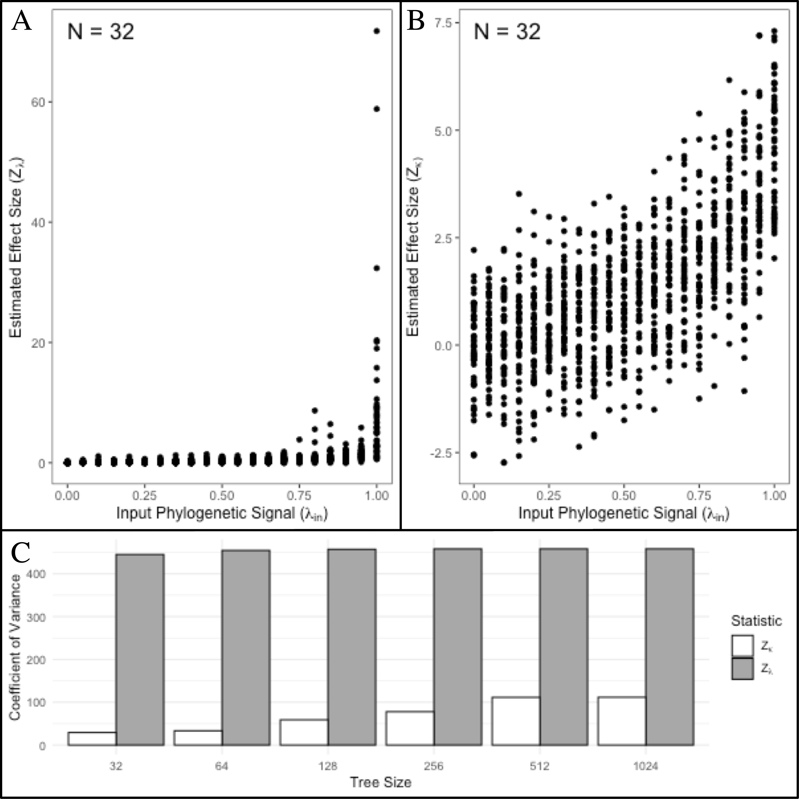

---
title:

output: 
  pdf_document:
    fig_caption: yes
    number_sections: no  #note: change to 'no' for most journals
    keep_tex: true
    pandoc_args:


csl: evolution.csl
bibliography: Lambda-Refs.bib

header-includes:
  - \usepackage{setspace}\doublespacing
  - \usepackage{lineno}\linenumbers

---
# A Standardized Effect Size for Evaluating the Strength of Phylogenetic Signal, and Why Lambda is not Appropriate

\hfill\break

**Keywords**: phylogenetic signal, effect size, Pagel's lambda \hfill\break

**Short Title**: An Effect Size for Phylogenetic Signal \hfill\break

```{r setup, include=FALSE}
  library(knitr)
  knitr::opts_chunk$set(echo = TRUE)
```

# Abstract

{conclusion holds: interpreting the regression is not appreciably different (in terms of slopes and f values)}


\newpage

# Introduction
Investigating macroevolutionary patterns of trait variation requires a phylogenetic perspective, because the shared ancestry among species generates statistical non-independence [@Felsenstein1985; @HarveyPagel1991]. Accounting for this evolutionary non-independence is the purview of *phylogenetic comparative methods* (PCMs); a suite of analytical tools that condition the data on the phylogeny through the course of statisical evaluations of phenotypic trends [e.g., @Grafen1989; @GarlandIves2000; @Rohlf2001; @ButlerKing2004]. The past several decades have witnessed a rapid expansion in the development of PCMs to address an ever-growing set of macroevolutionary hypotheses [@MartinsHansen1997; @OMeara_et_al2006; @RevellHarmon2008; @Beaulieu_et_al2012; @Adams2014b; @Adams2014a; @AdamsCollyer2018b]. These methods are predicated on the notion that phylogenetic signal -- the tendancy for closely related species to display similar trait values -- is present in cross-species datasets [@Felsenstein1985; @Pagel1999; @Blomberg_et_al2003]. Indeed, under numerous evolutionary models, phylogenetic signal is to be expected, as stochastic character change along the hierarchical structure of the tree of life generates trait covaration among related taxa [see @Felsenstein1985; @Blomberg_et_al2003; @Revell_et_al2008]. \hfill\break

Several analytical tools have been developed to quantify phylogenetic signal in phenotypic datasets, including measures of serial independence [$\mathbf{C}$: @Abouheif1999], autocorrelation estimates [$I$: @Gittleman1990], statistical ratios of trait variation relative to what is expected given the phylogeny [$Kappa$: @Blomberg_et_al2003; @Adams2014a], and scaling parameters used in maximum likelihood fitting of the data to the phylogeny [$\lambda$: @Pagel1999], among others [e.g., @Klingenberg2010]. The statistical properties of these methods -- namely type I error rates and power -- have also been investigated to determine when phylogenetic signal can be detected and under what conditions [e.g., @Munkemuller_et_al2012; @Pavoine2012;  @DinizFilho2012; @Adams2014a; @MolinaVenegas2017; see also @Revell_et_al2008; @Revell2010]. One of the most widely used methods for characterizing phylogenetic signal in macroevolutionary studies is Pagel's $\lambda$ [@Pagel1999]. Here, maximum likelihood is used to fit the data to the phylogeny under a Brownian motion model of evolution. A parameter ($\lambda$) is included, which transforms the lengths of the internal branches of the phylogeny to improve the fit [@Pagel1999; @Freckleton_et_al2002]. Pagel's $\lambda$ ranges from $0\to1$, with larger values signifying a greater dependence of observed trait variation on the phylogeny. Pagel's $\lambda$ also has the appeal that it may be included in phylogenetic regression  (PGLS) to account for the degree of phylogenetic signal in comparative analyses [see @Freckleton_et_al2002]. \hfill\break

Evolutionary biologists commonly seek to describe the relative strength of phylogenetic signal in phenotypic traits, to determine the extent to which shared evolutionary history has influenced trait covariation among taxa. This is often accomplished by interpreting empirical estimates of $\lambda$; with smaller values signifying 'weak' phylogenetic signal, while larger values are interpreted as 'strong' phylogenetic signal [e.g., @DeMeester2019; @Pintanel2019;@Su2019]. Other approaches for interpreting $\lambda$ are more statistical, through the use of confidence intervals [@Vandelook2019] or likelihood ratio tests that compare the observed model fit to that obtained when $\lambda=0$ or $\lambda=1$ [@Freckleton_et_al2002; @Cooper2010; @Bose2019]. Likewise, qualitative comparisons of $\lambda$ across multiple phenotypic traits have also been used to infer whether the strength of phylogenetic signal is greater in one trait as compared to another [e.g., @Liu2019; @Bai2019]. Indeed, it seems intuitive to interpret the strength of phylogenetic signal in this manner, as $\lambda$ is a parameter on a bounded scale ($0\to1$) for which interpretation of its extremal points are understood ($\lambda=0$ represents no phylogenetic signal, while $\lambda=1$ is phylogenetic signal as expected under Brownian motion). However, equating values of $\lambda$ directly to the strength of phylogenetic signal presumes two important statistical properties that have not been fully explored. \hfill\break

First, it presumes that values of $\lambda$ can be precisely estimated, as biological inferences regarding the strength of phylogenetic signal depend on high accuracy in its estimation. Therefore, understanding the precision in estimating $\lambda$ is paramount. One study [@Boettiger_et_al2012] found that estimates of Pagel's $\lambda$ displayed less variation (i.e., greater precision) when data were simulated on a large phylogeny ($N=281$) as compared to a small one ($N=13$). From this observation it was concluded that insufficient data (i.e., the number of species) was the underlying cause of the increased variation across parameter estimates [@Boettiger_et_al2012]. Indeed, such a pattern is common with statistical estimators, as summary statistics and parameters are often more precise at greater sample sizes [@Cohen1988]. However, this conclusion also assumes that the precision of $\lambda$ remains constant across its range ($\lambda = 0 \to 1$); an assumption that to date, has not been verified. Thus, despite widespread use of Pagel's [-@Pagel1999] $\lambda$ in macroevolutionary studies, at present, we still lack a general understanding of the precision with which $\lambda$ can estimate levels of phylogenetic signal in phenotypic datasets. \hfill\break

Second, while estimates of $\lambda$ are within a bounded scale ($0\to1$), this does not *de-facto* imply that the estimated values of this parameter correspond to the actual strength of the underlying input signal in the data. For this to be the case, $\lambda$ must be a statistical effect size. Effect sizes are a measure the magnitude of a statistical effect in data, represented on a common scale [@Glass1976; @Cohen1988]. Effect sizes have widespread use in many areas of the quantiative sciences, as they represent measures that may be readily summarized across datasets as in meta-analysis [@HedgesOlkin1985; @Glass1976; @Arnqvist1995], or compared among datasets [e.g., @AdamsCollyer2016; @AdamsCollyer2019b]. Unfortunatley, not all model parameters and test statistics are effect sizes, and thus many summary measures must first be converted to standardized units (i.e., an effect size) for meaningful comparison [see @Rosenthal1994]. As a consequence, it follows that only if $\lambda$ is a statistical effect size can comparisons of estimates across datasets be interpretable. For the case of $\lambda$, this has not yet been explored.  \hfill\break

In this study, we evaluate the precision of Pagel's $\lambda$ in estimating known levels of phylogenetic signal in phenotypic data. We use computer simulations with differing numbers of species, differently shaped phylogenies, and differing input levels of phylogenetic signal, to explore the degree to which $\lambda$ correctly identifies known levels of phylogenetic signal, and under what circumstances. We find that while PGLS parameters (e.g., $\beta$) are accurately estimated with the inclusion of phylogenetic signal, estimates of $\lambda$ are not. We also find that estimates of $\lambda$ vary widely for a given input value of phylogenetic signal, and that the precision in estimating $\lambda$ is not constant across the range of input signal, with decreased precision when phylogenetic signal is of intermediate strength. Additionally, the same $\lambda_{est}$ may be obtained from datasets containing vastly different input levels of phylogenetic signal. Thus, $\lambda$ is not a reliable estimate of the strength of phylogenetic signal in phenotypic data. We subsequently derive a standardized effect size for measuring the strength of phylogenetic signal in phenotypic datasets, and apply the concept to two common measures of phylogenetic signal: $\lambda$ and $Kappa$. Through simulations across a wide range of conditions, we find that the precision of effect sizes based on $\lambda$ ($Z_{\lambda}$) are less reliable than that those based on $Kappa$ ($Z_K$), implying that $Z_K$ is a more robust effect size measure. Additionally, we propose a two-sample test statistic that may be used to compare the strength of phylogenetic signal among datasets, and provide an empirical example to demonstrate its use. We conclude that estimates of phylogenetic signal using Pagel's $\lambda$ are often inaccurate, and thus interpreting strength of phylogenetic signal in phenotypic datasets based on this measure is compromised. By contrast, effect sizes obtained from $Kappa$ hold promise for characterizing phylogenetic signal, and for comparing the strength of phylogenetic signal across datasets.

# Methods and Results

## *The Precision of $\lambda$ is Variable*

We conducted a series of computer simulations to evaluate the precision of Pagel's $\lambda$. Our primary simulations were based on pure-birth phylogenies; however, we also evaluated patterns on both balanced and pectinate trees to determine whether tree shape affected our findings (see Supporting Information). First we generated 50 pure-birth phylogenies at each of six different tree sizes, ranging from 32 to 1024 taxa ($n=2^5 - 2^{10}$). Next, we rescaled the simulated phylogenies by multiplying the internal branches by $\lambda_{in}$, using 21 intervals of 0.05 units across its range ($\lambda_{in} = 0.0 \to 1.0$), resulting in 1050 scaled phylogenies at each level of species richness ($n$). Continuous traits were then simulated on each phylogeny under a Brownian motion model of evolution to obtain datasets with differing levels of phylogenetic signal, that ranged from no phylogenetic signal (when $\lambda_{in} =0$), to phylogenetic signal corresponding reflecting Brownian motion (when $\lambda_{in} =1$). For each dataset we then estimated phylogenetic signal ($\lambda_{est}$), and calculated the precision of $\lambda$ using the variance ($\sigma^2_\lambda$) across datasets at each input level of phylogenetic signal and level of species richness. \hfill\break

We also evaluated the precision of $\lambda$ when estimated in PGLS regression and ANOVA (i.e., $Y\sim{X}$). Here, an independent variable $X$ was simulated on each phylogeny under a Brownian motion model of evolution (for PGLS regression). For phylogenetic ANOVA, random groups ($X$) were obtained by simulating a discrete (binary) character on each phylogeny. Next, the dependent variable was simulated in such a manner as to contain a known relationship with $X$ plus random error containing phylogenetic signal. This was accomplished as: $Y=\beta{X}+\epsilon$. Here, the association between $Y$ and $X$  was modeled using a range of values: $\beta=(0.0,0.25, 0.5, 0.75,1.0)$, and the residual error was modeled to contain phylogenetic signal simulated under a Brownian motion model of evolution: $\epsilon=\mathcal{N}(\mu=0,\sigma=\mathbf{C})$: [see @Revell2010 for a similar simulation design]. The fit of the phylogenetic regression was estimated using maximum likelihood, and parameter estimates ($\beta_{est}$ and $\lambda_{est}$) were obtained. Precision estimates ($\sigma^2_\lambda$) at each input level of phylogenetic signal and level of species richness were then observed. \hfill\break

All analyses were performed in R v3.6.0 [@RCT] using the packages `geiger` [@Harmon2008], `caper` [@Orme2013], `phytools` [@Revell2012], and `geomorph` [@AdamsOtarola2013; @AdamsGeomorph]. R-scripts are found in the Supporting Information. \hfill\break

*Results.* We found that the precision of $\lambda_{est}$ varied widely across simulation conditions. Predictably, precision improved as the number of species increased (Figure 1). This confirmed earlier findings of Boettiger et al. [-@Boettiger_et_al2012], and adhered to parametric statistical theory. However, in many cases the set of $\lambda_{est}$ spanned nearly the entire range of possible values (e.g., $n=32$; $\lambda_{in}=0.5$: $\lambda_{est}= 0.0\to 0.985$), revealing that estimates of $\lambda$ were not a reliable indicator of input phylogenetic signal. Importantly, the precision of $\lambda_{est}$ was not uniform across all levels of phylogenetic signal, with the worst precision at intermediate levels of signal ($\lambda_{in}\approx0.5$), and improved precision as input levels approached the extremes of its range (i.e., $\lambda_{in}\rightarrow0$ & $\lambda_{in}\rightarrow1$). Thus, estimates of $\lambda$ were least reflective of the true input signal at intermediate values. Additionally, even at large levels of species richness, we found that the range of $\lambda_{est}$ still encompassed a substantial portion of possible values (e.g., $n=512$; $\lambda_{in}=0.5$: $\lambda_{est} = 0.32\to 0.68$). Likewise, the same $\lambda_{est}$ could be obtained from datasets containing vastly different input levels of phylogenetic signal (e.g., $n=512$; $\lambda_{est} = 0.5$; $\lambda_{in} = 0.25 \to 0.65$). Results were similar when $\lambda$ was co-estimated with regression parameters in PGLS regression (Figure 2). Here, regression parameters ($\beta$) were accurately estimated, confirming earlier findings of Revell 2010 [-@Revell2010] (see Supporting Information). However, estimates of phylogenetic signal were not, and the spread of $\lambda_{est}$ was even broader than that observed when $\lambda$ was estimated for only the dependent variable. Taken together, these findings reveal that $\lambda_{est}$ does not precisely characterize observed levels of phylogenetic signal in phenotypic datasets, and that biological interpretations of the strength of phylogenetic signal based on $\lambda$ may be highly inaccurate. \hfill\break

[insert Figure 1 here] \hfill\break

[insert Figure 2 here] \hfill\break 

## *A Standardized Effect Size for Phylogenetic Signal*

The results above demonstate that $\lambda$ is not a reliable estimate of the phylogenetic signal in phenotypic data. As such, biological interpretations of the strength of phylogenetic signal, and comparisons of the magnitude of such effects across datasets, are severely compromised when based on this parameter. As an alternative, we propose that summary estimates of phylogenetic signal be converted to effect sizes for interpretation and comparison. Statistically, a standardized effect size may be found as: 

\begin{align}
    Z_{\theta}=\frac{\theta_{obs}-E(\theta)}{\sigma_\theta}
\end{align}

where $\theta_{obs}$ is the observed test statistic, $E(\theta)$ is its expected value under the null hypothesis, and $\sigma_\theta$ is its standard error [@Glass1976; @Cohen1988;@Rosenthal1994]. $Z_{\theta}$ expresses the magnitude of the effect in $\theta_{obs}$ by transforming the original test statistic to a standard normal deviate [@Glass1976; @Kelley2012]. Typically, $\theta_{obs}$ and $\sigma_\theta$ are estimated from the data, while $E(\theta)$ is obtained from the distribution of $\theta$ derived from parametric theory. However, recent advances in resampling theory [@Collyer_et_al2015a;@AdamsCollyer2016; @AdamsCollyer2019b] have shown that $E(\theta)$ and $\sigma_\theta$ may also be obtained from an empirical sampling distribution of $\theta$ obtained from permutation procedures. \hfill\break

Adams and Collyer [-@AdamsCollyer2019] recently suggested that the strength of phylogenetic signal could be represented an effect size, obtained from $Kappa$ and its empirical sampling distribution from permutation. Here we formalize that suggestion, and find an effect size as:

\begin{align}
    Z_{K}=\frac{K_{obs}-\hat\mu_K}{\hat\sigma_K}
\end{align}

Similarly, an effect size based on $\lambda$ could be envisioned as: 

\begin{align}
    Z_{\lambda}=\frac{\lambda_{obs}-0}{\hat\sigma_\lambda}
\end{align}

Note that under the null hypothesis, $E(\lambda)=0$, a no phylogenetic signal is expected under this condition [@Freckleton_et_al2002]. \hfill\break

To evaluate the utility of $Z_K$ and $Z_\lambda$ we calculated both effect sizes for the simulated datasets generated above, and summarized the precision of each using its variance ($\sigma^2_{Z_K}$ and $\sigma^2_{Z_\lambda}$). Results are found in Figure 3. Here two things are evident. First, estimates of $Z_K$ track the input phylogenetic signal in a more linear fashion than to estimates of $Z_\lambda$. Second, the precision of $Z_K$ is considerably more stable, as coefficients of variation for the set of $\sigma^2_{Z_K}$ across input levels of phylogenetic signal for the same sample size was an order of magnitude smaller than that observed for $\sigma^2_{Z_\lambda}$ (Figure 3). This implies that estimates of the strength of phylogenetic signal were more reliable and robust when using $Z_K$ as compared with $Z_\lambda$. \hfill\break

[insert Figure 3 here] 

## *Statistical Comparisons of Phylogenetic Signal*

Once the magnitude of phylogenetic signal is characterized using $Z_K$, it may be of interest to compare such measures across datasets. This is useful, for instance, to determine whether the strength of phylogenetic signal is greater in one phenotypic trait as compared with another. As with other effect sizes derived from permutation distributions [e.g., @AdamsCollyer2016; @AdamsCollyer2019b], a two-sample test statistic may be found as: 

\begin{align}
  \hat{Z}_{12}=\frac{\lvert{(K_{1}-\hat\mu_{K_1})-(K_{2}-\hat\mu_{K_2})}\rvert}{\sqrt{\hat\sigma^2_{K_1}+\hat\sigma^2_{K_2}}}
\end{align}

where $K_1$, $K_2$, $\hat\mu_{K_1}$, $\hat\mu_{K_2}$, $\hat\sigma_{K_1}$, and $\hat\sigma_{K_2}$ are as defined above for equation 2. Estimates of significance of $\hat{Z}_{12}$ may be obtained from a standard normal distribution. As with other two-sample tests, $\hat{Z}_{12}$ is typically considered a two-tailed test, however directional (one-tailed) tests may be specified should the empirical situation require it [see @AdamsCollyer2016; @AdamsCollyer2019b].

## *Empirical Example*

# Conclusions and Implications
  

## *Literature Survey... WHERE DOES THIS GO???*

To determine how Pagel's $\lambda$ is commonly utilized in empirical studies, we conducted a literature survey. From Google.scholar we obtained a list of all papers published in 2019 that used $\lambda$; resulting in 341 studies. For each study, we extracted all $\lambda_{est}$, the size of the phylogeny ($n$), and noted whether authors reported confidence intervals or performed significance tests assessing difference of $\lambda_{est}$ from either zero or one. We also noted whether biological interpretations based on $\lambda_{est}$ were made, and for studies that reported more than one $\lambda_{est}$, we also noted whether these were compared in some manner, and whether such comparisons were accompanied with statistical tests between $\lambda_{est}$. 

*Results*. We found 182 manuscripts from 2019 that estimated and reported Pagel's lambda values using PGLS methods. These papers averaged 8.527 lambda values, ranging from a single lambda estimate up to 71 estimated lambdas. Almost exactly half of the published lambda estimates were either below 0.05 (25.32%) or above 0.9 (24.74%; Figure 3). 73.32% of the published lambdas were estimated using phylogenies with fewer than 200 tips, and 348 lambda estimates (8.57% of all published estimates) came from phylogenies with fewer than 30 tips.  \hfill\break

[insert Figure 4 here] \hfill\break

Many of the reviewed manuscripts liberally interpreted the magnitude of the estimate lambda, using phrases such as "strong" or "weak" phylogentic signal when statistically, all that was clear was a difference between the estimated lambda and 0 or 1 respectively. We estimated that about 20.49% of the manuscripts revealed some sort of biological interpretation of the magnitude of estimated phylogenetic signal that overreached the statistical findings. We also identified seven manuscripts as having inappropriately interpreted differences in lambda values, indicating that some traits had stronger or weaker signal than other traits without the appropriate statistical tests. \hfill\break

As is evidenced by macroevolutionary papers published in 2019 papers, Pagel's lambda estimation methods are often misused and over-interpretted. Despite the urging of Boettiger and colleagues to publish confidence intervals with all lambda parameter estimates, only 18% of papers published in 2019 do so.  


# Discussion

1: summary paragraph

2: expand on Lambda..
lambda innacurate, not precise, level of precision varies with input physig (worse in mid-range). NEW RESULT.  We are first to show this.  NOTE: pattern is obvious with reflection. Since it is a 'bounded' parameter estimation should be best at the extremes... (state this?).. hmm. 

Patterns worse with PGLS, though beta still estimated properly. Conclusion, lambda not overly useful.

3: By contrast, effect size Z-K useful, equally precise across range of values. Can be used to characterize the strength of physignal, and because robust to input levels, etc. may be used to compare across datasets.

Somewhere, recognize that this is somewhat 'backwards' from prior recommendations where Kappa had somewhat lower performance in terms of type I and type II error (which?? I forget). However, recall that those studies did not examine the precision of the estimates. Nor was Z-k included, because it was not yet invented. So Use of Z-k should make good sense here. 

Closing paragraph. 

\hfill\break

More discussion paragraphs

\newpage

# References

 \setlength{\parindent}{-0.25in}
 \setlength{\leftskip}{0.25in}
 \setlength{\parskip}{8pt}
 \noindent

<div id="refs"></div>
 
\newpage

# Figure Legends

\textbf{Figure 1}. Precision of Pagel's $\lambda$ across known levels of input phylogenetic signal ($\lambda_{in}$) on phylogenies of various sizes. As phylogenies increase in size, variation in $\lambda_{in}$ decreases; however the precision is not constant across the range of input levels ($\lambda_{in}: 0 \to 1$), and is highest at intermediate levels of phylogenetic signal. \hfill\break

\textbf{Figure 2}. Precision of Pagel's $\lambda$ when incorporated in phylogenetic regression ($Y\sim X$), across known levels of input phylogenetic signal ($\lambda_{in}$) on phylogenies of various sizes. As phylogenies increase in size, variation in $\lambda_{in}$ decreases; however the precision is not constant across the range of input levels ($\lambda_{in}: 0 \to 1$), and is highest at intermediate levels of phylogenetic signal. \hfill\break

\textbf{Figure 3}.  Variation in estimates of phylogenetic signal across input levels of phylogenetic signal. (A) Estimates of Pagel's $\lambda$ for data simulated on phylogenies with 128 taxa ($n=128$), (B) Estimates of $Z_K$ for data simulated on phylogenies with 128 taxa ($n=128$), (C) Variance in the variation of $\lambda_{est}$ across input levels of phylogenetic signal, estimated on phylogenies containing differing numbers of species. (D) Variance in the variation of $Z_K$ across input levels of phylogenetic signal, estimated on phylogenies containing differing numbers of species.    \hfill\break

\textbf{Figure 4}. Frequency of estimated lambda values published in manuscripts in 2019. The majority of these values were close to 0 or 1, and from phylogenies with fewer than 200 taxa.

\newpage

```{r, echo = FALSE, out.width="95%"}
include_graphics("Fig1.png")  

```

\singlespacing \textbf{Figure 1}. Precision of Pagel's $\lambda$ across known levels of input phylogenetic signal ($\lambda_{in}$) on phylogenies of various sizes. As phylogenies increase in size, variation in $\lambda_{in}$ decreases; however the precision is not constant across the range of input levels ($\lambda_{in}: 0 \to 1$), and is highest at intermediate levels of phylogenetic signal. 

\newpage
```{r, echo = FALSE, out.width="95%"}
include_graphics("Fig2.png")  

```

\singlespacing \textbf{Figure 2}. Precision of Pagel's $\lambda$ when incorporated in phylogenetic regression ($Y\sim X$), across known levels of input phylogenetic signal ($\lambda_{in}$) on phylogenies of various sizes. As phylogenies increase in size, variation in $\lambda_{in}$ decreases; however the precision is not constant across the range of input levels ($\lambda_{in}: 0 \to 1$), and is highest at intermediate levels of phylogenetic signal.


\newpage

```{r, echo = FALSE, out.width="95%"}
include_graphics("Fig3.png")  

```

\singlespacing \textbf{Figure 3}.  Variation in estimates of phylogenetic signal across input levels of phylogenetic signal. (A) Estimates of Pagel's $\lambda$ for data simulated on phylogenies with 128 taxa ($n=128$), (B) Estimates of $Z_K$ for data simulated on phylogenies with 128 taxa ($n=128$), (C) Variance in the variation of $\lambda_{est}$ across input levels of phylogenetic signal, estimated on phylogenies containing differing numbers of species. (D) Variance in the variation of $Z_K$ across input levels of phylogenetic signal, estimated on phylogenies containing differing numbers of species.  

\newpage

```{r, echo = FALSE, out.width="95%"}
  

```

\singlespacing \textbf{Figure 4}.Frequency of estimated lambda values published in manuscripts in 2019. The majority of these values were close to 0 or 1, and from phylogenies with fewer than 200 taxa.
