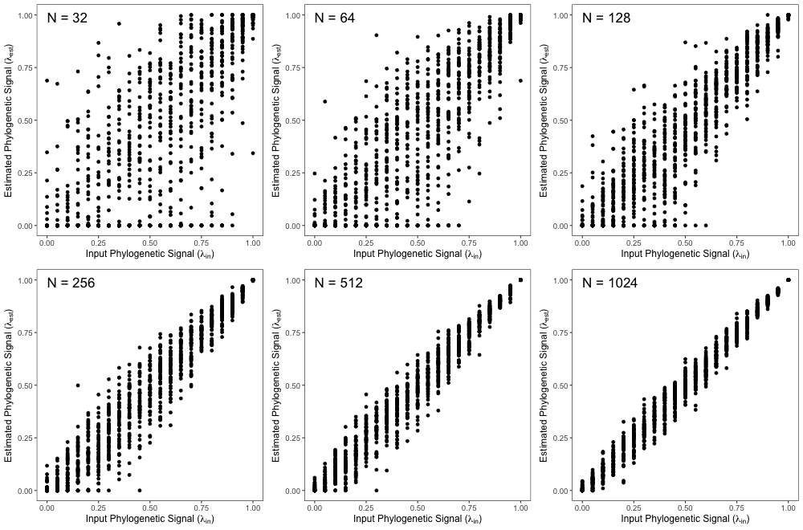
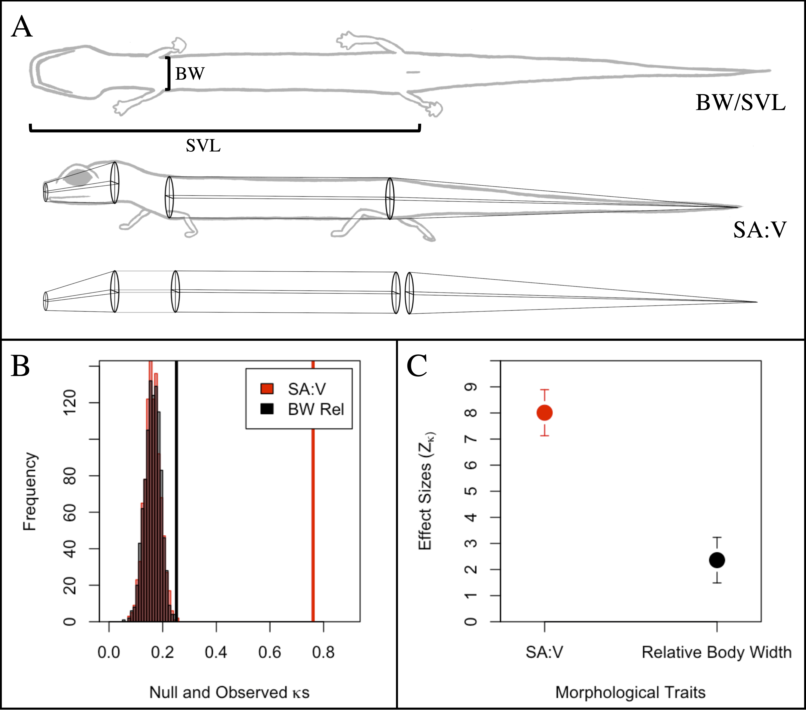

---
title:

output: 
  pdf_document:
    fig_caption: yes
    number_sections: no  #note: change to 'no' for most journals
    keep_tex: true
    pandoc_args:


csl: evolution.csl
bibliography: Lambda-Refs.bib

header-includes:
  - \usepackage{setspace}\doublespacing
  - \usepackage{lineno}\linenumbers

---
# A Standardized Effect Size for Evaluating the Strength of Phylogenetic Signal, and Why Lambda is not Appropriate

\hfill\break

```{r setup, include=FALSE}
  library(knitr)
  knitr::opts_chunk$set(echo = TRUE)
```

# Abstract

Macroevolutionary studies frequently characterize the phylogenetic signal in phenotypes, and wish to compare the strength of that signal across traits. However, analytical tools for such comparisons have largely remained underdeveloped. In this study, we evaluated the efficacy of one commonly used parameter (Pagel's $\lambda$) to estimate the strength of phylogenetic signal in phenotypic traits, and evaluate the degree to which $\lambda$ correctly identifies known levels of phylogenetic signal. We find that the precision of $\lambda$ in estimating actual levels of phylogenetic signal is often inaccurate, and that biological interpretations of the strength of phylogenetic signal based on $\lambda$ are therefore compromised. We then propose a standardized effect size based on $\kappa$ ($Z_\kappa$), which measures the strength of phylogenetic signal, and places it on a common scale for statistical comparison. Tests based on $Z_\kappa$ provide a mechanism for formally comparing the strength of phylogenetic signal across datasets, in much the same manner as effect sizes may be used to summarize patterns in quantitative meta-analysis. Our approach extends the phylogenetic comparative toolkit to address hypotheses that compare the strength of phylogenetic signal between various phenotypic traits, even when those traits are found in different evolutionary lineages or have different units or scale.

\newpage

# Introduction
Investigating macroevolutionary patterns of trait variation requires a phylogenetic perspective, because the shared ancestry among species violates an assumption of independence among trait values that is common for statistical tests [@Felsenstein1985; @HarveyPagel1991]. Accounting for this evolutionary non-independence is the purview of *phylogenetic comparative methods* (PCMs): a suite of analytical tools that condition trends in the data on the phylogenetic relatedness of observations [e.g., @Grafen1989; @GarlandIves2000; @Rohlf2001; @ButlerKing2004]. The past several decades have witnessed a rapid expansion in the development of PCMs to address an ever-growing set of macroevolutionary hypotheses [@MartinsHansen1997; @OMeara_et_al2006; @RevellHarmon2008; @Beaulieu_et_al2012; @Adams2014b; @Adams2014a; @AdamsCollyer2018b]. These methods are predicated on the notion that phylogenetic signal -- the tendancy for closely related species to display similar trait values -- is present in cross-species datasets [@Felsenstein1985; @Pagel1999; @Blomberg_et_al2003]. Indeed, under numerous evolutionary models, phylogenetic signal is to be expected, as stochastic character change along the hierarchical structure of the tree of life generates trait covaration among related taxa [see @Felsenstein1985; @Blomberg_et_al2003; @Revell_et_al2008]. \hfill\break

Several analytical tools have been developed to quantify phylogenetic signal in phenotypic datasets, including measures of serial independence [$\mathbf{C}$: @Abouheif1999], autocorrelation estimates [$I$: @Gittleman1990], statistical ratios of trait variation relative to what is expected given the phylogeny [$\kappa$: @Blomberg_et_al2003; @Adams2014a], and scaling parameters used in maximum likelihood fitting of the data to the phylogeny [$\lambda$: @Pagel1999], among others [e.g., @Klingenberg2010]. The statistical properties of these methods -- namely type I error rates and power -- have also been investigated to determine when phylogenetic signal can be detected and under what conditions [e.g., @Munkemuller_et_al2012; @Pavoine2012;  @DinizFilho2012; @Adams2014a; @MolinaVenegas2017; see also @Revell_et_al2008; @Revell2010]. One of the most widely used methods for characterizing phylogenetic signal in macroevolutionary studies is Pagel's $\lambda$ [@Pagel1999]. The ($\lambda$) parameter transforms the lengths of the internal branches of the phylogeny to improve a fit of data to the phylogeny via maximum likelihood [@Pagel1999; @Freckleton_et_al2002]. Pagel's $\lambda$ ranges from $0\to1$, with larger values signifying a greater dependence of observed trait variation on the phylogeny. Pagel's $\lambda$ also has the appeal that it may be included in phylogenetic generalized least-squares regression (PGLS) to account for the degree of phylogenetic signal in comparative analyses [see @Freckleton_et_al2002]. \hfill\break 

In addition to functioning as a parameter that is tuned for appropriate analysis, $\lambda$ can function as a descriptive statistic to describe the relative strength of phylogenetic signal in phenotypic traits, to determine the extent to which shared evolutionary history has influenced trait covariation among taxa. The appeal of $\lambda$ as a descriptive statistic for evolutionary biologists is a basis for interpreting "weak" versus "strong" phylogenetic signal; i.e., small versus large values of $\lambda$, respectively, in a comparative sense [e.g., @DeMeester2019; @Pintanel2019;@Su2019]. Indeed, statements regarding the strength of phylogenetic signal based on $\lambda$ are rather common in the evolutionary literature. For instance, of the 204 papers published in 2019 that estimated and reported Pagel's $\lambda$ (found from a literature survey we conducted in Google.scholar), 40% interpreted the strength of phylogenetic signal for at least one phenotypic trait. Further, because nearly half of the 1,572 $\lambda$ values reported were near 0 or 1 (Figure 1) where the biological interpretation of $\lambda$ is known, this percentage is even higher. \hfill\break

[insert Figure 1 here] \hfill\break

Various other approaches use $\lambda$ as a parameter that can be varied for inferences akin to sensitivity analysis. For instance, some have performed likelihood ratio tests that compare observed model fits to those obtained when $\lambda=0$ or $\lambda=1$ [@Freckleton_et_al2002; @Cooper2010; @Bose2019] or evaluated whether observed $\lambda$ differs from an expected $\lambda$, based on confidence intervals generated for the expected value [@Vandelook2019].  Qualitative comparisons of $\lambda$ estimates have also been performed for multiple traits on the same phylogenetic tree to infer whether the strength of phylogenetic signal is greater in one trait as compared to another [e.g., @Liu2019; @Bai2019]. \hfill\break

It seems intuitive to interpret the strength of phylogenetic signal based on the value of $\lambda$, as $\lambda$ is a parameter on a bounded scale ($0\to1$) for which interpretation of its extremal points are understood. Specifically, $\lambda=0$ represents no phylogenetic signal, while $\lambda=1$ is phylogenetic signal as expected under Brownian motion. However, equating values of $\lambda$ directly to the strength of phylogenetic signal presumes two important statistical properties that have not been fully explored. First, it presumes that values of $\lambda$ can be precisely estimated, as biological inferences regarding the strength of phylogenetic signal depend on high accuracy in its estimation. Therefore, understanding the precision in estimating $\lambda$ is paramount. One study [@Boettiger_et_al2012] found that estimates of Pagel's $\lambda$ displayed less variation (i.e., greater precision) when data were simulated on a large phylogeny ($N=281$) as compared to a small one ($N=13$). From this observation it was concluded that insufficient data (i.e., the number of species) was the underlying cause of the increased variation across parameter estimates [@Boettiger_et_al2012]. Indeed, such a pattern is common with statistical estimators, as summary statistics and parameters are often more precise at greater sample sizes [@Cohen1988]. However, this conclusion also implies that the precision of $\lambda$ remains constant across its range ($\lambda = 0 \to 1$); an assumption that to date, has not been verified. Thus, despite widespread use of Pagel's [-@Pagel1999] $\lambda$ in macroevolutionary studies, at present, we lack a general understanding of the precision with which $\lambda$ can estimate levels of phylogenetic signal in phenotypic datasets. \hfill\break

Second, while estimates of $\lambda$ are within a bounded scale ($0\to1$), this does not *de-facto* imply that the estimated values of this parameter correspond to the actual strength of the underlying input signal in the data. For this to be the case, $\lambda$ must be a statistical effect size. Effect sizes are a measure of the magnitude of a statistical effect in data, represented on a common scale [@Glass1976; @Cohen1988]. Effect sizes have widespread use in many areas of the quantiative sciences, as they represent measures that may be readily summarized across datasets as in meta-analyses [@HedgesOlkin1985; @Glass1976; @Arnqvist1995], or compared among datasets [e.g., @AdamsCollyer2016; @AdamsCollyer2019b]. Unfortunatley, not all model parameters and descriptive statistics are effect sizes, and thus many summary measures must first be converted to statistics with standardized units (i.e., conversion to an effect size) for meaningful comparison [see @Rosenthal1994]. As a consequence, it follows that only if $\lambda$ is a statistical effect size can comparisons of estimates across datasets be interpretable. For the case of $\lambda$, this has not yet been explored.  \hfill\break

In this study, we evaluate the precision of Pagel's $\lambda$ for estimating known levels of phylogenetic signal in phenotypic data. We use computer simulations with differing numbers of species, differently shaped phylogenies, and differing input levels of phylogenetic signal, to explore the degree to which $\lambda$ correctly identifies known levels of phylogenetic signal, and under what circumstances. We find that estimates of $\lambda$ vary widely for a given input value of phylogenetic signal, and that the precision in estimating $\lambda$ is not constant across its range. Rather, there is decreased precision when input levels of phylogenetic signal are of intermediate strength. Additionally, the same estimated values of $\lambda$ may be obtained from datasets containing vastly different input levels of phylogenetic signal. Thus, $\lambda$ is not a reliable indicator of the strength of phylogenetic signal in phenotypic data. We then describe a standardized effect size for measuring the strength of phylogenetic signal in phenotypic datasets, and apply the concept to two common measures of phylogenetic signal: $\lambda$ and $\kappa$. Through simulations we find that the precision of effect sizes based on $\lambda$ ($Z_{\lambda}$) are less reliable than that those based on $\kappa$ ($Z_\kappa$), implying that $Z_\kappa$ is a more robust effect size measure. We also propose a two-sample test statistic that may be used to compare the strength of phylogenetic signal among datasets, and provide an empirical example to demonstrate its use. We conclude that estimates of phylogenetic signal using Pagel's $\lambda$ are often inaccurate, and thus interpreting strength of phylogenetic signal in phenotypic datasets based on this measure is compromised. By contrast, effect sizes obtained from $\kappa$ hold promise for characterizing phylogenetic signal, and for comparing the strength of phylogenetic signal across datasets.

# Methods and Results

## *The Precision of $\lambda$ is Variable*

We conducted a series of computer simulations to evaluate the precision of Pagel's $\lambda$. Our primary simulations were based on pure-birth phylogenies; however, we also evaluated patterns on both balanced and pectinate trees to determine whether tree shape affected our findings (see Supporting Information). First we generated 50 pure-birth phylogenies at each of six different tree sizes, ranging from 32 to 1024 taxa ($n=2^5 - 2^{10}$). Next, we rescaled the simulated phylogenies by multiplying the internal branches by $\lambda_{in}$, using 21 intervals of 0.05 units across its range ($\lambda_{in} = 0.0 \to 1.0$), resulting in 1050 scaled phylogenies at each level of species richness ($n$). Continuous traits were then simulated on each phylogeny under a Brownian motion model of evolution to obtain datasets with differing levels of phylogenetic signal, that ranged from no phylogenetic signal (when $\lambda_{in} =0$), to phylogenetic signal reflecting Brownian motion (when $\lambda_{in} =1$). For each dataset we then estimated phylogenetic signal ($\lambda_{est}$), and calculated the variance of $\lambda$ ($\sigma^2_\lambda$) across datasets at each input level of phylogenetic signal and level of species richness as an estimate of precision. We verified that the variance of traits simulated had no effect on phylogenetic signal estimation. \hfill\break

We also evaluated the precision of $\lambda$ when estimated in PGLS regression and ANOVA (i.e., $Y\sim{X}$). Here, an independent variable $X$ was simulated on each rescaled phylogeny under a Brownian motion model of evolution (for PGLS regression). For phylogenetic ANOVA, random groups ($X$) were obtained by simulating a discrete (binary, 0 or 1) character on each phylogeny. Next, the dependent variable was simulated in such a manner as to contain a known relationship with $X$ plus random error containing phylogenetic signal. This was accomplished as: $Y=\beta{X}+\epsilon$.  The association between $Y$ and $X$ was modeled using a range of values: $\beta=(0.0,0.25, 0.5, 0.75,1.0)$, and the residual error ($\epsilon$) was modeled to contain phylogenetic signal simulated under a Brownian motion model of evolution on each rescaled phylogeny: $\epsilon=\mathcal{N}(\mu=0,\sigma=\sigma^2\mathbf{C})$: [see @Revell2010 for a similar simulation design]. The fit of the phylogenetic regression was estimated using maximum likelihood, and parameter estimates ($\beta_{est}$ and $\lambda_{est}$) were obtained. We then calculated precision estimates ($\sigma^2_\lambda$) at each input level of phylogenetic signal and level of species richness.  We verified that the amount of residual variance simulated had no effect on $\sigma^2_\lambda$ but did influence the precision of coefficients estimated from the linear model (precision increased with smaller $\epsilon$, as expected).  \hfill\break

All analyses were performed in R v3.6.0 [@RCT] using the packages `geiger` [@Harmon2008], `caper` [@Orme2013], `phytools` [@Revell2012], and `geomorph` 3.2.1 [@AdamsOtarola2013; @AdamsGeomorph]. R-scripts are found in the Supporting Information. \hfill\break

*Results.* We found that the precision of $\lambda_{est}$ varied widely across simulation conditions. Predictably, precision improved as the number of species increased (Figure 2). This confirmed earlier findings of Boettiger et al. [-@Boettiger_et_al2012], and adhered to parametric statistical theory. However, in many cases the set of $\lambda_{est}$ spanned nearly the entire range of possible values (e.g., $n=32$; $\lambda_{in}=0.5$: $\lambda_{est}= 0.0\to 0.985$), revealing that estimates of $\lambda$ were not a reliable indicator of input phylogenetic signal. Importantly, the precision of $\lambda_{est}$ was not uniform across all levels of phylogenetic signal. The worst precision was observed at intermediate levels of phylogenetic signal ($\lambda_{in}\approx0.5$), while precision improved as input levels approached the extremes of $\lambda$'s range (i.e., $\lambda_{in}\rightarrow0$ & $\lambda_{in}\rightarrow1$). Thus, estimates of $\lambda$ were least reflective of the true input signal at intermediate values. Additionally, even at large levels of species richness, we found that the range of $\lambda_{est}$ still encompassed a substantial portion of possible values (e.g., $n=512$; $\lambda_{in}=0.5$: $\lambda_{est} = 0.32\to 0.68$). Likewise, the same $\lambda_{est}$ could be obtained from datasets containing vastly different input levels of phylogenetic signal (e.g., $n=512$; $\lambda_{est} = 0.5$; $\lambda_{in} = 0.25 \to 0.65$). These findings were particularly unsettling when considered in light of our literature survey. Over one quarter of the $\lambda$ estimates published in empirical studies (421 of 1,572) were between $\lambda=0.25$ and $\lambda=0.75$ (Figure 1). This range reflected the region that our simulations identified as being the least reliable in terms of accurately characterizing levels of phylogenetic signal, yet 30% of these mid-range empirical estimates were explicitly interpreted in terms of the strength of phylogenetic signal that they represented (i.e., weak, intermediate, strong phylogenetic signal). \hfill\break

Finally, when $\lambda$ was co-estimated with regression parameters in PGLS regression and ANOVA, the results of our simulations were quite similar. Regression parameters ($\beta$) were accurately estimated, confirming earlier findings of Revell [-@Revell2010] (see Supporting Information). However, estimates of phylogenetic signal ($\lambda$) were less precise (Figure 3; see also Supporting Information), and the spread of $\lambda_{est}$ was similar to that observed when $\lambda$ was estimated for only the dependent variable, as in Figure 2. Taken together, these findings reveal that $\lambda_{est}$ does not precisely characterize observed levels of phylogenetic signal in phenotypic datasets, and that biological interpretations of the strength of phylogenetic signal based on $\lambda$ may be highly inaccurate. \hfill\break

[insert Figure 2 here] \hfill\break

[insert Figure 3 here] \hfill\break 

## *A Standardized Effect Size for Phylogenetic Signal*

The results above demonstate that $\lambda$ is not a reliable estimate of the phylogenetic signal in phenotypic data. As such, biological interpretations of the strength of phylogenetic signal, and comparisons of the magnitude of such effects across datasets are severely compromised when based on this parameter. As an alternative, we propose that summary estimates of phylogenetic signal be converted to effect sizes for interpretation and comparison of the relative strength of phylogenetic signal in phenotypic datasets. Statistically, a standardized effect size may be found as: 

\begin{align}
    Z_{\theta}=\frac{\theta_{obs}-E(\theta)}{\sigma_\theta}
\end{align}

where $\theta_{obs}$ is the observed test statistic, $E(\theta)$ is its expected value under the null hypothesis, and $\sigma_\theta$ is its standard error [@Glass1976; @Cohen1988;@Rosenthal1994]. $Z_{\theta}$ expresses the magnitude of the effect in $\theta_{obs}$ by transforming the original test statistic to its standard normal deviate [@Glass1976; @Kelley2012]. Typically, $\theta_{obs}$ and $\sigma_\theta$ are estimated from the data, while $E(\theta)$ is obtained from the distribution of $\theta$ derived from parametric theory. However, recent advances in resampling theory [@Collyer_et_al2015a;@AdamsCollyer2016; @CollyerAdams2018;@AdamsCollyer2019b] have shown that $E(\theta)$ and $\sigma_\theta$ may also be obtained from an empirical sampling distribution of $\theta$ obtained from permutation procedures. \hfill\break

Adams and Collyer [-@AdamsCollyer2019] suggested that the strength of phylogenetic signal could be represented as an effect size based on the $\kappa$ statistic and its empirical sampling distribution from permutation. Here we formalize that suggestion, resulting in an effect size of:

\begin{align}
    Z_\kappa=\frac{log(\kappa_{obs})-\hat\mu_{log(\kappa)}}{\hat\sigma_{log(\kappa)}}
\end{align}

where $\kappa_{obs}$ is the observed phylogenetic signal, and $\hat\mu_\kappa$ and $\hat\sigma_\kappa$ are the mean and standard deviation of the empirical sampling distribution of $log(\kappa)$ obtained via permutation. Note that the logarithm was used because $\kappa$ takes only positive values ($0\to\infty$) and its sampling distribution is log-normally distributed [for a similar transformation when calculating multivariate effect sizes see: Appendix 1 of @CollyerAdams2018]. \hfill\break

An effect size based on $\lambda$ could be envisioned, which is found as: 

\begin{align}
    Z_{\lambda}=\frac{\lambda_{obs}-0}{\hat\sigma_\lambda}.
\end{align}

In this case, $\lambda_{obs}$ and $\hat\sigma_\lambda$ are empirically derived using maximum likelihood, as permutation approaches have not been developed for evaluating $\lambda$. Note also that under the null hypothesis, no phylogenetic signal is expected [@Freckleton_et_al2002], and thus $E(\lambda)=0$ under this condition. \hfill\break

To evaluate the utility of $Z_\kappa$ and $Z_\lambda$ we calculated both effect sizes for the simulated datasets generated above, and summarized the precision of each using its variance ($\sigma^2_{Z_\kappa}$ and $\sigma^2_{Z_\lambda}$, Figure 4: additional results in the Supporting Information). Here two things are evident. First, estimates of $Z_\kappa$ linearly track the input phylogenetic signal whereas estimates of $Z_\lambda$ do not (Figure 4A, B). Thus, actual changes in the strength of phylogenetic signal are reflected more evenly in the corresponding values of the effect size $Z_\kappa$. Second, the precision of $Z_\kappa$ is considerably more stable as compared with $Z_\lambda$. This may be seen by calculating the coefficients of variation for the set of precision estimates (i.e., $\sigma^2_{Z_\kappa}$ and $\sigma^2_{Z_\lambda}$) across input levels of phylogenetic signal.  Coefficients of variation in the precision of $Z_\kappa$ were up to an order of magnitude smaller for than for $Z_\lambda$ (Figure 4C), implying that estimates of the strength of phylogenetic signal were more reliable and robust when using $Z_\kappa$. \hfill\break

[insert Figure 4 here] 

## *Statistical Comparisons of Phylogenetic Signal*

Once the magnitude of phylogenetic signal is characterized using $Z_\kappa$, one may wish to compare such measures across datasets, to determine whether the strength of phylogenetic signal is significantly greater in one phenotypic trait than another. As with other effect sizes derived from permutation distributions [e.g., @AdamsCollyer2016; @AdamsCollyer2019b], a two-sample test statistic may be calculated as: 

\begin{align}
  \hat{Z}_{12}=\frac{\lvert{(\kappa_{1}-\hat\mu_{\kappa_1})-(\kappa_{2}-\hat\mu_{\kappa_2})}\rvert}{\sqrt{\hat\sigma^2_{\kappa_1}+\hat\sigma^2_{\kappa_2}}} = \frac{\lvert Z_{\kappa_1} - Z_{\kappa_2}\rvert}{\sqrt{2}}
\end{align}

where $\kappa_1$, $\kappa_2$, $\hat\mu_{\kappa_1}$, $\hat\mu_{\kappa_2}$, $\hat\sigma_{\kappa_1}$, and $\hat\sigma_{\kappa_2}$ are as defined above for equation 2. The right side of the equation illustrates that if $Z_\kappa$ has already been calculated for two sampling distributions as in equation 2, the sampling distributions have unit variance for each of the $Z_\kappa$ statistics.  Estimates of significance of $\hat{Z}_{12}$ may be obtained from a standard normal distribution. Typically, $\hat{Z}_{12}$ is considered a two-tailed test, however directional (one-tailed) tests may be specified should the empirical situation require it [see @AdamsCollyer2016; @AdamsCollyer2019b]. \hfill\break

## *Empirical Example*

To demonstrate the utility of $\hat{Z}_{12}$ we quantified and compared the strength of phylogenetic signal of two phenotypic traits across species of plethodontid salamander. The data were part of a series of studies examining macroevolutionary trends in phenotypic diversification in this group [@Baken2019; @Baken2020]. Our dataset contained surface area to volume ratios (SA:V) and relative body width ($\frac{BW}{SVL}$) for 305 species (Figure 5A). For SA:V, 11 linear body measurements from 2,781 individuals were taken, from which estimates of the surface area and volume of the head, body, and tail were calculated and subsequently combined to arrive at the SA:V for each indiviual [for mathematical details see @Baken2020]. Species means were then obtained. Likewise, body size (SVL) and body width (BW) measurements were taken from 3,371 individuals, and species means of relative body width ($\frac{BW}{SVL}$) were calculated [data from @Baken2019]. A time-dated molecular phylogeny for the group [@Bonett2017] was then pruned to match the species in the dataset, resulting in a phylogeny and corresponding phenotypic dataset containing 305 species. The phylogenetic signal in each trait was then characterized using $\kappa$, which was converted to its effect size ($Z_\kappa$) using `geomorph` 3.2.1 [@AdamsOtarola2013; @AdamsGeomorph]. Finally, the strength of phylogenetic signal was compared across traits using $\hat{Z}_{12}$ as described above (**to be incorporated in `geomorph` upon manuscript acceptance**). \hfill\break

*Results.* Both SA:V and relative body width displayed significant phylogenetic signal ($\kappa_{SA:V}=0.7608$; $P=0.001$; $\kappa_{BW/SVL}=0.2515$; $P=0.001$).  For both phenotypic traits, $\kappa_{obs}$ differed markedly from their corresponding permutation distributions, which were found to overlap almost perfectly (Figure 5B). However, while both traits displayed significant phylogenetic signal, there was nearly a four-fold difference in the magnitude of their effect sizes, with SA:V displaying the greater phylogenetic signal (Figure 5C). Using the two-sample test statistic above, this difference was found to be highly significant ($\hat{Z}_{12}=4.13$; $P=0.000036$). Thus it may be concluded that SA:V displays significantly stronger phylogenetic signal than does relative body width, and that shared evolutionary history has strongly influenced trait covariation among taxa for SA:V. Biologically, this observation corresponds with the fact that tropical species -- which form a monophyletic group within plethodontids -- display greater variation in SA:V which covaries with disparity in their climatic niches [@Baken2020]. We hypothesize that because of this macroevolutionary association, strong phylogenetic signal in SA:V is observed. 

# Discussion
  
It is common in comparative evolutionary studies to characterize the phylogenetic signal in phenotypic traits to determine the extent to which shared evolutionary history has generated trait covariation among taxa. However, while numerous analytical approaches may be used to quantify phylogenetic signal [e.g., @Abouheif1999; @Gittleman1990; @Blomberg_et_al2003; @Adams2014a; @Pagel1999], methods that explicitly measure the strength of phylogenetic signal, or facilitate comparisons among datasets, have remained underdeveloped. In this study, we evaluated the precision of one common measure, Pagel's $\lambda$, and explored its efficacy for characterizing the strength of phylogenetic signal in phenotypic data. Using computer simulations, we found that the precision of $\lambda$ increased with increasing sample sizes; a pattern noted previously [@Boettiger_et_al2012], and one that conformed with parametric statistical theory [@Cohen1988].  However, we also found that vastly different $\lambda$ estimates could be obtained from data containing the same level of phylogenetic signal, and that similar $\lambda$ estimates may be obtained from data containing differing levels of phylogenetic signal. Further, the precision of $\lambda$ varied with the strength of phylogenetic signal, where lower precision was observed when in data whose phylogenetic signal was of intemediate strength. From these findings we conclude that $\lambda$ is not a reliable indicator of the observed strength of phylogenetic signal in phenoytpic datasets, and that biological interpretations of the strength of signal based on this parameter may innacurately characterize such effects. \hfill\break

As an alternative, we described a standardized effect size ($Z$) for assessing the strength of phylogenetic signal. $Z$ expresses the magnitude of phylogenetic signal as a standard normal deviate, which is easily interpretable as the strength of phylogenetic signal relative to the mean. We applied this concept to both $\lambda$ and $\kappa$, and found that $Z_\kappa$ was a better estimate of the strength of phylogenetic signal in phenotypic data. First, $Z_\kappa$ was more precise than $Z_{\lambda}$, and precision was more consistent across the range of input levels of phylogenetic signal. Additionally, values of $Z_\kappa$ more accurately tracked known levels of phylogenetic signal, with changes in the actual strength of phylogenetic signal reflected in a more linear fashion by concomitant changes in the values of $Z_\kappa$. Thus, $Z_\kappa$ holds promise as a measure of the relative strength of phylogenetic signal that reflects the magnitude of this effect in phenotypic data. We therefore recommend that future studies interested in the strength of phylogenetic signal incorporate $Z_\kappa$ as a statistical measure of this effect. \hfill\break

Based on the effect size $Z_\kappa$, we then proposed a two-sample test, which provides means of determining whether the strength of phylogenetic signal is greater in one phenotypic trait as compared to another, via a hypothesis test. Prior studies have summarized patterns of variation in phylogenetic signal across datasets using summary test values, such as $\kappa$ [e.g.,  @Blomberg_et_al2003]. However, $\kappa$ does not scale linearly with input levels of phylogenetic signal, and its variance increases (i.e., precision decreases) with increasing strength of phylogenetic signal [@Munkemuller_et_al2012; @DinizFilho2012: see also Supporting Information]. Thus, $\kappa$ should not be considered an effect size that measures the strength of phylogenetic signal on a common scale. By contrast, standardizing $\kappa$ ($Z_\kappa$, via equation 2) alleviates these concerns, and facilitates formal statistical comparisons of the strength of signal across datasets. Thus when viewed from this perspective, the approach developed here aligns well with other statistical approaches such as meta-analysis [sensu @HedgesOlkin1985; @Glass1976; @Arnqvist1995], where summary statistics across datasets are converted to standardized effect sizes for subsequent "higher order" statistical summaries or comparisons. As such our approach enables evolutionary biologists to quantitatively examine the relative strength of phylogenetic signal across a wide range of phenotypic traits, and thus opens the door for future discoveries that inform on how phenotypic diversity accumulates in macroevolutionary time across the tree of life.  \hfill\break

One important advantage of the approach advocated here is that the resulting effect sizes ($Z_\kappa$) are dimensionless, as the units of measurement cancel out during the calculation of $Z$ [@SokalRohlf2012]. Thus, $Z_\kappa$ represents the strength of phylogenetic signal on a common and comparable scale -- measured in standard deviation -- regardless of the initial units and original scale of the phenotypic variables under investigation. This means that the strength of phylogenetic signal may be compared across datsets for continuous phenotypic traits measured in different units and scale, because those units have been standardized through their conversion to $Z_\kappa$. For example, our approach could be utilized to determine whether the strength of phylogenetic signal (say, in response to ecological differentiation) is stronger in morphological traits (linear traits: $mm$), physiological traits (metabolic rate: $\frac{O^2}{min}$), or behavioral traits (aggression: $\frac{\#{displays}}{second}$). In fact, our empirical example provided such a comparison, as SA:V is represented in $mm^{-1}$ while relative body size is a unitless ratio ($\frac{BW}{SVL}$). Additionally, our method  is capable of comparing the strength of phylogenetic signal in traits of different dimensionality, as estimates of phylogenetic signal using $\kappa$ have been generalized for multivariate data [$K_{mult}$: see @Adams2014a]. Furthermore, tests based on $\hat{Z}_{12}$ may be utilized for comparing the strength of phylogenetic signal among datasets containing a different number of species, and even for phenotypes obtained from species in different lineages, because their phylogenetic non-independence and observed variation are taken into account in the generation of the empirical sampling distribution via permutation.    \hfill\break

This study is not the first to compare $\lambda$ and $\kappa$ for their ability as statistics to measure phylogenetic signal.  Our results for $\lambda$ and $\kappa$ values are consistent with those found in the simulations performed by Münkemüller et al. [-@Munkemuller_et_al2012], but that study investigated type I error rates and statistical power, finding that $\lambda$ performed better in both regards, irrespective of species number in trees.  Although not the central focus of their study, the same tendency for variable $\lambda$ and consistent $\kappa$ at intermediate phylogenetic signal strengths was observed [see Fig. 2, @Munkemuller_et_al2012].  Recent work by Molina-Venegas and Rodríguez [-@MolinaVenegas2017] found that $\kappa$ but not $lambda$ tended to inflate the estimate of phylogenetic signal, leading to moderate type I and type II biases, if polytomic chronograms were used.  Their work more thoroughly addressed previous observations of inflated $\kappa$ for incompletely resolved phylogenetic trees [@Davies2012; @Munkemuller_et_al2012].  An interesting question is whether an inflated $\kappa$ value leads to an inflated $Z_\kappa$ or does a tendency of a particular tree to inflate estimates of $\kappa$ also inflate the values in random permutations of a test, in which case $Z_\kappa$ is robust to polytomies?  We repeated the analyses in Figure 4, adjusting trees to have 50% collapsed nodes, per the technique of Molina-Venegas and Rodríguez [-@MolinaVenegas2017], and found results were consistent (see Supporting Information).  This confirms that any tendency of incompletely resolved trees to inflate $\kappa$ as a descriptive statistic does not inflate $Z_\kappa$ as an effect size, and because comparison of effect sizes in a test is a comparison of locations of observed values in their sampling distributions, if the sampling distributions also shift because of this tendency, the $Z_{12}$ test statistic in equation 4 appears to be robust in spite of unresolved trees.   \hfill\break  

***Note from Mike*** I did not use Boettiger's blog as ammo because he also speculates that $\kappa$ is problematic and I did not want to point a gun at our bow.  I think we need to add a section to the SI, which I will do, but I did a quick simulation using Molina-Venegas and Rodríguez's method for making a tree polytomy-rich and compared $\kappa$ and $Z$ from physignal analyses for $\lambda = 0$ and $\lambda = 1$ to the plots in Fig. 4 and there is no difference.  So I wrote the paragraph before having the full results but will obtain those results in a daya or two.  Take-home point, any distortion of $kappa$ because of trees does not translate to distortion of $Z_{\kappa}$!   \hfill\break

Phylogenetic signal can be thought of as both an attribute to be measured in the data and a paramter that can be tuned to account for the phylogenetic non-independence among observations, for analysis of the data.  As such, $\lambda$ is appealing, as a statistic that potentially fulfills both roles.  However, the inability to estimate phylogenetic signal with $\lambda$ for data simulated with known phylogenetic signal is troublesome, and we recommend evolutionary biologists refrain from viewing it as a useful  statistic to describe the amount of phylogenetic signal in the data.  Interestingly, $\kappa$ -- when standardized to an effect size $Z_\kappa$ -- is a better statistic for measuring the amount of phylogenetic signal in data simulated with respect to known levels of $\lambda$.  Although $\lambda$ might be viewed as an important parameter for modifying the the conditional estimation of linear model coefficients with respect to phylogeny, it is neither a statistic that has meaningful comparative value as a measure of phylogenetic signal nor a statistic that lends itself well to reliable calculation of a test statistic.  By contrast, $\kappa$ has been shown here to be a reliable statistic, but only when standardized by the mean and standard deviation of its empirical sampling distribution (i.e., when converted to the effect size, $Z_\kappa$).  Because one has control over the number of permutations used in analysis, one can be assured with many permutations that the empirical sampling distribution is representative of true probability distributions [@AdamsCollyer2018b].  With low coefficients of variation for $Z_\kappa$ (Figure 4), it is difficult to imagine that a hypothesis test can improve equation 4 for efficiently comparing phylogenetic signal for different traits, different trees, or a combination of both.

\newpage

# References

 \setlength{\parindent}{-0.25in}
 \setlength{\leftskip}{0.25in}
 \setlength{\parskip}{8pt}
 \noindent

<div id="refs"></div>
 
\newpage

# Figure Legends

\textbf{Figure 1}. Frequency distribution of $\lambda$ estimates published in 2019. The majority of these values were close to 0 or 1, and from phylogenies with fewer than 200 taxa. \hfill\break

\textbf{Figure 2}. Precision of Pagel's $\lambda$ across known levels of input phylogenetic signal ($\lambda_{in}$) on phylogenies of various sizes. As phylogenies increase in size, variation in $\lambda_{in}$ decreases; however the precision is not constant across the range of input levels ($\lambda_{in}: 0 \to 1$), and is highest at intermediate levels of phylogenetic signal. \hfill\break

\textbf{Figure 3}. Precision of Pagel's $\lambda$ when incorporated in phylogenetic regression ($Y\sim X$), across known levels of input phylogenetic signal ($\lambda_{in}$) on phylogenies of various sizes. As phylogenies increase in size, variation in $\lambda_{in}$ decreases; however the precision is not constant across the range of input levels ($\lambda_{in}: 0 \to 1$), and is highest at intermediate levels of phylogenetic signal. \hfill\break

\textbf{Figure 4}. Variation in effect size estimates of phylogenetic signal across input levels of phylogenetic signal. (A) Estimates $Z_\lambda$ for data simulated on phylogenies with 32 taxa ($n=32$), (B) Estimates of $Z_\kappa$ for data simulated on phylogenies with 32 taxa ($n=32$), (C) Coefficients of variation of precision estimates of $Z_\lambda$ and $Z_\kappa$ across input levels of phylogenetic signal, estimated on phylogenies containing differing numbers of species. 

\textbf{Figure 5}.  (A) Linear measures for relative body size, and regions of the body used to estimate surface area to volume (SA:V) ratios. (B) Permutation distributions of phylogenetic signal for SA:V and $\frac{BW}{SVL}$, with observed values shown as vertical bars. (C) Effect sizes ($Z_\kappa$) for SA:V and $\frac{BW}{SVL}$, with their 95% confidence intervals (CI not standardized by $\sqrt(n)$). 

\newpage

```{r, echo = FALSE, out.width="95%"}
include_graphics("Fig1.png")  

```

\singlespacing \textbf{Figure 1}.  Frequency distribution of $\lambda$ estimates published in 2019. The majority of these values were close to 0 or 1, and from phylogenies with fewer than 200 taxa.

\newpage

```{r, echo = FALSE, out.width="95%"}
  

```

\singlespacing \textbf{Figure 2}. Precision of Pagel's $\lambda$ across known levels of input phylogenetic signal ($\lambda_{in}$) on phylogenies of various sizes. As phylogenies increase in size, variation in $\lambda_{in}$ decreases; however the precision is not constant across the range of input levels ($\lambda_{in}: 0 \to 1$), and is highest at intermediate levels of phylogenetic signal. 

\newpage

```{r, echo = FALSE, out.width="95%"}
  

```

\singlespacing \textbf{Figure 3}. Precision of Pagel's $\lambda$ when incorporated in phylogenetic regression ($Y\sim X$), across known levels of input phylogenetic signal ($\lambda_{in}$) on phylogenies of various sizes. As phylogenies increase in size, variation in $\lambda_{in}$ decreases; however the precision is not constant across the range of input levels ($\lambda_{in}: 0 \to 1$), and is highest at intermediate levels of phylogenetic signal.


\newpage

```{r, echo = FALSE, out.width="95%"}
include_graphics("Fig4.png")  

```

\singlespacing \textbf{Figure 4}.  Variation in effect size estimates of phylogenetic signal across input levels of phylogenetic signal. (A) Estimates $Z_\lambda$ for data simulated on phylogenies with 32 taxa ($n=32$), (B) Estimates of $Z_\kappa$ for data simulated on phylogenies with 32 taxa ($n=32$), (C) Coefficients of variation of precision estimates of $Z_\lambda$ and $Z_\kappa$ across input levels of phylogenetic signal, estimated on phylogenies containing differing numbers of species. 

```{r, echo = FALSE, out.width="95%"}
  

```

\singlespacing \textbf{Figure 5}.  (A) Linear measures for relative body size, and regions of the body used to estimate surface area to volume (SA:V) ratios. (B) Permutation distributions of phylogenetic signal for SA:V and $\frac{BW}{SVL}$, with observed values shown as vertical bars. (C) Effect sizes ($Z_\kappa$) for SA:V and $\frac{BW}{SVL}$, with their 95% confidence intervals (CI not standardized by $\sqrt(n)$). 