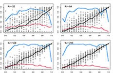
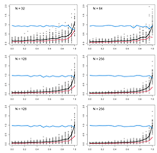

\begin{center}
\textbf{Dean C. Adams$^{1 *}$, Erica K. Baken$^{1,2}$,  and Michael L. Collyer$^{2}$}
\end{center}

\begin{center}`r format(Sys.time(), '%d %B, %Y')`\end{center}

$^{1}$Department of Ecology, Evolution, and Organismal Biology, Iowa State University, Ames, Iowa, USA. 

$^{2}$Department of Science, Chatham University, Pittsburgh, Pennsylvania, USA. 

$^{*}$Correspondence: Dean C. Adams <dcadams@iastate.edu> 
\hfill\break

**Keywords**: phylogenetic signal, lambda, kappa \hfill\break

**Short Title**: Effect size for phylogenetic signal \hfill\break


```{r setup, include=FALSE}
  library(knitr)
  knitr::opts_chunk$set(echo = TRUE)
```

```{r, include = FALSE}
library(stringr)
library(tidyverse)

RmdWords <- function(file) {

  # Creates a string of text
  file_string <- file %>%
    readLines() %>%
    paste0(collapse = " ") %>%
    # Remove YAML header
    str_replace_all("^<--- .*?--- ", "") %>%    
    str_replace_all("^--- .*?--- ", "") %>%
    # Remove code
    str_replace_all("```.*?```", "") %>%
    str_replace_all("`.*?`", "") %>%
    # Remove LaTeX
    str_replace_all("[^\\\\]\\$\\$.*?[^\\\\]\\$\\$", "") %>%
    str_replace_all("[^\\\\]\\$.*?[^\\\\]\\$", "") %>%
    # Deletes text between tags
    str_replace_all("TC:ignore.*?TC:endignore", "") %>%
    str_replace_all("[[:punct:]]", " ") %>%
    str_replace_all("  ", "") %>%
    str_replace_all("<", "") %>%
    str_replace_all(">", "")

  # Save several different results
  word_count <- str_count(file_string, "\\S+")
  char_count <- str_replace_all(string = file_string, " ", "") %>% str_count()

   return(list(num_words = word_count, num_char = char_count, word_list = file_string))
}

words <- RmdWords("Manuscript-8.Rmd")
```

```{r, echo = FALSE}
count <- c(words = words$num_words, characters = words$num_char)
knitr::kable(t(count))
```


\newpage

# Abstract

Macroevolutionary studies frequently characterize the phylogenetic signal in phenotypes, and wish to compare the strength of that signal across traits. However, analytical tools for such comparisons have largely remained underdeveloped. In this study, we evaluated the efficacy of one commonly used parameter (Pagel's $\lambda$) to estimate the strength of phylogenetic signal in phenotypic traits, and evaluate the degree to which $\lambda$ correctly identifies known levels of phylogenetic signal. We find that the precision of $\lambda$ in estimating actual levels of phylogenetic signal is often inaccurate, and that biological interpretations of the strength of phylogenetic signal based on $\lambda$ are therefore compromised. We then propose a standardized effect size based on $\kappa$ ($Z_\kappa$), which measures the strength of phylogenetic signal, and places it on a common scale for statistical comparison. Tests based on $Z_\kappa$ provide a mechanism for formally comparing the strength of phylogenetic signal across datasets, in much the same manner as effect sizes may be used to summarize patterns in quantitative meta-analysis. Our approach extends the phylogenetic comparative toolkit to address hypotheses that compare the strength of phylogenetic signal between various phenotypic traits, even when those traits are found in different evolutionary lineages or have different units or scales.

\newpage

# Introduction

Investigating macroevolutionary patterns of trait variation requires a phylogenetic perspective, because the shared ancestry among species violates an assumption of independence among trait values that is common for statistical tests [@Felsenstein1985; @HarveyPagel1991]. Accounting for this evolutionary non-independence is the purview of *phylogenetic comparative methods* (PCMs): a suite of analytical tools that condition trends in the data on the phylogenetic relatedness of observations [e.g., @Grafen1989; @GarlandIves2000; @Rohlf2001; @ButlerKing2004]. The past several decades have witnessed an impressive expansion in the development of PCMs to address an ever-growing set of macroevolutionary hypotheses [@MartinsHansen1997; @OMeara_et_al2006; @RevellHarmon2008; @Beaulieu_et_al2012; @Adams2014b; @Adams2014a; @AdamsCollyer2018b]. These methods are predicated on the notion that phylogenetic signal -- the tendancy for closely related species to display similar trait values -- is present in cross-species datasets [@Felsenstein1985; @Pagel1999; @Blomberg_et_al2003]. Indeed, under numerous evolutionary models, phylogenetic signal is to be expected, as stochastic character change along the hierarchical structure of the tree of life generates trait covaration among related taxa [see @Felsenstein1985; @Blomberg_et_al2003; @Revell_et_al2008]. \hfill\break

Several analytical tools have been developed to quantify phylogenetic signal in phenotypic datasets, including measures of serial independence [$\mathbf{C}$: @Abouheif1999], autocorrelation estimates [$I$: @Gittleman1990], statistical ratios of trait variation relative to what is expected given the phylogeny [$\kappa$: @Blomberg_et_al2003; @Adams2014a], and scaling parameters used in maximum likelihood fitting of the data to the phylogeny [$\lambda$: @Pagel1999], among others [e.g., @Klingenberg2010]. The statistical properties of these methods -- namely type I error rates and statistical power -- have also been investigated to determine under what conditions phylogenetic signal can be detected [e.g., @Munkemuller_et_al2012; @Pavoine2012;  @DinizFilho2012; @Adams2014a; @MolinaVenegas2017; see also @Revell_et_al2008; @Revell2010]. One of the most widely used methods for characterizing phylogenetic signal in macroevolutionary studies is Pagel's $\lambda$ [@Pagel1999]. The parameter ($\lambda$) transforms the lengths of the internal branches of the phylogeny to improve the fit of data to the phylogeny via maximum likelihood [@Pagel1999; @Freckleton_et_al2002]. Blomberg's $\kappa$ [@Blomberg_et_al2003] is also widely used.  This statistic measures the ratio of trait variation to the amount expected under a Brownian motion (BM) model of evolution.  Pagel's $\lambda$ and Blomberg's $\kappa$ have some similar intuitive appeal, namely because for both a value of $0$ corresponds to no phyloegentic signal in the data and a value of $1$ corresponds to the amount of phylogenetic signal one would expect with a BM model of evolution.  However, as putative measures (statistics) of the amount of phylogenetic signal, they are calculated quite differently.  \hfill\break

In PGLS analysis, Pagel's $\lambda$ is a parameter that ranges from $0$ to $1$ and is optimized via log-likelihood profiling.  After obtaining an optimized $\lambda$ value, $\hat{\lambda}$, likelihood ratio tests can be performed to compare observed model fits using $\hat{\lambda}$ to those obtained when $\lambda=0$ or $\lambda=1$ to infer whether phylogenetic signal differs from no signal or a BM model of evolutionary divergence, respectively [@Freckleton_et_al2002; @Cooper2010; @Bose2019].  Confidence limits on $\hat{\lambda}$ can also be estimated based on percentiles of a $\chi^2$ distribution and where these values are mapped onto a log-likelihood profile [*sensu* @Freckleton_et_al2002].  With respect to confidence limits, one can ascertain whether $\lambda=0$ or $\lambda=1$ is contained within an interval of $\hat{\lambda}$, as an analog to likelihood ratio tests [see, e.g., @Vandelook2019].  It is, therefore, tempting to regard $\hat{\lambda}$ as a descriptive statistic that measures the relative strength of phylogenetic signal, for inferring the extent to which shared evolutionary history has influenced trait covariation among taxa.  By contrast, Blomberg's $\kappa$ is a descriptive statistic that measures the ratio of obsrved trait variation to the amount expected under a BM model of evolution.  Like Pagel's $\lambda$, the range of $0$ to $1$ defines a greater dependence of observed trait variation on the phylogeny but values greater than 1 are possible when phylogenetic signal is especially strong.  Additionally, Blomberg's $\kappa$ can be a test statistic, by employing a permutation test to generate its sampling distribution [@Adams2014a].  Therefore, both statistics have a descriptive meaning, plus an associated test for the null hypothesis of no phlogenetic signal.  An important question that has yet to considered is whether these statistics are or can be converted to effect sizes for comparative analyses?  \hfill\break 

The appeal of either Pagel's $\lambda$ or Blomberg's $\kappa$ as descriptive statistics is that they provide a basis for interpreting "weak" versus "strong" phylogenetic signal; i.e., small versus large values of $\hat{\lambda}$ or $\kappa$, respectively, in a comparative sense [e.g., @DeMeester2019; @Pintanel2019;@Su2019]. As statistics, they should have reliable distributional properties, which could be revealed with simulation experiments.  As a proportional random variable bounded by 0 and 1, we might expect that $\hat{\lambda}$ follows a Bernoulli distribution (**add ref**); i.e., branch lengths in a tree are scaled proportionally to the probability that data arise from a BM process.  As such, we would also expect in a simulation experiment that given a known $\lambda$ value used to generate random data on a tree that the mean of an empirical sampling distribution of $\hat{\lambda}$ would approximately equal $\lambda$; the dispersion of $\hat{\lambda}$ would be largest at intermediate values of $\lambda$, and predictable over the range of $\lambda$ with respect to treesize; the distribution of $\hat{\lambda}$ would be symmetric at intermediate values of $\lambda$ and more skewed toward values of 0 or 1; and that the distribution of $\hat{\lambda}$ will be more platykurtic at intermediate values of $\lambda$, becoming more leptokurtic toward 0 and 1 (**add same ref**). These properties seemed to be reasonable from the simulations perfomed by Münkemüller et al.[-@Munkemuller_et_al2012, see Fig. 2].  Their study simulated "strength of Brownian motion" as a varied weighted-average of data simulated on trees with $\lambda=0$ and $\lambda=1$, rather than from prescribed values of $\lambda$.  Nonetheless, across the range of BM strength, $\hat{\lambda}$ resembled a Bernoulli random variable, based superficially on statistical moments (mean, variance, skewness, and kurtosis; see their Fig. 2), for a given tree size. \hfill\break

By contrast, with Blomberg's $\kappa$, which is positively ubounded, we might expect that $\hat{\lambda}$ follows a normal distribution (**add ref**).  A simulation experiment should reveal that $\kappa$ is symmetrically distributed across different strengths of phylogenetic signal, for any $\lambda$ used to generate data.  This attribute seemed less reasonable based on the simulations performed by Münkemüller et al. [-@Munkemuller_et_al2012], as distibutions were postively skewed, suggesting the Blomberg's $\kappa$ might not behave as a statistic that follows a noraml distribution.  However, because their simulations used a weighted combination of simulated phylogenetic signal strengths, strong inferences are not possible (and distributional attributes were not the intended result of their simulations).  For both Pagel's $\lambda$ or Blomberg's $\kappa$, evaluation of statistical moments across a range of $\lambda$ used to generate data would be valuable for adjudicating the relibalilty of these statistics.  Furthermore, these are statistics that appear to have expected values that vary with tree size [@Munkemuller_et_al2012], making comparisons across studies challenging.  Therefore, transformation of these statistics into $Z$-scores in the same simulation experiments would allow evaluation of the efficacy of each statistic to yield effect sizes that could be used for comparative anlyses. \hfill\break

In this study, we used simulation experiments to compare the distributional attributes of $\hat{\lambda}$ and Blomberg's $\kappa$, plus their effect sizes ($Z$-scores), across a range of tree size and phylogenetic signal strength.  We present results based on pure-birth trees, but results from blanced or pectinate trees were qualitatively no different (see Supporting Information).  Results from trees with polytomies, or from linear regression or phylogenetic ANOVA, were also qualitatively no different (see Supporting Information).

# Results

Our simulations involved tree sizes of $2^5$, $2^6$, ..., $2^{10}$ and $\lambda$ of 0, 0.05, 0.10, ..., 1.0, with 100 random trees for each intersection of tree size and $\lambda$.  For each $\lambda$ within each tree size, we measured the mean values of $\hat{\lambda}$ and Blomberg's $\kappa$, their standard deviation, and a Shapiro-Wilk  $W$ statistic as a departure from normality (symmetry), with a value of $1.0$ indicating normally distributed values.  Departures from $1.0$ indicate skewness.  Kurtosis was not measured directly but could be qualitatively evaluated from plots. \hfill\break

In general, the following six results were clear (Fig. 1).  First, for $\hat{\lambda}$, the distributional expectations of a Bernoulli variable were mostly upheld.  The mean value of $\hat{\lambda}$ increased as $\lambda$ increased; the standard deviation of $\hat{\lambda}$ was largest at intermediate values of $\lambda$ and smallest at extreme values; and the distributions of $\hat{\lambda}$ were increasing skewed at extreme values of $\lambda$ but rather normal at intermediate values.  (For small tree sizes, it was also clear that distributions were more platykurtik at intermeidate values of $\hat{\lambda}$; see Fig. 1).  However, second, $\hat{\lambda}$ was a negatively-biased estimate of $\lambda$ for small tree sizes, as the mean value was consistently less than the input $\lambda$ value.  Third, standard deviations of $\hat{\lambda}$ values were negatively associated with tree size.  In fact, for tress of 128 species or less, $\hat{\lambda}$ was quite variable, except for cases when $\lambda$ was near or equal to 1.  Fourth, for $\kappa$, mean values increased consistently with $\lambda$, irespective of tree size; standard deviation of $\kappa$ was consistent across tree sizes; and $\kappa$ was normally distributed regarless of $\kappa$ or tree size, in general (Fig. 2).  Fifth, standard deviation of $\kappa$ increased with $\lambda$, somewhat tracking the mean, but were always less than corresponding means.  This is perhaps unsurprising, as $\kappa$ is bound by 0, and was never large for small values of $\lambda$.  Finally, sixth, the only evidence of skewing of $\kappa$ distributions was at small tree sizes and $\lambda$ near or equal to 1, which differs from the results of Münkemüller et al. [-@Munkemuller_et_al2012], who used weighted combinations of simulated data.  The skewing observed in their simulation results appears to be from combining random values generated independently.  \hfill\break

In terms of effect sizes, $Z$-scores were associated with both phylogenetic signal strength ($\lambda$) and tree size, for both statistics.  Effect sizes from $\hat{\lambda}$ made little sense.  Effect sizes were exceedingly associated with tree size, as much or more so than  phylogenetic signal strength (Fig. 3).  By contrast, standard deviates from $\kappa$ were much more consistent accross tree sizes, and exhibited only a slight positive association with tree size despite a clear positive association with phylogenetic signal strength.  Between the two statistics, effect sizes from $\kappa$ would be reliable for cross-study comparisons but effect sizes from $\hat{\lambda}$ would require comparisons limited to phylogenies with similar numbers of species.

# Discussion

\newpage

Real figures will have 6 panels for lambda and kappa and probably only a subset for z.  Simulations need to be re-run.


```{r, echo = FALSE, out.width="95%"}
  

```

\singlespacing \textbf{Figure 1}.  Temporary Fig. 1 showing lambda patterns

\newpage

```{r, echo = FALSE, out.width="95%"}
  

```

\singlespacing \textbf{Figure 2}.  Temporary Fig. 2 showing kappa patterns

\newpage

```{r, echo = FALSE, out.width="95%"}
include_graphics("new.fig.3.temp.png")  

```

\singlespacing \textbf{Figure 3}.  Temporary Fig. 3 showing z patterns

\newpage
