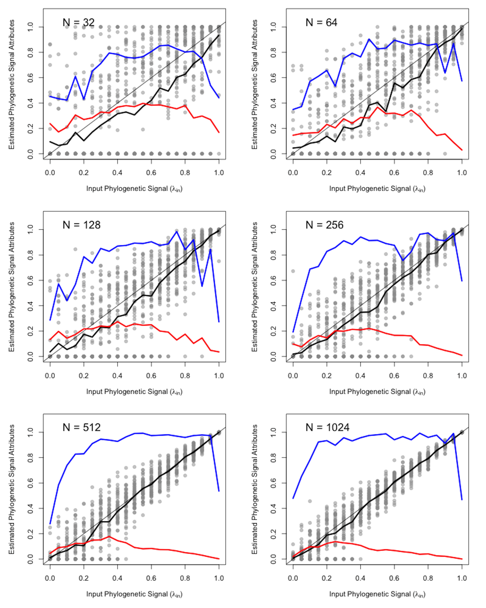
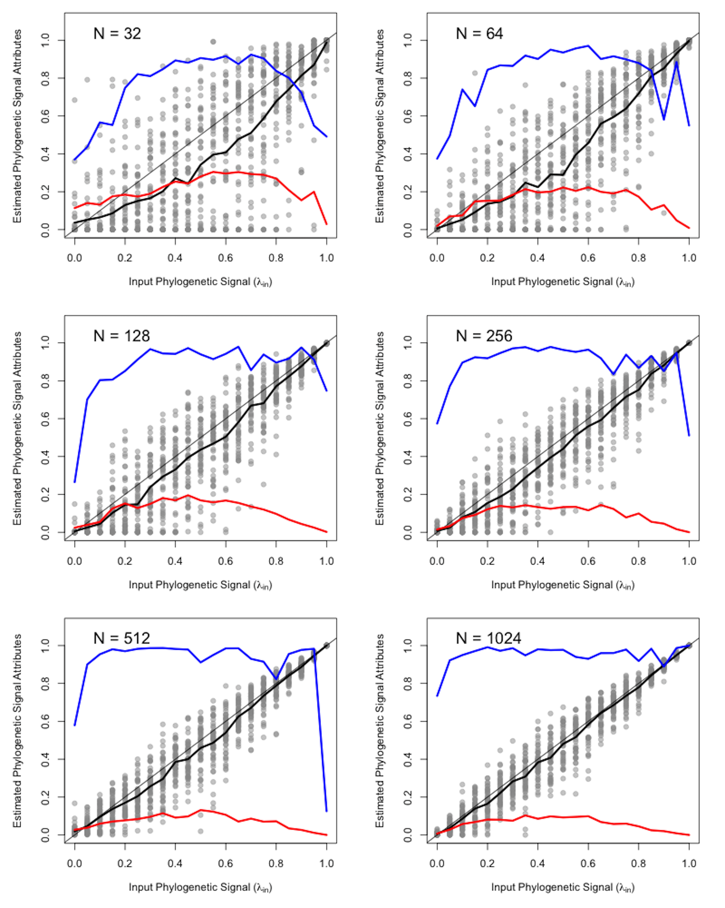
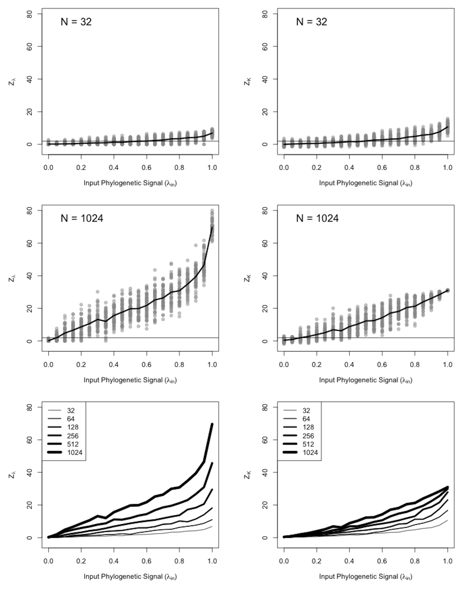
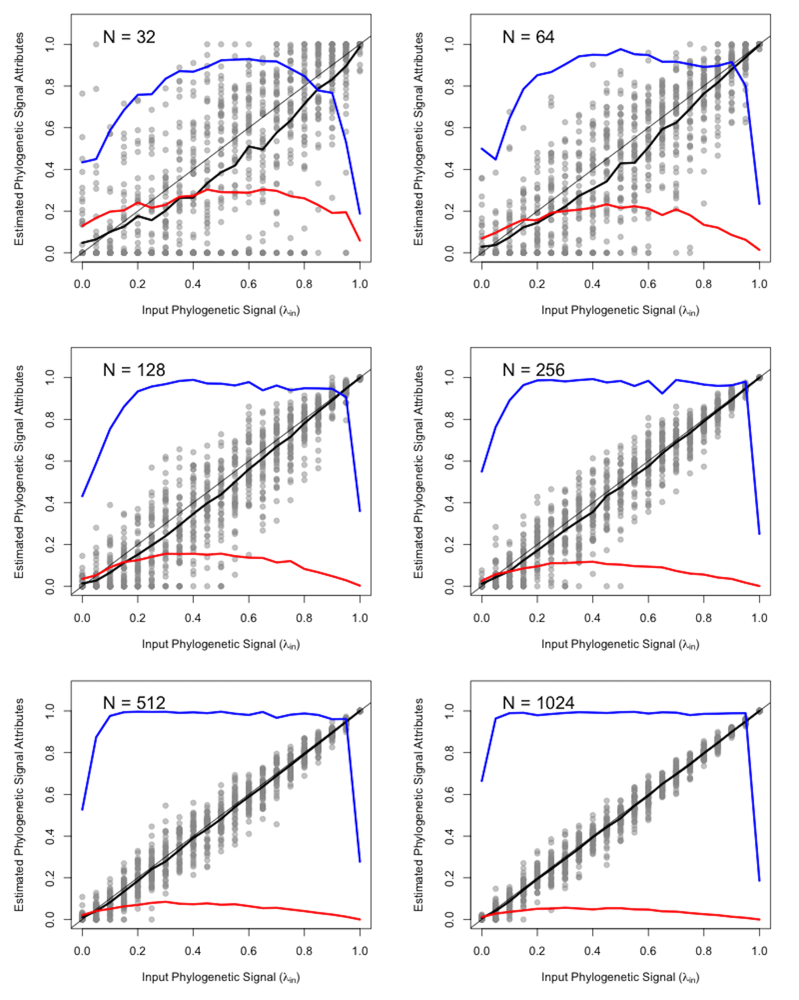

 
```{r setup, include=FALSE}
  library(knitr)
  knitr::opts_chunk$set(echo = TRUE)
```

# Additional Simulation Results

Here we provide additional supporting information referenced in the main document, which include additional analyses, and simulation results across a wider set of input conditions. As before, simulations were conducted on six different tree sizes ($n=2^5, 2^6, \cdots, 2^{10}$), and with differing levels of phylogenetic signal ($\lambda=0.0, 0.5, \cdots, 1.0$). We generated 50 random trees for each intersection of tree size and $\lambda$. For each $\lambda$ within each tree size, continuous traits were then simulated on each phylogeny under a BM model of evolution. For each set of 50 trees we measured the mean values of $\hat{\lambda}$ and $K$, their standard deviation, and calculated the Shapiro-Wilk $W$ statistic as a departure from normality (symmetry). For the latter, a value of $1.0$ indicates normally distributed values, while departures from $1.0$ indicate skewness.

## Additional Results on Pure-Birth Phylogenies

Results from the simulations on pure-birth trees revealed that both $Z_{\lambda}$ and $Z_K$ increased with increasing input phylogenetic signal, but $\hat{\lambda}$ was strongly affected by tree size, whereas $Z_K$ was more consistent (Fig. S4). Additionally, $Z_K$ increased more linearly with increasing levels of phylogenetic signal, and its standard deviation across input signal was more even across tree sizes, implying more consistent precision. This latter observation is seen in the upper four panels of Fig. S1, where the dispersion of simulation results (gray dots) is far more even at each input level of phylogenetic signal for $Z_K$ than it is for $Z_{\lambda}$.

```{r, echo = FALSE, out.width="95%", align= "center"}
  
```

\textbf{Figure S1}. Response of effect sizes \(Z_{\lambda}\) and \(Z_K\) to increasing strength of Brownian motion for pure-birth trees.

\newpage


## Simulations on Pectinate Phylogenies

Results from simulations on pectinate phylogenies largely mirrored those found on pure-birth trees. For $\hat{\lambda}$, the mean value increased with increasing input signal, but was negatively biased, and was less than the input value across most of its range (Fig. S2: black line). Additionally, the precision of $\hat{\lambda}$ varied with differing input levels, with the greatest variation found at intermediate values of $\lambda$ (Fig. S2 red line). Finally, the distribution of $\hat{\lambda}$ was not normal, and became more skewed at more extreme values of $\lambda$ (Fig. S2 blue line).  \hfill\break

For *K*, mean values increased with increasing phylogenetic signal, though as was found with pure-birth trees, the increase was nonlinear (Fig. S3 black line). Likewise, variation increased with increasing phylogenetic signal (Fig. S3 red line), though the distribution of *K* was more normally distributed throughout its range, and across different tree sizes, as compared with $\hat{\lambda}$, though there was some slight skew for high input levels of phylogenetic signal on large phylogenies (Fig. S3 blue line). \hfill\break

With respect to effect sizes, both $Z_{\lambda}$ and $Z_K$ increased with increasing input phylogenetic signal, but $\hat{\lambda}$ was strongly affected by tree size, whereas $Z_K$ was more consistent (Fig. S4). Also, $Z_K$ increased more linearly with increasing levels of phylogenetic signal, and its standard deviation across input signal was more even across tree sizes, implying more consistent precision. 

```{r, echo = FALSE, out.width="95%", align= "center"}
  
```

\textbf{Figure S2}. Response of Pagel's \(\lambda\) to increasing strength of Brownian motion on pectinate trees. Gray line signifies the 1:1 line where the input value matches the estimate.At each input level, the dark
black line represents the empirically derived expected value (mean) of
\(\hat\lambda\), the red line is the standard deviation of
\(\hat\lambda\), and the blue line is Shapiro Wilks statistic of
\(\hat\lambda\) (\(W=1.0\) signifies normality, \(W< 1.0\) represent
skewed distributions).

```{r, echo = FALSE, out.width="95%", align= "center"}
  
```

\textbf{Figure S3}. Response of Blomberg's \textit{K} to increasing strength of Brownian motion on pectinate trees.  At each input level, the dark black line represents the empirically derived expected value (mean) of
\textit{K}, the red line is the standard deviation of
\textit{K}, and the blue line is Shapiro Wilks statistic of
\textit{K} (\(W=1.0\) signifies normality, \(W< 1.0\) represent
skewed distributions).

```{r, echo = FALSE, out.width="95%", align= "center"}
  
```

\textbf{Figure S4}. Response of effect sizes \(Z_{\lambda}\) and \(Z_K\) to increasing strength of Brownian motion for pectinate trees.

\newpage

## Simulations on Balanced Phylogenies

Results from simulations on balanced phylogenies also mirrored those found on pure-birth trees. For $\hat{\lambda}$, the mean value increased with increasing input signal, but was negatively biased, and was less than the input value across most of its range (Fig. S5: black line). Additionally, the precision of $\hat{\lambda}$ varied with differing input levels, with the greatest variation found at intermediate values of $\lambda$ (Fig. S5 red line). Finally, the distribution of $\hat{\lambda}$ was not normal, and became more skewed at more extreme values of $\lambda$ (Fig. S5 blue line).  \hfill\break

For *K*, mean values increased with increasing phylogenetic signal, though as was found with pure-birth trees, the increase was nonlinear (Fig. S6 black line). Likewise, variation increased with increasing phylogenetic signal (Fig. S6 red line), though the distribution of *K* was more normally distributed throughout its range, and across different tree sizes, as compared with $\hat{\lambda}$, though there was some slight skew for high input levels of phylogenetic signal on large phylogenies (Fig. S6 blue line). \hfill\break

With respect to effect sizes, both $Z_{\lambda}$ and $Z_K$ increased with increasing input phylogenetic signal, but $\hat{\lambda}$ was strongly affected by tree size (fig. S7). Also, $Z_K$ increased more linearly with increasing levels of phylogenetic signal, though there was a slight effect of tree size with balanced phylogenies. But as before, its standard deviation across input signal was more even across tree sizes, implying more consistent precision. 

```{r, echo = FALSE, out.width="95%", align= "center"}
  
```

\textbf{Figure S5}. Response of Pagel's \(\lambda\) to increasing strength of Brownian motion on balanced trees. Gray line signifies the 1:1 line where the input value matches the estimate. At each input level, the dark black line represents the empirically derived expected value (mean) of \(\hat\lambda\), the red line is the standard deviation of \(\hat\lambda\), and the blue line is Shapiro Wilks statistic of \(\hat\lambda\) (\(W=1.0\) signifies normality, \(W< 1.0\) represent skewed distributions).

```{r, echo = FALSE, out.width="95%", align= "center"}
  
```

\textbf{Figure S6}. Response of Blomberg's \textit{K} to increasing strength of Brownian motion on balanced trees.  At each input level, the dark black line represents the empirically derived expected value (mean) of \textit{K}, the red line is the standard deviation of \textit{K}, and the blue line is Shapiro Wilks statistic of \textit{K} (\(W=1.0\) signifies normality, \(W< 1.0\) represent skewed distributions).

```{r, echo = FALSE, out.width="95%", align= "center"}
  
```

\textbf{Figure S7}. Response of effect sizes \(Z_{\lambda}\) and \(Z_K\) to increasing strength of Brownian motion for balanced trees.

\newpage

## Simulations on Phylogenies Containing Polytomies

We also investigaged the effect of unresolved phylogenies on estimates of phylogenetic signal by adjusting pure-birth trees to have 20% collapsed nodes, following the procedures of [@MolinaVenegas2017]. Results from simulations on phylogenies containing polytomies mirrored those found on fully resolved trees. For $\hat{\lambda}$, the mean value increased with increasing input signal, but was negatively biased, and was less than the input value across most of its range (Fig. S8: black line). Additionally, the precision of $\hat{\lambda}$ varied with differing input levels, with the greatest variation found at intermediate values of $\lambda$ (Fig. S8 red line). Finally, the distribution of $\hat{\lambda}$ was not normal, and became more skewed at more extreme values of $\lambda$ (Fig. S8 blue line).  \hfill\break

For *K*, mean values increased with increasing phylogenetic signal, though as was found with pure-birth trees, the increase was nonlinear (Fig. S9 black line). Likewise, variation increased with increasing phylogenetic signal (Fig. S9 red line), though the distribution of *K* was more normally distributed throughout its range, and across different tree sizes, as compared with $\hat{\lambda}$ (Fig. S9 blue line). \hfill\break

With respect to effect sizes, both $Z_{\lambda}$ and $Z_K$ increased with increasing input phylogenetic signal, but $\hat{\lambda}$ was strongly affected by tree size, whereas $Z_K$ was more consistent (Fig. S10). Also, $Z_K$ increased more linearly with increasing levels of phylogenetic signal, and its standard deviation across input signal was more even across tree sizes, implying more consistent precision. Thus, polytomies do not exert an appreciable effect on $Z_K$.

```{r, echo = FALSE, out.width="95%", align= "center"}
  
```

\textbf{Figure S8}. Response of Pagel's \(\lambda\) to increasing strength of Brownian motion on pure-birth trees containing polytomies. Gray line signifies the 1:1 line where the input value matches the estimate. At each input level, the dark black line represents the empirically derived expected value (mean) of \(\hat\lambda\), the red line is the standard deviation of \(\hat\lambda\), and the blue line is Shapiro Wilks statistic of \(\hat\lambda\) (\(W=1.0\) signifies normality, \(W< 1.0\) represent skewed distributions).

```{r, echo = FALSE, out.width="95%", align= "center"}
  
```

\textbf{Figure S9}. Response of Blomberg's \textit{K} to increasing strength of Brownian motion on pure-birth trees containing polytomies.  At each input level, the dark black line represents the empirically derived expected value (mean) of \textit{K}, the red line is the standard deviation of \textit{K}, and the blue line is Shapiro Wilks statistic of \textit{K} (\(W=1.0\) signifies normality, \(W< 1.0\) represent skewed distributions).

```{r, echo = FALSE, out.width="95%", align= "center"}
  
```

\textbf{Figure S10}. Response of effect sizes \(Z_{\lambda}\) and \(Z_K\) to increasing strength of Brownian motion for pure-birth trees containing polytomies.

\newpage

## Simulations of Phylogenetic Regression and ANOVA

We also investigated the effect of incorporating $\lambda$ in PGLS analyses (phylogenetic regression and ANOVA). Here, patterns for $\hat\lambda$, *K*, $Z_\lambda$ and $Z_K$ were virtually identical to those found previously. In essence, $\hat\lambda$ was not suitable as a test statistic representing phylogenetic signal due to all properties previously shown (Figs. S11 & S12), *K* was more appropriate, but  associated non-linearly with signal strength (Figs. S13 & 14), while $Z_K$ was found to be a superior effect size as compared with $Z_\lambda$ (Figs S15 & S16). \hfill\break

With respect to model performance, input parameters ($\beta$) were well estimated in phylogenetic regression  and ANOVA when $\lambda$ was incorporated (Figs S17 & S18), implying that $\lambda$ may be used as a tuning parameter for these models. Additionally, type I error and statistical power were unaffected by the inclusion of $\lambda$ (Figs S19 & S20), though power was reduced at smaller sample sizes in phylogenetic ANOVA, mirroring prior findings of [@AdamsCollyer2018b]. These results generally confirmed earlier findings of [@Revell2010] for phylogenetic regression, and extend them to the case of phylogenetic ANOVA.

```{r, echo = FALSE, out.width="95%", align= "center"}
  
```

\textbf{Figure S11}. Response of Pagel's \(\lambda\) to increasing strength of Brownian motion in phylogenetic regression (incorporating $\lambda$). Gray line signifies the 1:1 line where the input value matches the estimate. At each input level, the dark black line represents the empirically derived expected value (mean) of \(\hat\lambda\), the red line is the standard deviation of \(\hat\lambda\), and the blue line is Shapiro Wilks statistic of \(\hat\lambda\) (\(W=1.0\) signifies normality, \(W< 1.0\) represent skewed distributions).

```{r, echo = FALSE, out.width="95%", align= "center"}
  
```

\textbf{Figure S12}. Response of Pagel's \(\lambda\) to increasing strength of Brownian motion in phylogenetic ANOVA (incorporating $\lambda$). Gray line signifies the 1:1 line where the input value matches the estimate. At each input level, the dark black line represents the empirically derived expected value (mean) of \(\hat\lambda\), the red line is the standard deviation of \(\hat\lambda\), and the blue line is Shapiro Wilks statistic of \(\hat\lambda\) (\(W=1.0\) signifies normality, \(W< 1.0\) represent skewed distributions).

```{r, echo = FALSE, out.width="95%", align= "center"}
  
```

\textbf{Figure S13}. Response of Blomberg's \textit{K} to increasing strength of Brownian motion in phylogenetic regression (incorporating $\lambda$).  At each input level, the dark black line represents the empirically derived expected value (mean) of \textit{K}, the red line is the standard deviation of \textit{K}, and the blue line is Shapiro Wilks statistic of \textit{K} (\(W=1.0\) signifies normality, \(W< 1.0\) represent skewed distributions).

```{r, echo = FALSE, out.width="95%", align= "center"}
  
```

\textbf{Figure S14}. Response of Blomberg's \textit{K} to increasing strength of Brownian motion in phylogenetic ANOVA (incorporating $\lambda$). At each input level, the dark black line represents the empirically derived expected value (mean) of \textit{K}, the red line is the standard deviation of \textit{K}, and the blue line is Shapiro Wilks statistic of \textit{K} (\(W=1.0\) signifies normality, \(W< 1.0\) represent skewed distributions).

```{r, echo = FALSE, out.width="95%", align= "center"}
  
```

\textbf{Figure S15}. Response of effect sizes \(Z_{\lambda}\) and \(Z_K\) to increasing strength of Brownian motion in phylogenetic regression (incorporating $\lambda$).

```{r, echo = FALSE, out.width="95%", align= "center"}
  
```

\textbf{Figure S16}. Response of effect sizes \(Z_{\lambda}\) and \(Z_K\) to increasing strength of Brownian motion in phylogenetic ANOVA (incorporating $\lambda$).

```{r, echo = FALSE, out.width="95%", align= "center"}
  
```

\textbf{Figure S17}. Parameter estimates from phylogenetic regression (incorporating $\lambda$). The red line represents the estimated slope, which almost completely overlaps the gray 1:1 line.

```{r, echo = FALSE, out.width="95%", align= "center"}
  
```

\textbf{Figure S18}. Parameter estimates from phylogenetic ANOVA (incorporating $\lambda$). The red line represents the estimated slope, which almost completely overlaps the gray 1:1 line.

```{r, echo = FALSE, out.width="95%", align= "center"}
  
```

\textbf{Figure S19}. Power curves for phylogenetic regression (incorporating $\lambda$). Type I error is found on the far-left of the plot (effect = 0).

```{r, echo = FALSE, out.width="95%", align= "center"}
  
```

\textbf{Figure S20}. Power curves for phylogenetic ANOVA (incorporating $\lambda$). Type I error is found on the far-left of the plot (effect = 0).

\newpage

## Statistical properties of $\hat{Z}_{12}$

Here we examine the statistical properties of tests for comparing the relative strength of phylogenetic signal, using $\hat{Z}_{12}$. Simulations were performed using pure-birth trees of different sizes ($n=2^5, 2^6, \cdots, 2^{10}$), and with differing levels of phylogenetic signal ($\lambda=0.0, 0.5, \cdots, 1.0$). For each combination of $n$ and $\lambda$, 2 pure-birth trees were generated and 50 traits were simulated on each phylogeny under a Brownian motion model of evolution. Next, the phylogenetic signal between traits was compared in pairwise fashion for all $50*49/2 = 1225$ combinations, using $\hat{Z}_{12}$. The proportion of significant results provided an estimate of the type I error or model misspecification. Specifically, type I error was evaluated when traits were simulated using no input phylogenetic signal (i.e., $\lambda = 0$). Likewise, model misspecification was evaluated for data simulated with some known, but equal, level of phylogenetic signal (i.e., $\lambda > 0$). \hfill\break

**Results:** Tests revealed that across simulation conditions, the average type I error of $\hat{Z}_{12}$ was approximately 0.05 (Fig. S21). Likewise, levels of misspecification were also low, and were at or below the nominal 5% level (Fig. S21 black line). Both results demonstrate that comparisons of the strength of phylogenetic signal using $\hat{Z}_{12}$ do not display high levels of false positives, and are thus appropriate for comparing the degree of phylogenetic signal across traits. 

```{r, echo = FALSE, out.height="50%", align= "center"}
include_graphics("Figs/fig.S21.png")  
```

\textbf{Figure S21}. Type I error rates and model misspecification for $\hat{Z}_{12}$. Type I error is found on the far-left of the plot ($\lambda = 0$).


\newpage

## References
