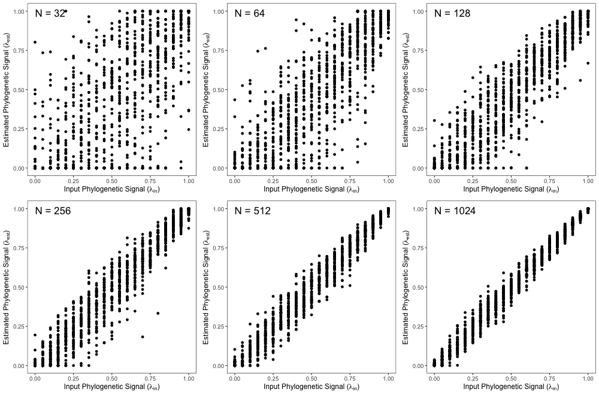
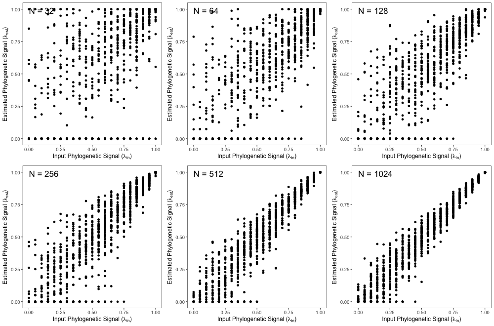
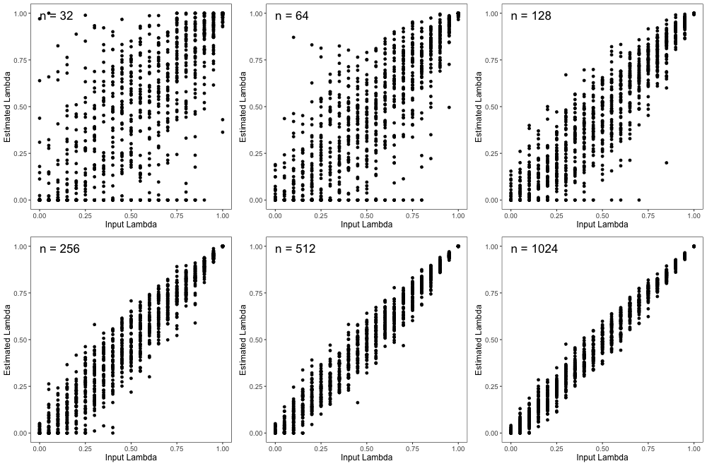
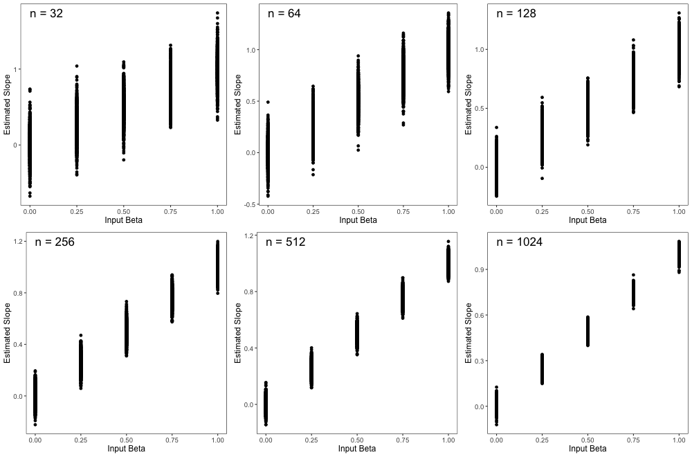
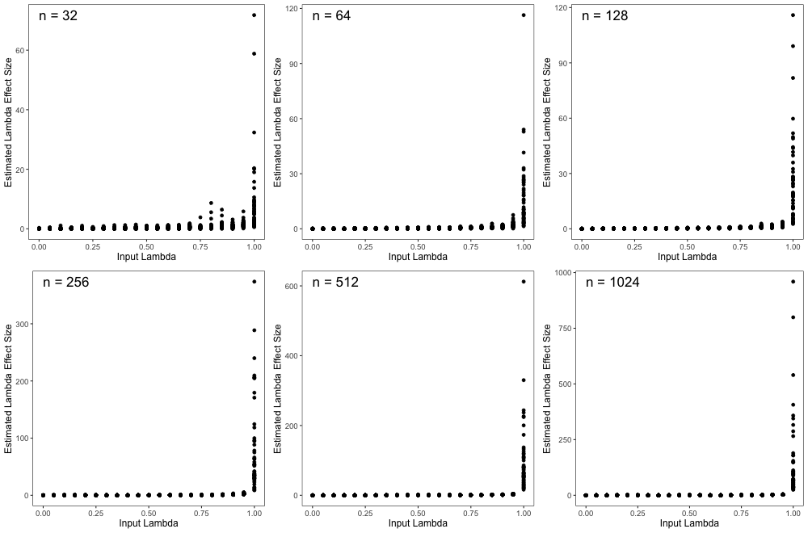
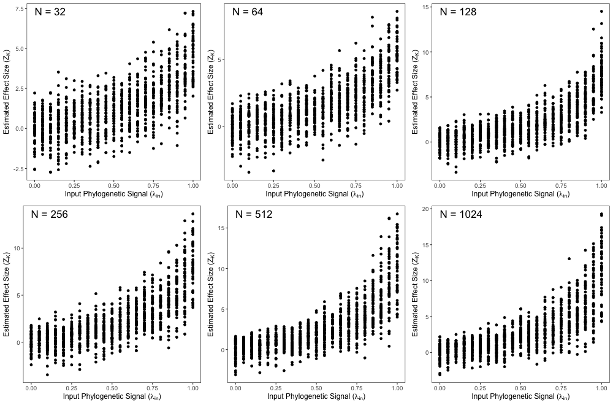
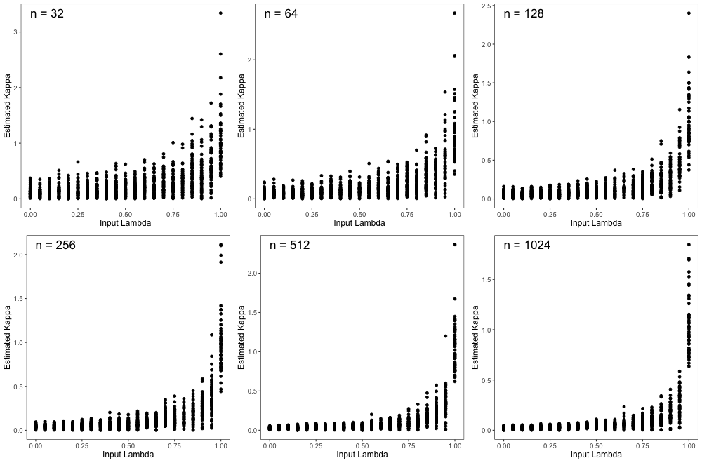

---
title:

output: 
  pdf_document:
    fig_caption: yes
    number_sections: no  #note: change to 'no' for most journals
    keep_tex: true
    pandoc_args:


csl: evolution.csl
bibliography: Lambda-Refs.bib


---
# Supporting Information for: Estimates of Phylogenetic Signal Based on Lambda are Often Inaccurate

*COPY FIGURES FROM FIGURES FOLDER INTO MANUSCRIPT FOLDER IN ORDER TO KNIT*

Here we provide additional supporting information referenced in the main document: additional analyses, and simulation results across a wider set of input conditions.


## Simulations on differently shaped phylogenies

```{r setup, include=FALSE}
  library(knitr)
  knitr::opts_chunk$set(echo = TRUE)
```

In addition to using pure-birth phylogenies, we explored the effect of tree shape on our findings using both balanced and pectinate trees. As before, simulations were conducted on a range of tree sizes ($n=2^5 - 2^{10}$), and across a range of input levels of phylogenetic signal ($\lambda_{in} = 0.0 \to 1.0$; in 21 intervals of 0.05 units). For each $n$ and $\lambda_{in}$ combination, 50 replicates of a continuous trait were simulated using a Brownian motion model of evolution. Using these, we estimated the degree of phylogenetic signal using $\lambda$. \hfill\break

*Results*. As found with pure-birth phylogenies, estimates of $\lambda$ varied most dramatically in simulations with fewer species and at intermediate values of lambda (Fig. S1, S2). Pectinate trees showed an interesting tendency to underestimate $/lambda$ as 0 for input $/lambda$ values. Most dramatically, some simulations on the largest pectinate phylogeny ($n = 1024$) estimated $/lambda = 0$ for input values as high as 0.75 (Fig. S2).

```{r, echo = FALSE, out.width="95%"}
  

```

\textbf{Figure S1}. Accuracy of Pagel's lambda estimations across known lambda inputs on various tree sizes. Results obtained using balanced trees. \hfill\break

```{r, echo = FALSE, out.width="95%"}
  

```

\textbf{Figure S2}. Accuracy of Pagel's lambda estimations across known lambda inputs on various tree sizes. Results obtained using pectinate trees. \hfill\break

## Simulations of phylogenetic regression and ANOVA

```{r setup, include=FALSE}
  library(knitr)
  knitr::opts_chunk$set(echo = TRUE)
```

We analyzed the reliability of parameter estimations when used in phylogenetic regression and ANOVA. This involved simulations of dependent variables with $\lambda$ values ranging from 0 to 1 (21 intervals of 0.05 units) across pure-birth trees ($n=2^5 - 2^{10}$). For each $\lambda$ input value, independent variables were then generated with a known relationship ($\beta = 0, 0.25, 0.5, 0.75, 1.0$), from which $\lambda$ was then estimated.

*Results* As with the results from the regression analyses in the main text, we found limmited $\lambda$ estimation precision in smaller trees and at intermediate levels of phylogenetic signal with phylogenetic ANOVA (Fig. S3). Slope was reliably estimated across tree sizes and known $\lambda$ values (Fig. S4).

```{r, echo = FALSE, out.width="95%"}
  

```

\textbf{Figure S3}. Precision of Pagel's $\lambda$ when incorporated in phylogenetic ANOVA. Results are from input $\beta$ values of $0.5$. \hfill\break

```{r, echo = FALSE, out.width="95%"}
  

```

\textbf{Figure S4}. Precision of slope estimates across known input $\beta$ values of phylogenetic regression. Results shown include all input $\lambda$ values. \hfill\break

\newpage

*still needs heavy edits*

```{r, echo = FALSE, out.width="95%"}
  

```

\textbf{Figure S5}. lambda_Z~lambda_input across tree sizes \hfill\break

```{r, echo = FALSE, out.width="95%"}
  

```

\textbf{Figure S6}. kappa_Z~lambda_input across tree sizes \hfill\break

```{r, echo = FALSE, out.width="95%"}
  

```

\textbf{Figure S7}. kappa~lambda_input across tree sizes \hfill\break

\newpage

# References

 \setlength{\parindent}{-0.25in}
 \setlength{\leftskip}{0.25in}
 \setlength{\parskip}{8pt}
 \noindent

<div id="refs"></div>
 

