 
```{r setup, include=FALSE}
  library(knitr)
  knitr::opts_chunk$set(echo = TRUE)
```


Here we provide additional supporting information referenced in the main document, which include additional analyses, and simulation results across a wider set of input conditions. As before, simulations were conducted on six different tree sizes ($n=2^5, 2^6, \cdots, 2^{10}$), and with differing levels of phylogenetic signal ($\lambda=0.0, 0.5, \cdots, 1.0$). We generated 100 random trees for each intersection of tree size and $\lambda$. For each $\lambda$ within each tree size, continuous traits were then simulated on each phylogeny under a BM model of evolution. For each set of 100 trees we measured the mean values of $\hat{\lambda}$ and $\kappa$, their standard deviation, and calculated the Shapiro-Wilk $W$ statistic as a departure from normality (symmetry). For the latter, a value of $1.0$ indicates normally distributed values, while departures from $1.0$ indicate skewness.

## Simulations on Pectinate Phylogenies

Results from simulations on pectinate phylogenies largely mirrored those found on pure-birth trees. For $\hat{\lambda}$, the mean value increased with increasing input signal, but was negatively biased, and was less than the input value across most of its range (Fig. S1: black line). Additionally, the precision of $\hat{\lambda}$ varied with differing input levels, with the greatest variation found at intermediate values of $\lambda$ (Fig. S1 red line). Finally, the distribution of $\hat{\lambda}$ was not normal, and became more skewed at more extreme values of $\lambda$ (Fig. S1 blue line).  \hfill\break

For $\hat\kappa$, mean values increased with increasing phylogenetic signal, though as was found with pure-birth trees, the increase was nonlinear (Fig. S2 black line). Likewise, variation increased with increasing phylogenetic signal (Fig. S2 red line), though the distribution of $\hat\kappa$ was more normally distributed throughout its range, and across different tree sizes, as compared with $\hat{\lambda}$, thought there was some slight skew for high input levels of phylogenetic signal on large phylogenies (Fig. S2 blue line). \hfill\break

With respect to effect sizes, both $Z_{\lambda}$ and $Z_{\kappa}$ increased with increasing input phylogenetic signal, but $\hat{\lambda}$ was strongly affected by tree size, whereas $Z_{\kappa}$ was more consistent (Fig. S3). Also, $Z_{\kappa}$ increased more linearly with increasing levels of phylogenetic signal, and its standard deviation across input signal was more even across tree sizes, implying more consistent precision. 

```{r, echo = FALSE, out.width="95%", align= "center"}
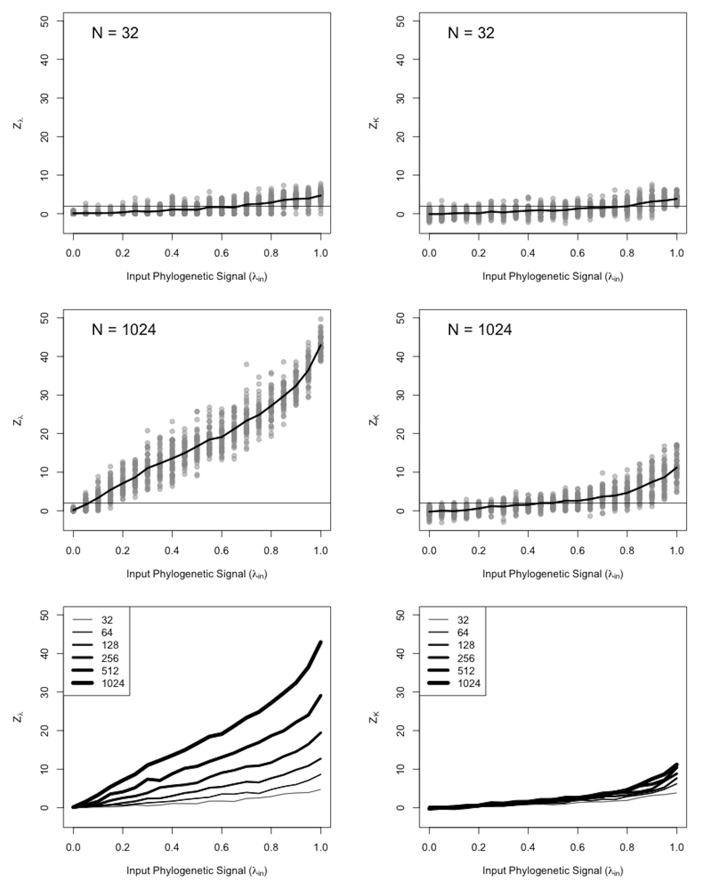  
```

\textbf{Figure S1}. Response of Pagel's \(\lambda\) to increasing strength of Brownian motion on pectinate trees. Gray line signifies the 1:1 line where the input value matches the estimate.

```{r, echo = FALSE, out.width="95%", align= "center"}
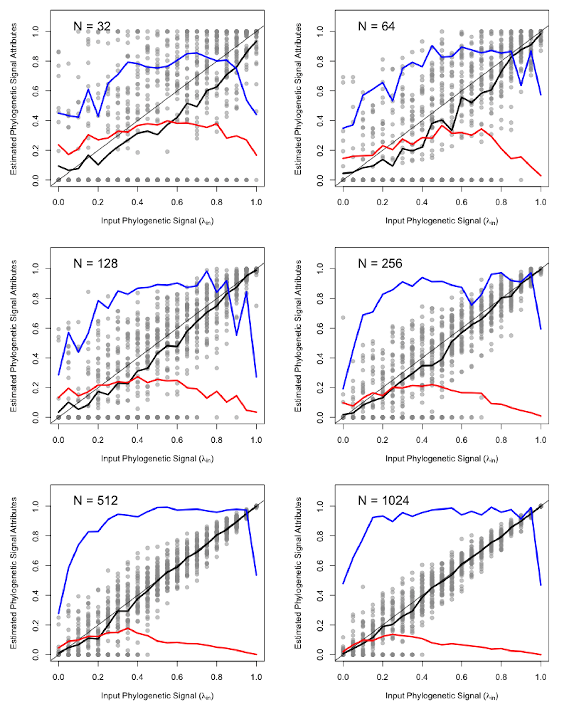  
```

\textbf{Figure S2}. Response of Blomberg's \(\kappa\) to increasing strength of Brownian motion on pectinate trees. Gray line signifies the 1:1 line where the input value matches the estimate.

```{r, echo = FALSE, out.width="95%", align= "center"}
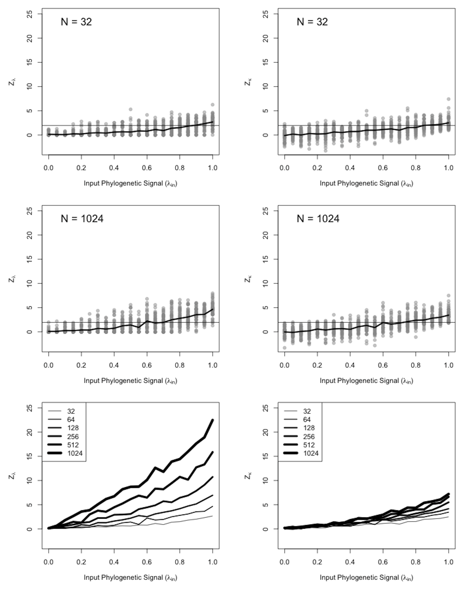  
```

\textbf{Figure S3}. Response of effect sizes \(Z_{\lambda}\) and \(Z_{\kappa}\) to increasing strength of Brownian motion.

\newpage

## Simulations on Balanced Phylogenies

Results from simulations on balanced phylogenies also mirrored those found on pure-birth trees. For $\hat{\lambda}$, the mean value increased with increasing input signal, but was negatively biased, and was less than the input value across most of its range (Fig. S4: black line). Additionally, the precision of $\hat{\lambda}$ varied with differing input levels, with the greatest variation found at intermediate values of $\lambda$ (Fig. S4 red line). Finally, the distribution of $\hat{\lambda}$ was not normal, and became more skewed at more extreme values of $\lambda$ (Fig. S4 blue line).  \hfill\break

For $\hat\kappa$, mean values increased with increasing phylogenetic signal, though as was found with pure-birth trees, the increase was nonlinear (Fig. S5 black line). Likewise, variation increased with increasing phylogenetic signal (Fig. S5 red line), though the distribution of $\hat\kappa$ was more normally distributed throughout its range, and across different tree sizes, as compared with $\hat{\lambda}$, thought there was some slight skew for high input levels of phylogenetic signal on large phylogenies (Fig. S5 blue line). \hfill\break

With respect to effect sizes, both $Z_{\lambda}$ and $Z_{\kappa}$ increased with increasing input phylogenetic signal, but $\hat{\lambda}$ was strongly affected by tree size (fig. S6). Also, $Z_{\kappa}$ increased more linearly with increasing levels of phylogenetic signal, though there was some affect of tree size with balanced phylogenies. But as before, its standard deviation across input signal was more even across tree sizes, implying more consistent precision. 

```{r, echo = FALSE, out.width="95%", align= "center"}
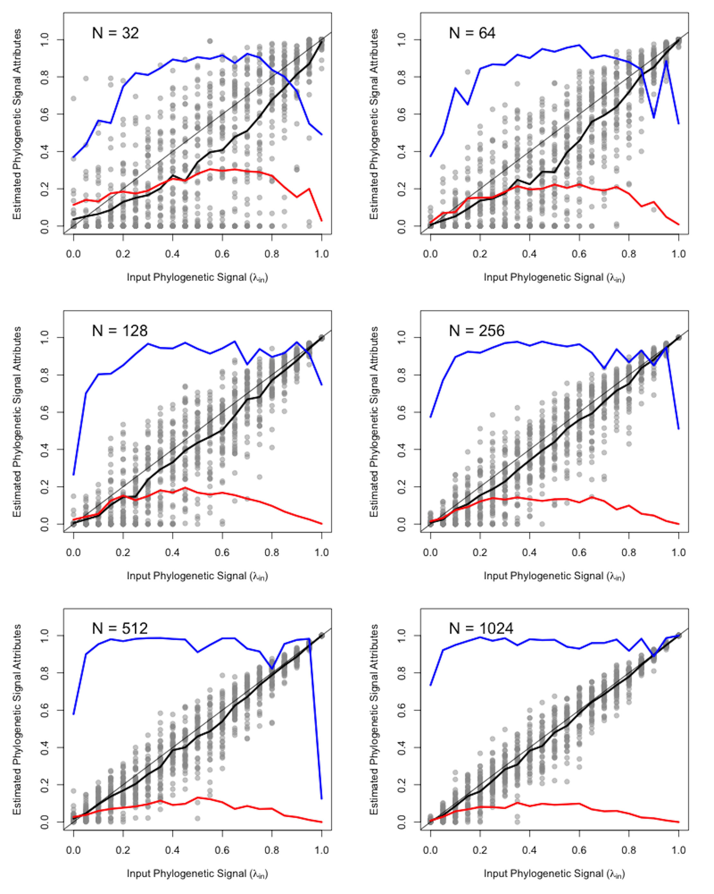  
```

\textbf{Figure S4}. Response of Pagel's \(\lambda\) to increasing strength of Brownian motion on balanced trees. Gray line signifies the 1:1 line where the input value matches the estimate.

```{r, echo = FALSE, out.width="95%", align= "center"}
  
```

\textbf{Figure S5}. Response of Blomberg's \(\kappa\) to increasing strength of Brownian motion on balanced trees. Gray line signifies the 1:1 line where the input value matches the estimate.

```{r, echo = FALSE, out.width="95%", align= "center"}
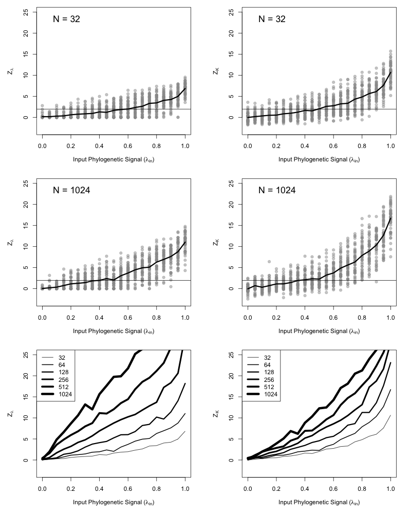  
```

\textbf{Figure S6}. Response of effect sizes \(Z_{\lambda}\) and \(Z_{\kappa}\) to increasing strength of Brownian motion.

\newpage

## Simulations on Phylogenies Containing Polytomies

We also investigaged the effect of unresolved phylogenies on estimates of phylogenetic signal by adjusting pure-birth trees to have 50% collapsed nodes, following the procedures of [@MolinaVenegas2017]. Results from simulations on phylogenies containing polytomies mirrored those found on fully resolved trees. For $\hat{\lambda}$, the mean value increased with increasing input signal, but was negatively biased, and was less than the input value across most of its range (Fig. S7: black line). Additionally, the precision of $\hat{\lambda}$ varied with differing input levels, with the greatest variation found at intermediate values of $\lambda$ (Fig. S7 red line). Finally, the distribution of $\hat{\lambda}$ was not normal, and became more skewed at more extreme values of $\lambda$ (Fig. S7 blue line).  \hfill\break

For $\hat\kappa$, mean values increased with increasing phylogenetic signal, though as was found with pure-birth trees, the increase was nonlinear (Fig. S8 black line). Likewise, variation increased with increasing phylogenetic signal (Fig. S8 red line), though the distribution of $\hat\kappa$ was more normally distributed throughout its range, and across different tree sizes, as compared with $\hat{\lambda}$ (Fig. S8 blue line). \hfill\break

With respect to effect sizes, both $Z_{\lambda}$ and $Z_{\kappa}$ increased with increasing input phylogenetic signal, but $\hat{\lambda}$ was strongly affected by tree size, whereas $Z_{\kappa}$ was more consistent (Fig. S9). Also, $Z_{\kappa}$ increased more linearly with increasing levels of phylogenetic signal, and its standard deviation across input signal was more even across tree sizes, implying more consistent precision. Thus, polytomies do not exert an appreciable effect on $Z_{\kappa}$.

```{r, echo = FALSE, out.width="95%", align= "center"}
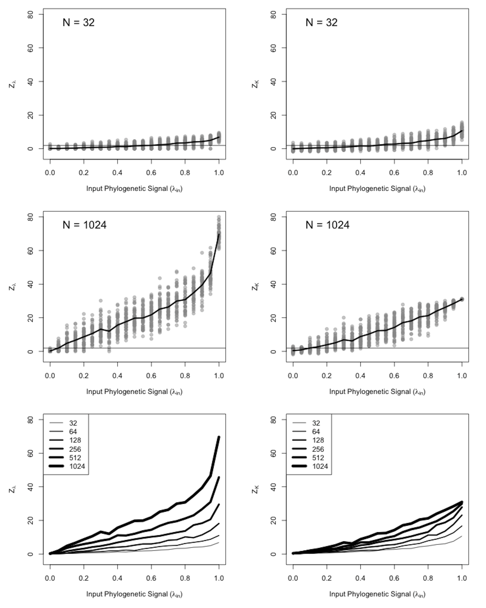  
```

\textbf{Figure S7}. Response of Pagel's \(\lambda\) to increasing strength of Brownian motion on pure-birth trees containing polytomies. Gray line signifies the 1:1 line where the input value matches the estimate.

```{r, echo = FALSE, out.width="95%", align= "center"}
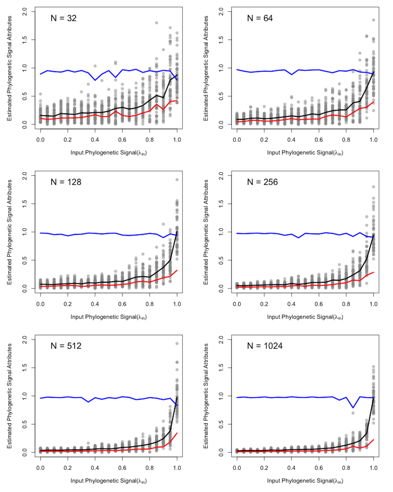  
```

\textbf{Figure S8}. Response of Blomberg's \(\kappa\) to increasing strength of Brownian motion on pure-birth trees containing polytomies. Gray line signifies the 1:1 line where the input value matches the estimate.

```{r, echo = FALSE, out.width="95%", align= "center"}
  
```

\textbf{Figure S9}. Response of effect sizes \(Z_{\lambda}\) and \(Z_{\kappa}\) to increasing strength of Brownian motion.

\newpage

## Simulations of Phylogenetic Regression and ANOVA

We also investigated the effect of incorporating $\lambda$ in PGLS analyses (phylogenetic regression and ANOVA). Here, patterns for $\hat\lambda$, $\hat\kappa$, $Z_\lambda$ and $Z_\kappa$ were virtually identical to those found previously. In essence, $\hat\lambda$ was not suitable as a test statistic representing phylogenetic signal due to all properties previously shown (Figs. S10 & S11), $\hat\kappa$ was more appropriate, but  associated non-linearly with signal strength (Figs. S12 & 13), while $Z_\kappa$ was found to be a superior effect size as compared with $Z_\lambda$ (Figs S14 & S15). \hfill\break

With respect to model performance, input parameters ($\beta$) were well estimated in phylogenetic regression  and ANOVA when $\lambda$ was incorporated (Figs S16 & S17), implying that $\lambda$ may be used as a tuning parameter for these models. Additionally, type I error and statistical power were unaffected by the inclusion of $\lambda$ (Figs S18 & S19). This latter result confirms earlier findings of [@Revell2010] for phylogenetic regression, and extends them to the case of phylogenetic ANOVA.

```{r, echo = FALSE, out.width="95%", align= "center"}
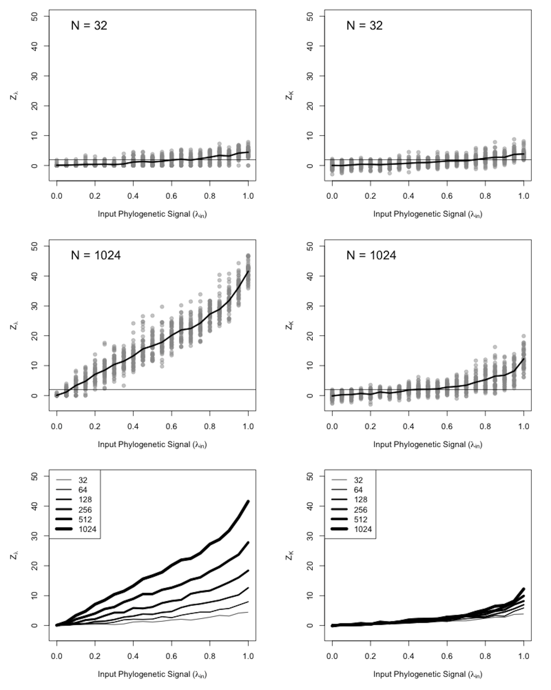  
```

\textbf{Figure S10}. Response of Pagel's \(\lambda\) to increasing strength of Brownian motion in phylogenetic regression (incorporating $\lambda$). Gray line signifies the 1:1 line where the input value matches the estimate.

```{r, echo = FALSE, out.width="95%", align= "center"}
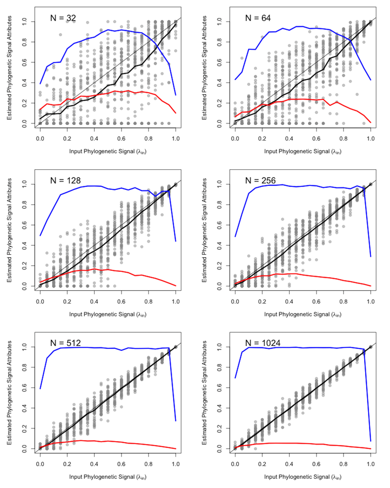  
```

\textbf{Figure S11}. Response of Pagel's \(\lambda\) to increasing strength of Brownian motion in phylogenetic ANOVA (incorporating $\lambda$). Gray line signifies the 1:1 line where the input value matches the estimate.

```{r, echo = FALSE, out.width="95%", align= "center"}
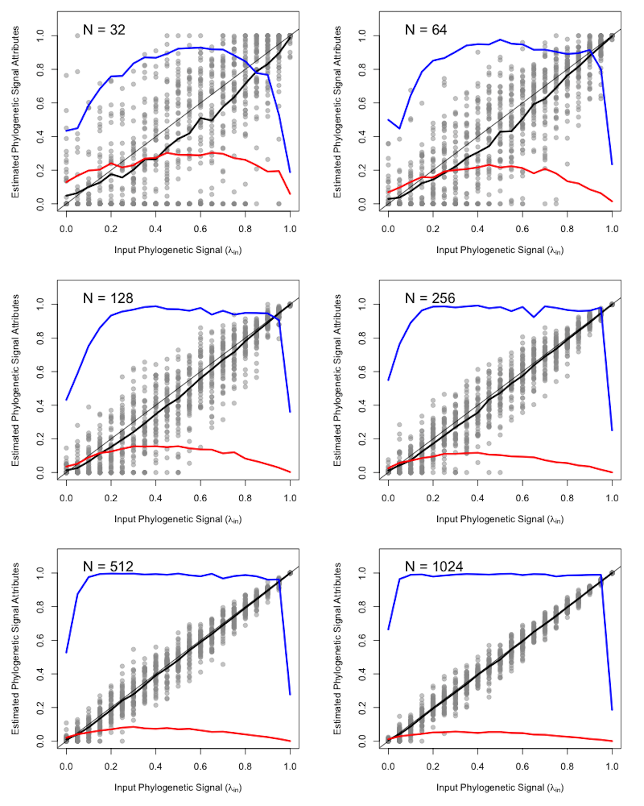  
```

\textbf{Figure S12}. Response of Blomberg's \(\kappa\) to increasing strength of Brownian motion in phylogenetic regression (incorporating $\lambda$). Gray line signifies the 1:1 line where the input value matches the estimate.

```{r, echo = FALSE, out.width="95%", align= "center"}
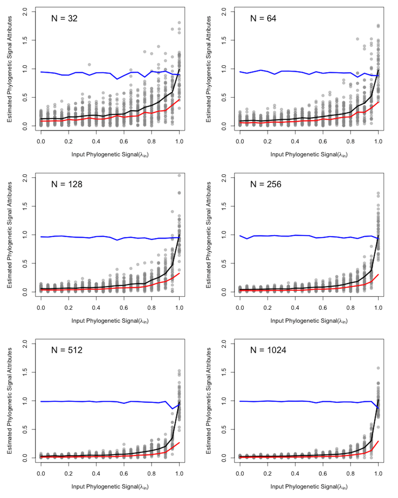  
```

\textbf{Figure S13}. Response of Blomberg's \(\kappa\) to increasing strength of Brownian motion in phylogenetic ANOVA (incorporating $\lambda$). Gray line signifies the 1:1 line where the input value matches the estimate.

```{r, echo = FALSE, out.width="95%", align= "center"}
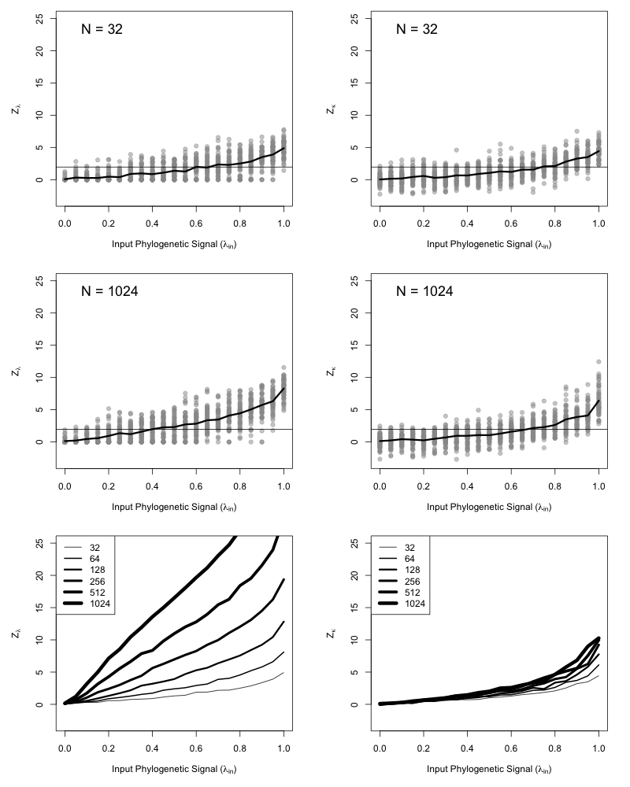  
```

\textbf{Figure S14}. Response of effect sizes \(Z_{\lambda}\) and \(Z_{\kappa}\) to increasing strength of Brownian motion in phylogenetic regression (incorporating $\lambda$).

```{r, echo = FALSE, out.width="95%", align= "center"}
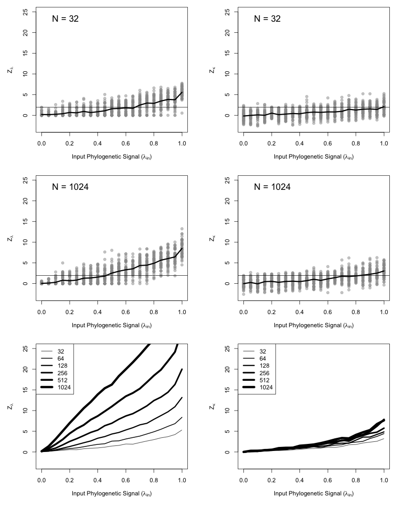  
```

\textbf{Figure S15}. Response of effect sizes \(Z_{\lambda}\) and \(Z_{\kappa}\) to increasing strength of Brownian motion in phylogenetic ANOVA (incorporating $\lambda$).

```{r, echo = FALSE, out.width="95%", align= "center"}
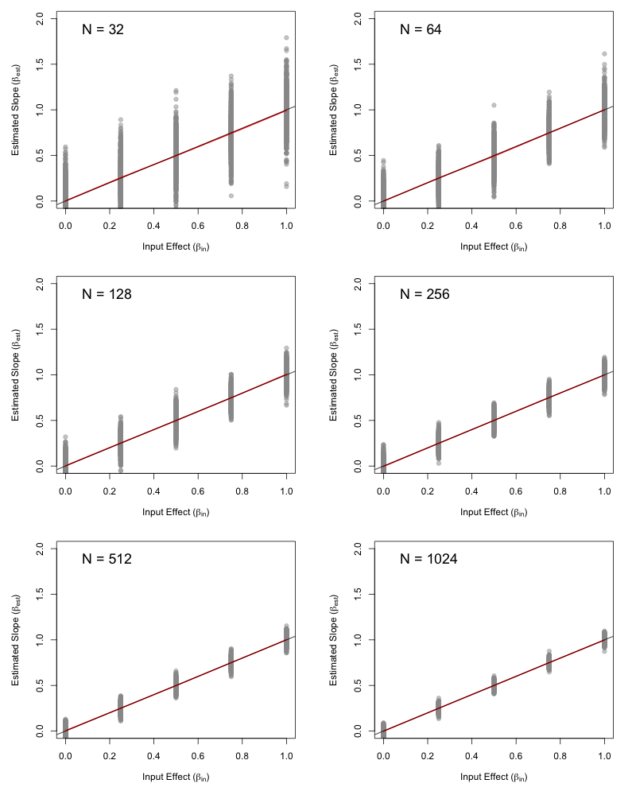  
```

\textbf{Figure S16}. Parameter estimates from phylogenetic regression (incorporating $\lambda$). Gray line is the 1:1 line and red line is the estimate.

```{r, echo = FALSE, out.width="95%", align= "center"}
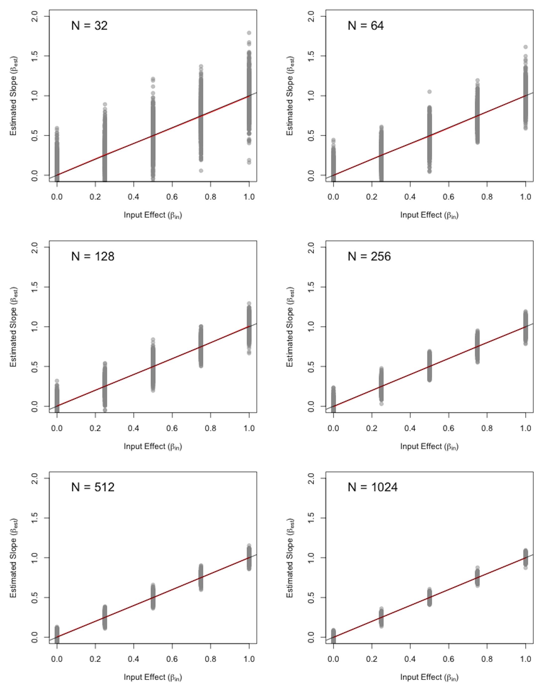  
```

\textbf{Figure S17}. Parameter estimates from phylogenetic ANOVA (incorporating $\lambda$). Gray line is the 1:1 line and red line is the estimate.

\newpage

## References
